# Modular & Generative Systems Reference

## 1. Introduction to Modular Synthesis

**Definition:**  
Modular synthesis refers to sound creation and manipulation through independent modules connected by patch cables or virtual routings.  
Each module performs a distinct function—oscillation, filtering, modulation, sequencing—and together they form a reconfigurable, non-linear instrument.

### Fundamental Concepts
- **Voltage Control (CV):** The analog voltage that modulates parameters such as pitch, amplitude, filter cutoff, or timing.  
  - Typical Eurorack standard: ±5V for bipolar signals, 0–8V for unipolar control.  
- **Signal Types:**  
  - **Audio signals:** Typically AC-coupled, representing sound waves.  
  - **Control voltages (CV):** DC-coupled, used to control parameters.  
- **Patch Cables:** The physical or virtual links between modules that define signal routing.  
- **Semi-Modular:** Instruments with pre-wired signal paths but open patch points (e.g., Moog DFAM, Make Noise 0-Coast).  

### Technical Standards
- **Formats:** Eurorack (3U, 1/8” jacks), 5U/MU (Moog Unit), Buchla (banana jacks, separate CV/audio).  
- **Power:** ±12V (Eurorack), ±15V (5U), specialized in Buchla (±15V + 5V).  
- **Signal Levels:**  
  - Audio: ~10V peak-to-peak  
  - CV: typically 0–10V  
  - Gate/Trigger: 5V logic signals  

> [!TIP]
> Always normalize levels between modules of different systems.  
> Use attenuators, VCAs, or dedicated interfaces (e.g., Expert Sleepers ES-9, Befaco A*B+C) to maintain headroom and avoid clipping or DC offset.

### Practical Application
A minimal subtractive patch typically includes:
- 1 oscillator (VCO) → waveform source  
- 1 filter (VCF) → timbral shaping  
- 1 amplifier (VCA) → amplitude control  
- 1 envelope generator (ADSR) → contour shaping  
- 1 LFO → modulation source  

**Basic Subtractive Patch:**

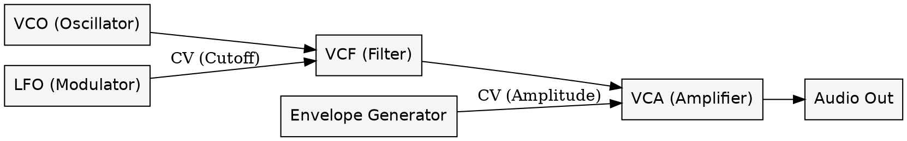

>[!TIP]
Try modulating the filter cutoff with both the LFO and the envelope generator.
Adjust modulation depth dynamically to explore the relationship between time and timbre.

### Historical Context

- **1950s–60s:** Moog and Buchla pioneer voltage-controlled synthesis.
- **1970s:** ARP, EMS, and Serge systems emerge.
- **1990s:** Doepfer introduces the Eurorack standard.
- **2000s–present:** A global modular renaissance with manufacturers like Make Noise, Intellijel, Mutable Instruments, and Noise Engineering.

## 2. Architectures and Patch Philosophies
### Overview:
The architecture of a modular system determines how sound flows and evolves within it. Patch philosophy refers to the conceptual approach—whether linear, generative, performative, or experimental.

### Core Architectures
###### 1. East Coast Architecture (Subtractive):
	- Origin: Moog systems.
	- Flow: Oscillator → Filter → Amplifier.
	- Focus: Harmonic content sculpted through filtering and envelopes.
	- Example Instruments: Moog Mother-32, ARP 2600.

###### 2. West Coast Architecture (Additive / Complex):
	- Origin: Buchla & Serge systems.
	- Flow: Complex Oscillator → Wavefolder → LPG (Low Pass Gate).
	- Focus: Dynamic modulation, timbral evolution, and organic motion.
	- Example Instruments: Make Noise DPO, Verbos Complex Oscillator.

###### 3. Hybrid / Post-Coast:
	- Combination of East and West philosophies.
	- Incorporates digital modulation, granular techniques, and non-linear control.
	- Example Instruments: Intellijel Shapeshifter, Mutable Instruments Plaits, Moog DFAM.

#### Signal Flow Archetypes

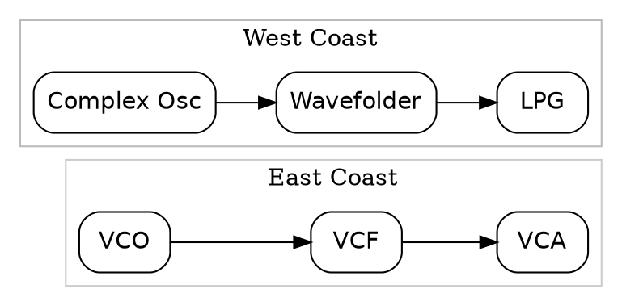

### Practical Application
Try exploring both paradigms with the same set of modules:

>[!TIP]
Patch a complex oscillator into a wavefolder and control it with an envelope follower from an external source (e.g., drum loop).
This merges the West Coast timbral complexity with East Coast amplitude shaping.

Example Hybrid Patch:

Modulate wavefolder symmetry with an LFO at sub-audio rate.

Add a random CV generator (e.g., S&H) to the cutoff frequency.

Route the output through reverb/delay for evolving spatiality.

Conceptual Distinctions

|Philosophy|Key Characteristic|Control Method|Typical Timbre|
|---|---|---|---|
|East Coast|Tonal, subtractive|Envelopes & Filters|Warm, harmonic|
|West Coast|Timbre synthesis|CV Modulation & LPGs|Organic, dynamic|
|Hybrid / Generative|Algorithmic control|Random, probability, feedback|Evolving, complex|

Historical Context
East Coast: Bob Moog’s emphasis on tonal, keyboard-based synthesis.

West Coast: Don Buchla’s vision of experimental, non-tonal, performance-driven systems.

Hybrid: Emerges with Eurorack, bridging philosophies through modular freedom.

>[!TIP]
For studio use, combine both approaches: 
>- East Coast for bass, leads, and percussive patches.
>- West Coast for textures, drones, and generative modulations.
>- Layer and cross-modulate them to achieve evolving arrangements.

## 3. Types of Modules

Modular systems are built from independent function blocks called *modules*.  
Each performs a specific role in the audio or control chain: generation, shaping, modulation, sequencing, or processing.

---

### 3.1 Oscillators (VCO / DCO / Complex)

**Definition:**  
Voltage-Controlled Oscillators generate periodic waveforms that serve as the primary audio source or modulation signal.

#### Core Types
- **Analog VCO:** Continuous voltage control, rich harmonic content, slight drift → “alive” tone.  
- **Digital VCO / DCO:** Numerically controlled, perfect stability, capable of complex algorithms (FM, wavetable, additive).  
- **Complex Oscillator:** Dual-oscillator structure with internal FM, wavefolding, and modulation buses.

#### Common Waveforms
Sine, Triangle, Saw, Square/Pulse, Noise, Wavetable, FM Operators.

#### Technical Specs
- Typical audio range: 20 Hz – 20 kHz  
- CV input standard: 1 V/Oct  
- FM modes: Linear vs Exponential  
- Sync types: Hard / Soft  

> [!TIP]
> Use exponential FM for tonal timbres and linear FM for inharmonic metallic spectra.

#### Example Patch: FM Modulation
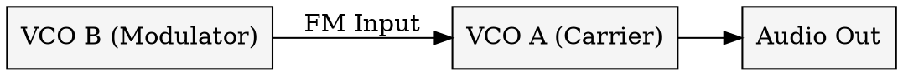
#### Typical Modules

Doepfer A-110, Intellijel Rubicon2, Make Noise DPO, Mutable Plaits, Noise Engineering Loquelic Iteritas.

---

### 3.2 Filters (VCF)

**Definition:**  
Voltage-Controlled Filters shape harmonic content by attenuating or emphasizing frequency regions.

#### Filter Types

- **Low-Pass (LPF):** Removes highs, emphasizes body.
- **High-Pass (HPF):** Removes lows, clarifies transients.
- **Band-Pass (BPF):** Isolates midrange, formant control.
- **Notch / Comb / Morphing:** Creative and phase-based effects.

#### Topologies

Ladder (Moog), State-Variable (Oberheim), Diode (EMS), Multimode, Digital Morphing.

#### Technical Specs

- Cutoff range: 20 Hz – 20 kHz
    
- Resonance (Q): 0 – self-oscillation
    
- Typical CV response: 1 V/Oct optional
    

> [!TIP]  
> Route an LFO or envelope to the cutoff CV input for animated movement.  
> Self-oscillating filters can act as sine oscillators when tuned precisely.

#### Example Patch: Filter Sweep

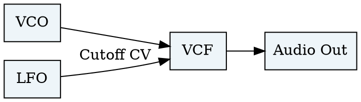

#### Typical Modules

Doepfer A-120, Mutable Ripples, Intellijel Dr. Octature, Rossum Evolution, Xaoc Belgrad, Make Noise QPAS.

---

### 3.3 Envelopes & Modulation Sources

**Definition:**  
Envelope Generators (EG) and Low-Frequency Oscillators (LFO) provide time-based control for amplitude, pitch, or timbre.

#### Envelope Types

- **ADSR:** Attack, Decay, Sustain, Release.
- **AD / AR:** Simplified two-stage shapes.
- **Multi-Segment (DAHDSR etc.):** Extended control.
- **Function Generators:** Voltage-controllable envelopes (e.g., Maths).

#### LFO Modes

- Free-running, tempo-sync, sample & hold, random walk.
- CV rate modulation for chaotic behaviour.

> [!TIP]  
> Invert an envelope’s output or use bipolar LFOs to create counter-motion between parameters.

#### Example Patch: Amplitude Modulation

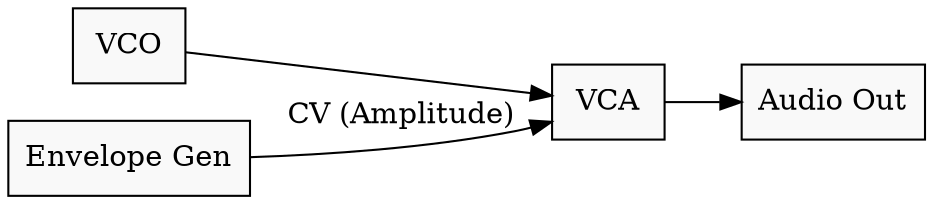
#### Typical Modules

Make Noise Maths, Intellijel Quadrax, Xaoc Zadar, Doepfer A-140, Mutable Stages.

---

### 3.4 Sequencers, Random & Quantizers

**Definition:**  
Sequencers generate step-based or algorithmic control voltages.  
Random modules introduce probability, chance, and generative motion.  
Quantizers constrain CVs to musical scales.

#### Sequencer Categories

- **Step Sequencer:** Fixed pattern, manual CV per step.
- **Trigger Sequencer:** Gate patterns for rhythmic structures.
- **Algorithmic / Euclidean:** Mathematical distribution of events.
- **Generative Sequencer:** Evolving logic, feedback, randomness

#### Random Sources

- Sample & Hold, Noise-based, Probabilistic Gates, Turing Machine, Marbles-style looped random.

#### Quantization

Translates CV into discrete pitch intervals.

> [!TIP]  
> Combine a random CV generator with a quantizer and clock divider for infinite melodic variation.

#### Example Patch: Generative Sequence

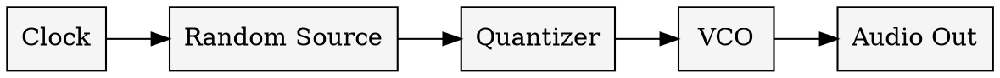

#### Typical Modules

Make Noise René, Mutable Marbles, Intellijel Metropolis / Metropolix, Doepfer A-155, XAOC Moskva II, Instruō Harmonaig.

---

### 3.5 Effects & Processors

**Definition:**  
Processing modules alter audio or CV to create space, depth, or transformation.

#### Categories

- **Delay / Reverb:** Temporal space (e.g., Magneto, Erbe-Verb).
- **Wavefolder / Distortion:** Timbre enhancement, harmonic complexity.
- **Granular & Spectral:** Texture creation.
- **Dynamics / VCAs:** Amplitude and mix control.
- **Utilities:** Attenuators, Inverters, Mixers, Multiples, Logic Modules.


> [!TIP]  
> In modular systems, VCAs are not only for amplitude—use them to control modulation depth dynamically.

#### Example Patch: Modulated Delay

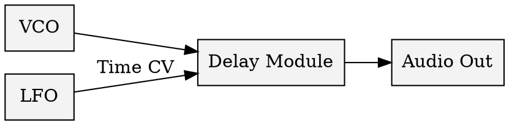

#### Typical Modules

Make Noise Mimeophon, Strymon Magneto, Mutable Clouds / Beads, Intellijel Rainmaker, Happy Nerding FX Aid, Noise Engineering Desmodus Versio.

---

### Summary Table

|Category|Primary Function|Typical CV Range|Examples|
|---|---|---|---|
|**Oscillators**|Sound generation|1 V/Oct pitch, ±5 V FM|DPO, Plaits, Rubicon 2|
|**Filters**|Harmonic shaping|0–8 V cutoff|Ripples, Belgrad|
|**Envelopes / LFOs**|Time-based control|0–10 V CV|Maths, Zadar|
|**Sequencers / Random**|CV generation|0–5 V pitch/gate|Marbles, René|
|**Effects / Processors**|Sound transformation|Audio (±5 V) + CV|Magneto, Clouds|

---

> [!TIP]  
> Patch discipline is crucial in large systems: label signal types (audio vs CV), use color-coded cables, and calibrate oscillators regularly.

## 4. Systems and Formats

### Overview
Different modular formats coexist, each with its own **electrical standards**, **physical dimensions**, and **design philosophies**.  
Understanding these ecosystems is essential for interoperability and long-term system design.

---

### 4.1 Eurorack

**Definition:**  
Eurorack is the most widely adopted modular standard, introduced by Dieter Doepfer in the mid-1990s.  

**Specifications**

| Parameter | Value / Description |
|------------|--------------------|
| Panel Height | 3 U (128.5 mm) |
| Width Units | HP (1 HP = 5.08 mm) |
| Power | ±12 V rails (+5 V optional) |
| Signal Levels | Audio ≈ 10 V pp, CV 0–10 V |
| Connectors | 3.5 mm TS jacks |
| Mounting | 84 HP or 104 HP standard rails |

**Advantages**
- Extremely diverse ecosystem (2 000 + manufacturers).  
- Compact and cost-efficient.  
- High density of modules for experimental setups.

**Limitations**
- Tight panel space, fragile patch cables.  
- Noise and ground sensitivity at high currents.

**Typical Use Case**
Small-to-medium hybrid studios combining analog control with DAW integration (via Expert Sleepers ES-9 / FH-2).

> [!TIP]
> Keep ribbon-cable orientation consistent – the red stripe indicates –12 V.  
> Always power down before inserting or removing modules.

**Example Rack Topology**

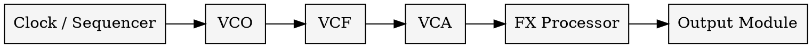

### 4.2 5U / MU (Moog Unit)

**Definition:**  
The 5U format is derived from early Moog systems, emphasizing **large panels**, **¼-inch jacks**, and **high-voltage headroom**.

**Specifications**

|Parameter|Value / Description|
|---|---|
|Panel Height|8.75 in (5 U)|
|Power|±15 V|
|Signal Levels|Audio ≈ 20 V pp|
|Connectors|¼-inch TS|
|Typical Width|2.125 in per MU unit|

**Characteristics**

- Superior dynamic range and low noise floor.
- Large control spacing → performance friendly.
- Ideal for permanent studio installations.

**Manufacturers**  
Moog reissues, Synthesizers.com, Corsynth, Mos-Lab, Moon Modular.

> [!TIP]  
> MU and Eurorack CV/gate signals are compatible in concept (1 V/Oct),  
> but voltage ranges differ – use scaling interfaces when mixing formats.

---

### 4.3 Buchla / Serge

**Definition:**  
Alternative modular lineages prioritizing **control voltage behavior** and **experimental interaction** rather than keyboard pitch tracking.

#### Buchla

- Uses **banana jacks** (stackable connections).
- Separates audio and CV paths; non-standard voltage levels (≈ ±10 V).
- Features unique modules – Complex Oscillators, Low-Pass Gates, Sequential Voltage Sources.
- Strong focus on **tactile performance** and **non-tonal sound design**.

#### Serge

- Also banana-based but patch-agnostic (audio = CV).
- Compact panels, function blocks rather than instrument emulation.
- Encourages feedback networks and cross-modulation.

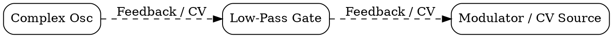

> [!TIP]  
> Buchla’s CV polarity is positive-only; use format converters when integrating with Eurorack.  
> Serge excels in **function chaining** – any module can act as envelope, LFO, or oscillator depending on patch context.

**Influence**  
Modern West-Coast-style Eurorack modules (Make Noise, Verbos, Random Source) replicate these design principles.

---

### 4.4 Ciat-Lonbarde and Experimental Formats

**Overview:**  
Ciat-Lonbarde instruments by Peter Blasser (PLW / Cocoquantus / Plumbutter) represent a parallel evolution: wooden cases, banana jacks, low-voltage analog logic, and psycho-acoustic interaction.

**Traits**

- Power ≈ 9 V single-rail.
- Touch-plate controls responding to body capacitance.
- Emphasis on **chaotic / organic** behavior over precision.

> [!TIP]  
> These systems often run below Eurorack voltage levels; interfacing requires attenuation or re-amplification.

**Application**  
Used for experimental composition, live improvisation, and electro-acoustic research.

---

### 4.5 Semi-Modular / Desktop Systems

**Definition:**  
Semi-modular instruments integrate fixed internal routing with external patch points – a bridge between fixed-architecture synths and full modular racks.

**Examples**

- **Moog DFAM / Mother-32 / Subharmonicon** – East-Coast analog design.
- **Make Noise 0-Coast / Strega** – West-Coast philosophy in compact form.
- **Pittsburgh Taiga**, Arturia MiniBrute 2S, Behringer Neutron.

**Advantages**

- Immediate sound creation without patching from zero.
- Portable / performance-ready.
- Expandable via CV I/O.

**Example Hybrid Chain**

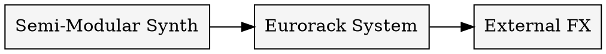

> [!TIP]  
> Semi-modulars make excellent control hubs:  
> Use their MIDI-to-CV converters and envelopes to drive larger Eurorack setups.

---

### Summary Comparison

|Format|Voltage|Connectors|Strengths|Limitations|
|---|---|---|---|---|
|**Eurorack**|±12 V|3.5 mm TS|Compact, affordable, huge ecosystem|Crowded panels, no standard grounding|
|**5U/MU**|±15 V|¼ inch TS|High headroom, studio stability|Large size, expensive|
|**Buchla**|±15 V (+5 V)|Banana|Performance interaction, separated CV/audio|Non-standard voltage logic|
|**Serge**|±12 V / ±15 V|Banana|Patch agnostic design|Steep learning curve|
|**Ciat-Lonbarde**|+9 V|Banana / Touch|Organic, chaotic interaction|Low signal level / integration issues|
|**Semi-Modular**|Varies|3.5 mm TS|Immediate workflow / expandable|Limited re-patching depth|

---

> [!TIP]  
> When combining different formats, always check **ground reference**, **signal polarity**, and **voltage amplitude**.  
> Use isolation transformers or balanced interfaces for hybrid analog-digital rigs.

## 5. Sound Aesthetics & Generative Approaches

### Overview
Sound aesthetics define the *philosophical orientation* of a modular patch.  
In modular and generative music, the artist is both **composer and system designer**—shaping not just notes but *rules of sonic evolution.*

---

### 5.1 East Coast vs West Coast Aesthetics

| Parameter | East Coast (Moog) | West Coast (Buchla / Serge) |
|------------|------------------|------------------------------|
| Primary Method | Subtractive | Additive / FM / Wavefolding |
| Control | Keyboard CV (1 V/Oct) | CV logic / random / touch |
| Core Modules | VCO → VCF → VCA | Complex Osc → Wavefolder → LPG |
| Timbre | Warm, harmonic | Dynamic, metallic, evolving |
| Goal | Tonal synthesis | Behavioral systems |

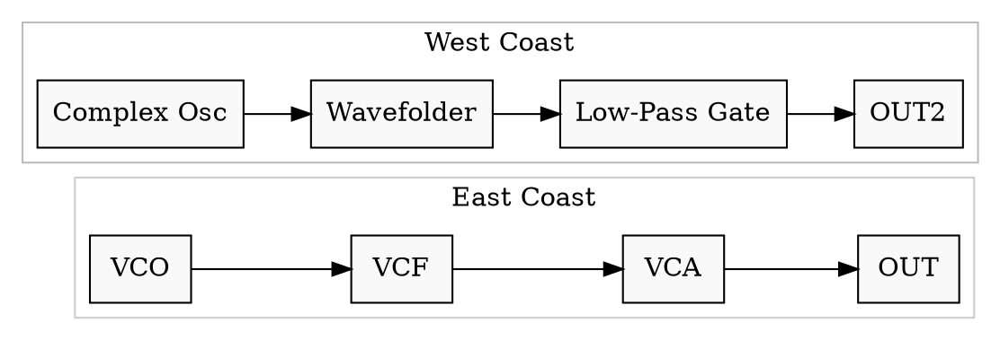
> [!TIP]  
> Combine the two: route a **West-Coast complex oscillator** through an **East-Coast ladder filter** for harmonic-rich yet organic results.

---

### 5.2 Feedback, Chaos & Non-Linearity

**Concept:**  
Feedback transforms static patches into _self-modulating ecosystems_.  
By routing outputs back into control inputs, systems exhibit _chaotic, non-periodic, or quasi-stable_ states.

#### Common Feedback Techniques

- Audio feedback through filters (resonant drive).
    
- CV feedback loops (e.g., envelope → itself via attenuator).
    
- Cross-modulation between oscillators.
    
- Delay line regeneration and Karplus–Strong models.
    

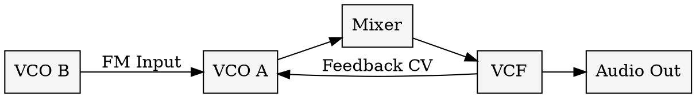

> [!TIP]  
> Always use attenuators or VCAs in feedback paths—small voltage changes can cause runaway oscillation.

---

### 5.3 Generative Patch Design

**Definition:**  
Generative systems create music via _rule-based logic_ rather than direct performance.  
The designer programs _probability, interaction,_ and _autonomy._

#### Core Principles

- **Randomization:** controlled chaos (Turing Machine, Marbles).
- **Probability Gates:** define event likelihood.
- **Self-modulation:** outputs modulate their own parameters.
- **Clock division / multiplication:** hierarchical time structures.
- **Feedback control:** evolving patterns without repetition.

#### Example: Probabilistic Clock Network

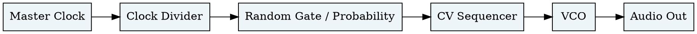

> [!TIP]  
> Patch the **random gate output** back to the **clock reset** input for evolving rhythmic drift.

#### Musical Applications

- **Ambient Generative:** Slowly evolving textures via LFO interactions.
- **Rhythmic Generative:** Probabilistic triggers controlling percussive modules.
- **Melodic Generative:** Quantized random CV controlling VCO pitch.
- **Algorithmic Control:** Logic modules shaping system behavior.

---

### 5.4 Drone & Texture Systems

**Concept:**  
Drone patches explore _stasis through motion_—continuous sound fields where micro-variation replaces traditional melody.

#### Techniques

- Multiple oscillators tuned to intervals or microtonal spreads.
- Slow modulation of wavefolder symmetry, filter cutoff, and panning.
- Layered delays and reverbs for spatial depth.
- Sub-audio LFOs and random CV to generate imperceptible drift.

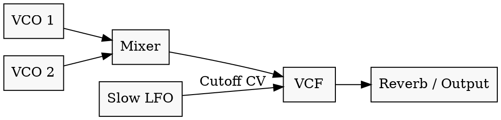

> [!TIP]  
> Tune oscillators a few cents apart; introduce _phase drift_ for a living, breathing texture.

#### Applications

- Ambient and Cinematic composition
- Meditation and installation sound
- Live performance background beds

---

### 5.5 Live Performance vs Studio Approaches

|Context|Goal|Tools|Workflow|
|---|---|---|---|
|**Studio**|Precision, multi-track control|DAW integration, CV recorders|Iterative composition|
|**Live**|Real-time interaction|Performance mixers, sequencers, controllers|Improvised flow|
|**Hybrid**|Pre-sequenced core + generative layers|MIDI–CV interfaces, loopers|Controlled improvisation|

**Performance Strategies**

- _Scene-based patching_: groups of modules acting as macro-voices.
- _Cross-fade mixers_: morph between scenes.
- _Hands-off control_: probability and envelope followers guide evolution.

> [!TIP]  
> Use _matrix mixers_ or _voltage-addressed switches_ (e.g., Planar 2, Morph 4) to interpolate between entire patch states during a performance.

---

### 5.6 Conceptual Summary

|Aesthetic|Description|Typical Modules|Musical Outcome|
|---|---|---|---|
|**East Coast**|Harmonic, structured|VCO–VCF–VCA|Classic synthesis|
|**West Coast**|Timbre-modulation, organic|Wavefolder, LPG, Function Gen|Dynamic motion|
|**Generative**|Probabilistic, self-modulating|Random / Logic / Clock networks|Autonomous evolution|
|**Drone / Texture**|Continuous, slow variation|Oscillator clusters, VCFs, FX|Static motion|
|**Hybrid Live**|Performative control|Mixer, Joystick, Matrix CV|Expressive gestures|

---

> [!TIP]  
> Generative modular design is not about _letting the machine play itself_—it’s about constructing **conditions for emergence**, where musical structure arises from controlled complexity.

## 6. Digital & Software Modular Systems

### Overview
Digital modular environments simulate or extend hardware modular synthesis.  
They enable complex systems, advanced modulation, and algorithmic behaviors without hardware constraints, while maintaining the same conceptual architecture: **signal flow through interconnected modules**.

---

### 6.1 VCV Rack

**Definition:**  
An open-source modular environment that replicates the Eurorack format virtually, with CV and audio routing identical to real hardware.

#### Technical Characteristics
- **Sampling Rate:** up to 192 kHz.  
- **Voltage Scaling:** ±10 V for both audio and CV.  
- **Integration:** VCV Rack Pro supports VST/AU plugin mode.  
- **Module Ecosystem:** 2000+ modules (official and community).  

**Advantages**
- Realistic emulation of Eurorack modules.  
- Full patch recall and save.  
- Hardware integration via audio interfaces and CV outputs.

**Limitations**
- CPU heavy with large patches.  
- Limited tactile interaction.

#### Example Signal Flow

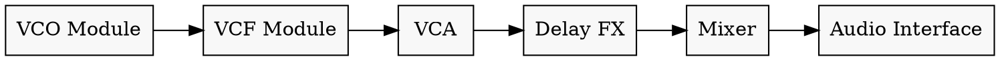

> [!TIP]  
> VCV Rack can output control voltages through DC-coupled audio interfaces.  
> Use modules like _CV-CC Converter_ to synchronize real Eurorack gear.

**Key Modules**

- Fundamental series (VCV).
- Audible Instruments (Mutable Instruments ports).
- MindMeld MixMaster, Stoermelder utilities.
- NYSTHI for experimental control.
---

### 6.2 Reaktor Blocks (Native Instruments)

**Definition:**  
A modular synthesis environment inside _Reaktor_, combining patchable modules (_Blocks_) with full modular routing.

#### Technical Characteristics

- Voltage representation: ±1.0 normalized range.
- Supports polyphony and macro-level control.
- Integration with hardware via MIDI/CV.

**Advantages**

- Combines modular patching with advanced DSP algorithms.
- Patch recall and snapshot management.
- Deep macro and custom-building options.

**Limitations**

- Limited physical I/O compared to dedicated CV systems.
- CPU load increases with polyphonic patches.

#### Example Block Structure

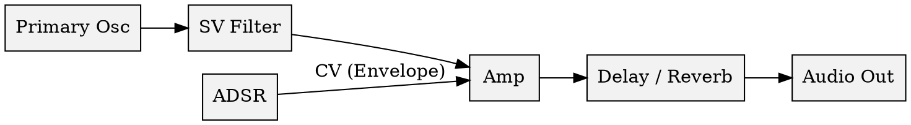

> [!TIP]  
> Use Reaktor’s _Rack View_ for hardware-like control.  
> Combine Blocks with traditional Reaktor Core Cells for hybrid DSP workflows.

**Common Libraries**  
Toybox Audio, Unfiltered Audio Blocks, Bento Box, and Euro Reakt collections.

---

### 6.3 Max/MSP and Pure Data

**Definition:**  
Graphical programming environments for real-time audio, MIDI, and control data.  
They allow complete freedom to build synthesis and generative systems from first principles.

#### Technical Overview

- **Patch-based signal flow** with audio and control domains.
- **Visual programming:** objects represent mathematical or logical functions.
- **Sampling rate:** user-defined; supports vector processing.
- **OpenSoundControl (OSC):** network communication for inter-system control.

**Differences**

- **Max/MSP:** Commercial, polished UI, extensive documentation.
- **Pure Data:** Open-source, lighter, preferred for embedded systems (e.g., Organelle, Raspberry Pi).

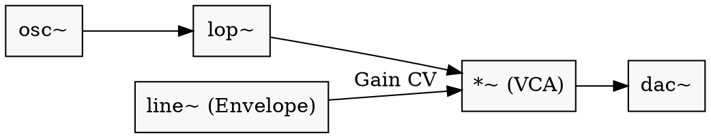

> [!TIP]  
> Patch discipline in Max and PD mirrors hardware modular:  
> keep audio (`~` objects) and control domains separated for stability and efficiency.

**Applications**

- Generative ambient systems.
- Interactive installations (sensors, visuals, OSC).
- Algorithmic composition with real-time control.

---

### 6.4 Bitwig Grid / Voltage Modular / Modular VSTs

**Definition:**  
Modern DAWs and plugins now include modular environments with patch-based control directly inside production workflows.

#### Bitwig Grid

- Integrated modular environment inside Bitwig Studio.
- Polyphonic patching, audio/CV interchange, hybrid with DAW automation.
- Module types: Oscillators, Filters, Envelopes, Logic, Data.

#### Voltage Modular

- Standalone or VST modular instrument.
- Commercial modules, Eurorack emulation, easy drag-and-drop interface.

#### Other Modular VSTs

- Cherry Audio _Modular_, Softube _Modular_, and Reason Rack.
- Offer hardware integration and controlled recall within projects.

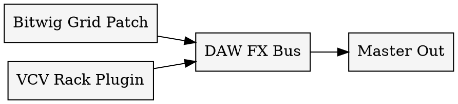

> [!TIP]  
> The key advantage of DAW-integrated modular systems is **automation recording** and **total recall**, while retaining patch-level flexibility.

---

### 6.5 Hybrid Integration (Hardware + Software)

**Concept:**  
Combine digital modular systems with physical hardware for the best of both worlds—**tactile control** and **infinite recall.**

#### Integration Methods

- **MIDI to CV:** DAW sequencer → modular pitch/gate.
- **Audio Interface CV Output:** via DC-coupled interfaces.
- **Sync & Clock:** Ableton Link, DIN Sync, or MIDI Clock.
- **CV Recording:** capture control signals in DAW automation lanes.

#### Example Setup

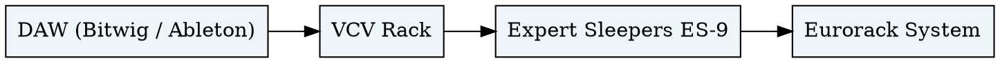

> [!TIP]  
> Use calibration tools (e.g., Silent Way, Bitwig CV Tools) to ensure precise pitch tracking and synchronization between software and hardware.

---

### Summary Table

|System|Type|Strengths|Limitations|Integration|
|---|---|---|---|---|
|**VCV Rack**|Virtual Eurorack|Free, realistic, large ecosystem|CPU intensive|CV/audio via interface|
|**Reaktor Blocks**|Modular DSP|Deep DSP design, hybrid workflow|Steeper learning curve|MIDI/CV and DAW|
|**Max/MSP**|Programming environment|Infinite flexibility|Manual patching, no fixed UI|OSC, hardware, sensors|
|**Bitwig Grid**|DAW integrated|Polyphonic, fast recall|Limited third-party modules|Native DAW CV tools|
|**Voltage Modular**|VST modular|Easy to use, scalable|Less experimental depth|Plugin in any DAW|

---

> [!TIP]  
> Digital modular systems are not replacements but **extensions**—they can model, prototype, and expand physical modular setups.  
> The most advanced workflows integrate _both_, using virtual CV as a bridge between generative algorithms and tactile sound design.

## 7. Schools of Thought & Key Artists

### Overview
The development of modular and generative systems can be traced through distinct **schools of thought** and **artist-engineers**.  
Each generation expanded both the *technical possibilities* and the *compositional paradigms* of electronic sound.

---

### 7.1 Early Pioneers (1950s–1970s)

#### Don Buchla (1937–2016)
**Philosophy:**  
Synthesis as *instrumental interaction*, not keyboard emulation.  
Encouraged unpredictability, tactile control, and performance as exploration.

**Technical Innovations:**  
- First voltage-controlled modular synthesizer (1963).  
- Use of banana jacks (stackable CV).  
- Separation of audio and control voltages.  
- Introduction of the Low Pass Gate (LPG).

**Key Systems:**  
Buchla 100, 200, 200e Series.  

> [!TIP]
> Buchla’s systems favored *event-based control*—think of voltages as gestures, not notes.

---

#### Robert Moog (1934–2005)
**Philosophy:**  
Accessible, tonal, keyboard-driven synthesis for musicians.

**Technical Innovations:**  
- 1 V/Oct standardization.  
- Ladder filter (24 dB/oct low-pass).  
- Envelope generator + VCA shaping paradigm.

**Key Systems:**  
Moog Modular, Minimoog Model D, System 55.  

**Musical Legacy:**  
From Wendy Carlos (*Switched-On Bach*) to Emerson, Lake & Palmer—Moog defined the archetype of subtractive synthesis.

---

#### Serge Tcherepnin (b. 1941)
**Philosophy:**  
A democratic, modular system where any function could be re-purposed.  
Focus on patch programmability, compact design, and affordability.

**Technical Innovations:**  
- Patch-programmable function blocks.  
- Dual-function modules (audio/CV).  
- First "CV feedback ecosystems."

**Key Systems:**  
Serge Modular Music System (1970s).  

> [!TIP]
> Serge systems reward experimentation—modules can serve multiple roles depending on context and patch voltage range.

---

### 7.2 The Academic & Experimental Era (1970s–1980s)

#### Morton Subotnick
**Philosophy:**  
Electronic music as a *living composition*.  
Used the Buchla 100/200 to create structured improvisations with organic flow.

**Notable Works:**  
*Silver Apples of the Moon* (1967), *The Wild Bull* (1968).  
Both were early examples of recorded modular music conceived as full compositions.

**Legacy:**  
Proved that modular synthesis could create complete musical forms beyond academic studios.

---

#### Suzanne Ciani
**Philosophy:**  
Emotional and sculptural use of electronic sound—modular systems as expressive tools.

**Contributions:**  
- Commercial sound design pioneer (Coca-Cola, Atari).  
- Virtuosic Buchla performer.  
- Combined classical harmony with generative techniques.

> [!TIP]
> Ciani’s performance method emphasizes *voltage choreography*: planning voltage gestures like melodic phrasing.

---

#### EMS / BBC Radiophonic Workshop
**Philosophy:**  
Experimental tape and modular synthesis for broadcast and film.  
Created hybrid workflows mixing *tape splicing, voltage control,* and *live diffusion*.

**Key Systems:**  
EMS VCS3, Synthi AKS.

---

### 7.3 Post-Analog Renaissance (1990s–2000s)

#### Dieter Doepfer
**Philosophy:**  
Make modular synthesis affordable and standardized.  

**Contribution:**  
- Introduced **Eurorack** format (A-100 system, 1995).  
- Open ecosystem allowing independent module creation.  
- Sparked the modern modular revival.

**Impact:**  
Enabled small-scale builders and boutique experimentation; today’s Eurorack owes its existence to Doepfer’s modular pragmatism.

---

#### Richard Devine
**Philosophy:**  
Complex generative sound structures and algorithmic control.  
Combines modular systems with granular DSP and field recordings.

**Setup Highlights:**  
- Eurorack with Make Noise, Mutable Instruments, Intellijel.  
- Hybrid integration with Reaktor and Max/MSP.

> [!TIP]
> Devine’s patches often use *multi-tiered clock divisions* and *nested feedback loops* for evolving textures.

---

#### Alessandro Cortini
**Philosophy:**  
Minimal, emotional composition from complex modular systems.  
Prefers limited setups with deep modulation possibilities.

**Typical Setup:**  
Buchla Music Easel, Verbos Eurorack, Ciat-Lonbarde instruments.

**Techniques:**  
- Slow modulation of few parameters.  
- Harmonic drone layering.  
- CV feedback through filters and delays.

> [!TIP]
> Cortini’s work shows how *limitation amplifies emotion*—a single oscillator with modulation depth can replace an entire wall of sound.

---

### 7.4 The Contemporary Generative School (2010s–Present)

#### Caterina Barbieri
**Philosophy:**  
Time perception and pattern recursion.  
Her music is based on algorithmic sequences, psychoacoustic layering, and minimalist evolution.

**Modules & Systems:**  
Mutable Instruments, Intellijel, Make Noise, Buchla.  
Uses Euclidean and logic-based patterns to explore repetition and emergence.

**Conceptual Focus:**  
Generative determinism—controlled systems that gradually unfold complexity.

---

#### Colin Benders
**Philosophy:**  
Modular improvisation as orchestral performance.  
Treats the modular as a live instrument, conducting in real-time.

**Setup:**  
Large Eurorack system with multiple sequencers, performance mixers, and external FX.  
Integration via Expert Sleepers ES-9 for DAW multi-tracking.

**Approach:**  
- Real-time scene management.  
- Dynamic routing during performance.  
- Self-contained compositional ecosystems.

---

#### Surachai Sutthisasan
**Philosophy:**  
Industrial / generative hybrid approach.  
Explores chaotic modulation, analog distortion, and digital feedback.  

**Setup:**  
Eurorack + computer feedback loops (modular ↔ DAW).  
Focuses on *signal instability* as aesthetic expression.

> [!TIP]
> Surachai demonstrates the “post-analog” aesthetic: when analog unpredictability meets digital precision.

---

#### Kaitlyn Aurelia Smith
**Philosophy:**  
Organic synthesis—merging human performance with modular life.  
Creates harmonic ecosystems with rich timbral animation.

**Key Tools:**  
Buchla Music Easel, custom analog-modular hybrids, voice integration.

**Technique:**  
- CV-controlled vocal processing.  
- Polyrhythmic modulation structures.  
- Layered looping and environmental blending.

---

#### Summary Table

| Artist | System Type | Philosophical Focus | Characteristic Techniques |
|---------|--------------|--------------------|---------------------------|
| **Buchla** | Buchla 100/200 | Interaction, performance | Non-tonal gestures |
| **Moog** | Moog Modular | Tonal, keyboard | Subtractive synthesis |
| **Serge** | Serge Modular | Patch programmability | Feedback, logic |
| **Subotnick** | Buchla | Compositional evolution | Tape + live modular |
| **Ciani** | Buchla | Expressive voltage phrasing | Dynamic control |
| **Doepfer** | Eurorack | Standardization | Open modular format |
| **Cortini** | Buchla / Verbos | Minimalism, emotion | Slow modulation, texture |
| **Barbieri** | Eurorack | Pattern recursion | Euclidean sequencing |
| **Benders** | Eurorack | Real-time orchestration | Performance patching |
| **Surachai** | Hybrid | Chaos, post-analogism | Analog/digital feedback |
| **Smith** | Buchla | Organic synthesis | Harmonic ecosystems |

---

> [!TIP]
> The diversity of modular philosophies reflects a continuum:  
> **from control to emergence, from synthesis to system design.**  
> The modern modular artist is both engineer and composer, sculpting the *conditions under which music happens*.

## 8. Studio Integration & Workflow

### Overview
Integrating a modular system into a professional studio requires careful attention to **signal levels**, **synchronization**, and **workflow management**.  
A modular synthesizer can act as both *instrument* and *signal processor*, but proper interfacing ensures fidelity, stability, and creative control.

---

### 8.1 Audio Interface & Gain Staging

#### Modular Signal Levels
- Typical modular audio levels: **±5 V to ±10 V (≈ +20 to +24 dBu)**.  
- Typical line-level gear: **+4 dBu (≈ 1.23 V RMS)**.  
- Requires **attenuation** before entering audio interfaces or mixers.

#### Integration Methods
1. **Direct Connection via Attenuator Modules:**  
   - Modules such as Intellijel Audio Interface, Befaco Out, or Vermona TAI-4 scale modular signals down to line level.  
2. **Re-amping / DI Boxes:**  
   - Passive DI boxes convert modular output to balanced mic-level for recording chains.  
3. **Balanced I/O Interfaces:**  
   - Use interfaces with DC-coupled inputs/outputs for dual audio and CV use (e.g., Expert Sleepers ES-9, MOTU Ultralite).

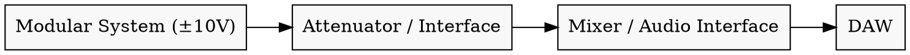

> [!TIP]  
> Always calibrate levels: avoid sending hot modular outputs directly into line inputs.  
> Use reference tones (~1 kHz sine) to align gain staging between modules and DAW.

---

### 8.2 DAW Synchronization

Synchronization keeps modular systems aligned with DAW timelines, MIDI devices, or other external sequencers.

#### Common Sync Methods

|Method|Description|Precision|Example Tools|
|---|---|---|---|
|**MIDI Clock / DIN Sync**|Traditional tempo and transport control|Medium|MIDI–CV interface, Pamela’s Pro Workout|
|**CV Clock / Reset**|Modular-native pulse synchronization|High|ALM Busy Circuits Pamela’s Pro Workout|
|**Audio Pulse Clock**|Square waves at fixed rate from DAW audio track|Very High|Silent Way, Bitwig CV Tools|
|**Ableton Link / Network Sync**|Wireless tempo sharing between devices|Variable|Bitwig, Ableton, iOS Apps|

#### Example Clock Distribution

```dot
digraph ClockSync {   rankdir=LR;   node [shape=box, style=filled, fillcolor="#eef5f9"];   DAW [label="DAW Clock Source"];   INT [label="MIDI-to-CV Interface"];   DIV [label="Clock Divider"];   MOD [label="Modular Sequencer"];   DAW -> INT -> DIV -> MOD; }
```

> [!TIP]  
> When syncing analog and digital gear, designate one **master clock source** only—avoid feedback loops between sync signals.

---

### 8.3 Multitrack Recording

#### Methods

1. **Direct Multi-Channel Capture:**
	- Use DC-coupled audio interfaces (e.g., Expert Sleepers ES-9, MOTU Ultralite AVB) to record multiple modular voices individually.

2. **Stem Recording:**
    - Submix within modular using performance mixers (e.g., WMD Performance Mixer, Befaco Hexmix) and record stereo stems.

3. **CV Recording:**
    - Record modulation as automation lanes in the DAW for later resynthesis or playback.

```dot
digraph Multitrack {   rankdir=LR;   node [shape=box, style=filled, fillcolor="#f5f5f5"];   OSC1 [label="Voice 1"];   OSC2 [label="Voice 2"];   MIX [label="Performance Mixer"];   ES9 [label="ES-9 Interface"];   DAW [label="DAW Multitrack"];   OSC1 -> MIX -> ES9 -> DAW;   OSC2 -> MIX; }
```

> [!TIP]  
> Record both **audio** and **control voltage** outputs when possible.  
> This allows re-modulation or re-synthesis later in post-production.

---

### 8.4 Hybrid Routing & Re-Processing

A modular system can function as a **signal processor** for external instruments, not just a sound source.

#### Common Techniques

- **External Audio In:** Route DAW or hardware synths through filters, wavefolders, delays.
- **Sidechain Control:** Use envelopes or CV from DAW to control modular VCAs or effects.
- **Re-Amp Path:** Send modular signals through analog pedals and back.

```dot
digraph HybridRouting {   rankdir=LR;   node [shape=box, style=filled, fillcolor="#f8f8f8"];   DAW [label="DAW Audio Out"];   INTF [label="Audio Interface CV Out"];   MOD [label="Eurorack Effects Chain"];   PED [label="Pedal / External FX"];   RETURN [label="DAW Audio In"];   DAW -> INTF -> MOD -> PED -> RETURN; }
```

> [!TIP]  
> Use attenuverters and VCAs to control modulation intensity from DAW automation.  
> This ensures consistent reprocessing gain and avoids clipping during recall.

---

### 8.5 Monitoring & Noise Management

#### Best Practices

- **Power Supply Quality:** Linear PSUs reduce hum and interference.
- **Grounding:** Shared ground between modular and audio interface eliminates hum loops.
- **Cable Management:** Separate audio from power cables; avoid running near transformers.
- **Balanced Outputs:** Use balanced TRS or XLR for long cable runs.

> [!TIP]  
> If you experience digital noise (e.g., USB hash), isolate your DAW and modular with a ground loop isolator or transformer-balanced DI.

---

### 8.6 Workflow Optimization

#### Recording Workflow

1. Patch exploratory sound design sessions freely.
2. Record long, evolving performances.
3. Slice and edit in DAW for arrangement.
4. Add mastering chain (EQ, compression, stereo enhancement).
#### Creative Hybrid Techniques

- **CV Sampling:** Record evolving modulation, loop or reverse in sampler.
- **Re-patching Automation:** Use MIDI controllers mapped to CV utilities for morphing.
- **Generative Capture:** Let the patch evolve autonomously, record for later curation.

> [!TIP]  
> Think of your modular like a _field of processes_—capture its behavior, not just its output.  
> Some of the best takes come from unplanned moments of instability.

---

### 8.7 Example Hybrid Studio Layout

```dot
digraph StudioLayout {   rankdir=LR;   node [shape=box, style=filled, fillcolor="#f5f5f5"];   SYNTH [label="Semi-Modular Synth"];   MOD [label="Eurorack Rack"];   INT [label="Audio/MIDI Interface"];   DAW [label="DAW (Bitwig / Ableton)"];   FX [label="Outboard FX / Mixer"];   MON [label="Studio Monitors"];   SYNTH -> MOD -> INT -> DAW -> FX -> MON; }
```

> [!TIP]  
> For maximum flexibility, use a **patchbay or modular matrix** (Bantam/TRS) to route between modular, DAW, and outboard gear without repatching cables.

---

### Summary Table

|Component|Role|Signal Domain|Integration Method|
|---|---|---|---|
|**Modular System**|Sound generation / CV modulation|±5–10 V (unbalanced)|Interface, attenuators|
|**Audio Interface**|Capture / playback|+4 dBu balanced|DC-coupled or DI boxes|
|**DAW**|Recording, sequencing, automation|Digital (0 dBFS)|CV Tools / MIDI|
|**Outboard FX**|Analog/digital processing|Line level|Re-amp or aux send|
|**Monitors / Mixer**|Output & monitoring|Balanced|TRS/XLR connections|

---

> [!TIP]  
> A hybrid modular studio merges **exploration** and **precision**—analog unpredictability inside a structured digital workflow.  
> Calibrate, clock, and record everything—then let generative behavior unfold freely within those boundaries.

## 9. Post-Analog Aesthetics & Generative AI

### Overview
“Post-analog” describes the current era of modular music in which **analog systems**, **digital computation**, and **artificial intelligence** coexist.  
The emphasis shifts from “sound design” to **system design**—creating frameworks that produce, adapt, and *learn* sonic behaviors.

---

### 9.1 Post-Analog Philosophy

**Definition:**  
Post-analog aesthetics combine the warmth and imperfection of analog voltage with the precision and repeatability of digital logic.

**Core Principles**
- Hybrid signal domains (analog + digital CV).  
- Feedback between hardware and software layers.  
- Machine learning as a *modulator* rather than composer.  
- Systems designed for emergence, not reproduction.

| Parameter | Analog | Digital | Post-Analog |
|------------|--------|----------|--------------|
| Control | Voltage | Data | Probabilistic algorithms |
| Interaction | Manual | Deterministic | Feedback-driven |
| Timbre | Continuous | Quantized | Hybrid spectral motion |
| Philosophy | Craft | Design | Ecology |

> [!TIP]
> The post-analog composer operates like a *gardener of systems*—planting interactions that grow on their own.

---

### 9.2 Algorithmic Probability

**Concept:**  
Algorithmic composition relies on **rules of probability** rather than fixed sequences.  
Modules such as Mutable *Marbles* or software like *TidalCycles* implement stochastic logic that produces *variation within boundaries.*

#### Key Techniques
- Weighted random CV (bias + spread).  
- Probability gates and event chance.  
- Markov chains for pitch or rhythm.  
- Rule-based recursion (patterns triggering new patterns).

```dot
digraph Probabilistic {
  rankdir=LR;
  node [shape=box, style=filled, fillcolor="#f5f5f5"];
  CLOCK [label="Clock"];
  RNG [label="Random Generator"];
  MARKOV [label="Markov / Logic"];
  QUANT [label="Quantizer"];
  VCO [label="Oscillator"];
  CLOCK -> RNG -> MARKOV -> QUANT -> VCO;
}
```

> [!TIP]  
> Adjust _probability density_ dynamically with a modulation source—turning randomness into rhythm.

---

### 9.3 Machine Learning & Neural Sound Systems

**Overview:**  
Machine learning introduces data-driven control, where models learn timbral relationships or performance gestures.

#### Approaches

- **Neural Synthesis:** Models (RAVE, DDSP, NSynth) generate new waveforms conditioned on training data.
- **Gesture Recognition:** ML models map controller movements or CV to complex parameter sets (Magenta ML4L, Wekinator).
- **Adaptive Control:** Reinforcement learning agents optimize patches for target timbres.
- **Audio Embeddings:** Represent timbre as multidimensional vectors for morphing and clustering.

```dot
digraph MLIntegration {   rankdir=LR;   node [shape=box, style=filled, fillcolor="#eef5f9"];   DATA [label="Training Data"];   MODEL [label="Neural Net"];   CONTROL [label="CV / MIDI Mapper"];   SYNTH [label="Modular System"];   OUTPUT [label="Audio Output"];   DATA -> MODEL -> CONTROL -> SYNTH -> OUTPUT; }
```

> [!TIP]  
> Use AI not as composer but as collaborator: feed it **control data**, not **musical scores**.  
> The best results arise when machine learning modulates, not dictates, behavior.

---

### 9.4 Generative Autonomy & Evolution

**Concept:**  
Generative autonomy means that the patch maintains _self-evolution_ without direct human intervention.

#### Techniques

- **Feedback loops:** audio and CV cross-feeding to create self-referential structures.
- **Adaptive logic:** logic gates and comparators re-patching control networks.
- **Probabilistic modulation:** stochastic CV guiding evolving form.
- **Evolutionary selection:** record multiple iterations, select best emergent results (Darwinian curation).

```dot
digraph Autonomy {   rankdir=LR;   node [shape=box, style=filled, fillcolor="#f8f8f8"];   MOD1 [label="Mod Source A"];   MOD2 [label="Mod Source B"];   COMP [label="Comparator"];   LOGIC [label="Logic Switch"];   FX [label="Delay / Feedback"];   OUT [label="Audio Out"];   MOD1 -> COMP -> LOGIC -> FX -> OUT;   FX -> MOD2 [label="Feedback CV"]; }
```

> [!TIP]  
> Record long takes of autonomous systems; their complexity often exceeds what can be consciously composed.

---

### 9.5 Human–Machine Collaboration

**Philosophy:**  
The future of modular synthesis is not automation but _interaction_.  
Human intention defines boundaries, while machines explore within them.

#### Hybrid Control Strategies

- Human gestural input → ML response modulation.
- Machine-generated CV → musician interprets or filters in real-time.
- Shared agency: artist curates, system generates.

|Control Level|Human Role|Machine Role|Example|
|---|---|---|---|
|Direct|Manual patching|Static modulation|Classic modular|
|Assisted|Live control + ML smoothing|Gesture mapping|Wekinator CV interface|
|Autonomous|High-level goals only|Self-generation|Reinforcement learning patch|

> [!TIP]  
> A “conversation patch” alternates between human and machine control: let the system lead for a while, then re-inject intention by changing a single connection.

---

### 9.6 AI-Driven Modular Composition Workflows

#### 1. Data Capture

Record long improvisations → extract CV and audio features (spectral centroid, pitch variance, modulation depth).

#### 2. Model Training

Train a neural network or ML model to predict new modulation curves or timbral envelopes.

#### 3. Real-Time Application

Map AI-generated CV to parameters such as filter cutoff, delay feedback, or probability density.

#### 4. Performance Loop

Monitor system output; intervene only when necessary to steer macro-form.

```dot
digraph AIWorkflow {   rankdir=LR;   node [shape=box, style=filled, fillcolor="#f5f5f5"];   CAP [label="Data Capture"];   TRAIN [label="ML Training"];   GEN [label="AI Modulator"];   PATCH [label="Modular Patch"];   OUT [label="Audio Output"];   CAP -> TRAIN -> GEN -> PATCH -> OUT; }
```

> [!TIP]  
> Keep the human in the loop: the **most compelling AI-modular systems** are those that preserve unpredictability within musical boundaries.

---

### 9.7 Conceptual Summary

|Domain|Technique|Goal|Outcome|
|---|---|---|---|
|**Probability**|Stochastic CV generation|Controlled randomness|Dynamic evolution|
|**Neural Synthesis**|AI-based sound generation|New timbres|Novel textures|
|**Adaptive Control**|ML parameter mapping|Expressive modulation|Human–machine synergy|
|**Evolutionary Patching**|Feedback + selection|Emergent structure|Self-organizing form|
|**Hybrid Interaction**|Shared control space|Collaboration|Live intelligence|

---

> [!TIP]  
> The post-analog paradigm reframes composition as _ecology_:  
> you don’t compose sounds—you **design relationships** among systems that listen and respond to each other.

## 10. Technical Appendix & Reference Material

### 10.1 Glossary of Core Terms

| Term | Definition |
|------|-------------|
| **VCO** | Voltage-Controlled Oscillator – produces periodic or complex waveforms controlled by CV. |
| **VCF** | Voltage-Controlled Filter – shapes the harmonic spectrum of an audio signal. |
| **VCA** | Voltage-Controlled Amplifier – scales amplitude or modulation depth via control voltage. |
| **LFO** | Low-Frequency Oscillator – modulation source below the audible range (< 20 Hz). |
| **EG / ENV** | Envelope Generator – produces time-based CV shapes (AD, ADSR, etc.). |
| **CV** | Control Voltage – continuous voltage used to modulate parameters (0–10 V typical). |
| **Gate / Trigger** | Digital-like voltage pulses that start envelopes or clocks (5–10 V). |
| **FM / PM** | Frequency or Phase Modulation – alters pitch or phase for complex timbres. |
| **Wavefolder** | Circuit that “folds” a waveform, adding overtones without filtering. |
| **LPG** | Low-Pass Gate – West-Coast module combining VCF + VCA + resonant damping. |
| **Quantizer** | Converts continuous CV into discrete semitone or scale steps. |
| **Attenuverter** | Bipolar attenuator allowing both scaling and inversion of CV. |
| **Clock Divider / Multiplier** | Derives slower or faster clocks from a master pulse. |
| **Logic Module** | Processes gates with Boolean operations (AND, OR, XOR). |
| **Sample & Hold** | Samples an input voltage at each trigger, producing stepped CV. |
| **Bipolar / Unipolar** | ± voltage vs 0–positive voltage ranges. |
| **DC-Coupled** | Connection passing both audio and control voltages. |

---

### 10.2 Voltage & Signal Standards

| Signal Type | Typical Range | Notes |
|--------------|----------------|-------|
| **Audio (Eurorack)** | ± 5 V to ± 10 V | ~10 V pp = +20 dBu |
| **Control Voltage (Pitch)** | 1 V/Octave | Each volt = 1 octave |
| **Envelope / Modulation CV** | 0–8 V | Often unipolar |
| **Gate / Trigger** | +5 V (on), 0 V (off) | Digital logic |
| **LFO** | ± 5 V typical | May run up to audio rates |
| **Clock Pulse** | 5–10 V positive spike | 1–24 PPQN standards |
| **Audio Interface Line Level** | +4 dBu (1.23 V RMS) | Requires attenuation |
| **Headroom Margin** | 6 dB minimum | Prevents clipping at converters |

> [!TIP]
> When interfacing modular with studio gear, attenuate roughly **10 : 1** to match modular to line level.

---

### 10.3 Patch Symbols & Conventions

| Symbol | Meaning | Example |
|---------|----------|----------|
| `→` | Signal flow (audio or CV) | VCO → VCF → VCA |
| `⟶` | Modulation path | LFO ⟶ VCF cutoff |
| `[A]` | Audio path node | [VCO] → [VCF] |
| `[C]` | Control signal node | [ENV] ⟶ [VCA CV] |
| `~` | Audio domain object (Max / PD) | `osc~`, `filter~` |
| `ΔV` | Voltage difference | Used for pitch intervals |

---

### 10.4 Canonical Patch Schematics

#### A. Subtractive Voice

```dot
digraph SubtractiveVoice {
  rankdir=LR;
  node [shape=box, style=filled, fillcolor="#f9f9f9"];
  VCO [label="VCO"];
  VCF [label="VCF"];
  VCA [label="VCA"];
  ENV [label="Envelope"];
  OUT [label="Audio Out"];
  VCO -> VCF -> VCA -> OUT;
  ENV -> VCA [label="Amplitude CV"];
  ENV -> VCF [label="Cutoff CV"];
}
```

#### B. FM Cross-Modulation

```dot
digraph CrossFM {   rankdir=LR;   node [shape=box, style=filled, fillcolor="#eef5f9"];   A [label="Osc A (Carrier)"];   B [label="Osc B (Modulator)"];   MIX [label="Mixer"];   OUT [label="Audio Out"];   B -> A [label="FM Input"];   A -> MIX -> OUT; }
```

#### C. Random + Quantized Melody

```dot
digraph RandomQuant {   rankdir=LR;   node [shape=box, style=filled, fillcolor="#f5f5f5"];   RAND [label="Random CV"];   QUANT [label="Quantizer"];   VCO [label="VCO"];   OUT [label="Out"];   RAND -> QUANT -> VCO -> OUT; }
```

> [!TIP]  
> Document your favorite patch structures using DOT or text diagrams directly in Obsidian; they serve as reproducible patch notes.

---

### 10.5 Reference Conversion Tables

#### Voltage to Frequency (1 V/Oct Standard)

|CV (V)|Frequency (Hz)|Note (approx.)|
|---|---|---|
|0 V|16.35 Hz|C0|
|1 V|32.70 Hz|C1|
|2 V|65.41 Hz|C2|
|3 V|130.81 Hz|C3|
|4 V|261.63 Hz|C4 (Middle C)|
|5 V|523.25 Hz|C5|
|6 V|1046.5 Hz|C6|
|7 V|2093.0 Hz|C7|

> [!TIP]  
> When calibrating oscillators, verify that a 1 V change produces exactly one octave.  
> Use a tuner or frequency counter for precision.

---

### 10.6 Modular Utility Functions (Quick Reference)

|Function|Patch Method|Modules|
|---|---|---|
|**Mixing CV**|Sum multiple mod sources → attenuate|A*B+C, Maths, Blinds|
|**Inversion**|Use attenuverter or negative offset|Shades, Triatt|
|**Offset**|Add DC bias to modulation|2hp Bias, Befaco A*B+C|
|**Slew / Glide**|Smooth stepped CVs|Maths, Function, Disting S&H|
|**Logic Combination**|Combine gates|Doepfer A-166, Mutable Kinks|
|**Envelope Follower**|Convert audio → CV|Ears, EnvFollower, Disting A|
|**Clock Division**|Derive rhythms|Pamela’s Pro Workout, Tempi|

---

### 10.7 Calibration & Maintenance

1. **Temperature Drift:** Allow analog oscillators ≈ 15 min warm-up.
2. **Power Supply:** Maintain < 80 % of rated load.
3. **Cable Hygiene:** Replace patch cables periodically—oxidation affects CV precision.
4. **Firmware Updates:** For digital modules, keep firmware current to avoid desync or latency drift.
5. **Backup Patches:** Photograph or diagram important patches for reproducibility.

> [!TIP]  
> A well-calibrated modular system behaves predictably enough to be _unpredictable with intent._

---

### 10.8 Recommended Reading & Resources

- **Allen Strange – Electronic Music: Systems, Techniques, and Controls**
- **Miller Puckette – The Theory and Technique of Electronic Music**
- **Curtis Roads – Microsound**
- **Kim Cascone – The Aesthetics of Failure**
- **Cycling ’74 Documentation** (Max/MSP)
- **VCV Rack Library & Wiki**
- **Mutable Instruments Technical Manuals**
- **Doepfer A-100 Technical Specifications**
- **Sound on Sound – Synth Secrets Series**

---

### 10.9 Closing Notes

The _Modular & Generative Systems Reference_ unifies the **technical**, **conceptual**, and **aesthetic** domains of modular synthesis.  
From patch cables to neural synthesis, the through-line is the pursuit of _agency within complexity._

> [!TIP]  
> The modular instrument is not a machine that plays music—it is an environment that **creates the conditions for music to happen**.

---

**End of Document**