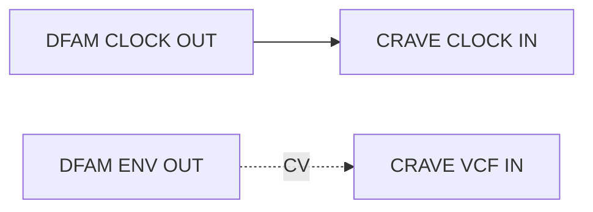
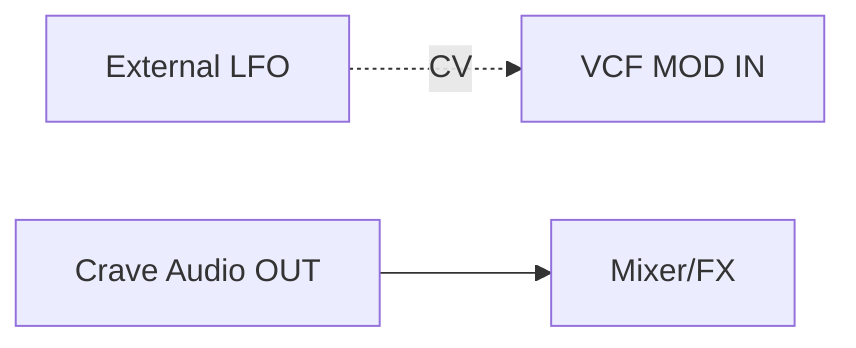

Comprehensive technical and musical reference for the Behringer Crave analog synthesizer.  
Structured in the same format as the *Moog Matriarch Reference*.

---

## Table of Contents
1. Design Lineage – From Mother-32 to Crave  
2. Overview & Architecture  
3. Signal Flow Diagram  
4. Voltage Controlled Oscillator (VCO)  
5. Filter (VCF)  
6. Envelope Generator (EG)  
7. Low Frequency Oscillator (LFO)  
8. Sequencer & Arpeggiator  
9. Patchbay Reference  
10. MIDI, Sync & USB Integration  
11. Integration & Patch Examples  
12. Quick Reference & Nomenclature  

---

## 1. Design Lineage – From Mother-32 to Crave
The **Crave** shares its design philosophy with the Moog Mother-32: a single analog oscillator, ladder filter,  
and a semi-modular patchbay intended for hands-on exploration.

> [!NOTE]  
> The Crave uses the same 3340 VCO core found in many classic synths, combined with Moog-style sequencing logic.

---

## 2. Overview & Architecture
The Crave is a **monophonic semi-modular analog synthesizer** with a 32-step sequencer.  
Core modules:
- 1 × VCO (3340)  
- 1 × Ladder VCF  
- 1 × ADS Envelope  
- 1 × LFO  
- 1 × 32-step Sequencer / Arpeggiator  
- 18-point patchbay  

---

## 3. Signal Flow Diagram


```mermaid
graph LR
  VCO["VCO (Saw/Square)"] --> MIX["Mixer"]
  MIX --> VCF["VCF (Ladder Filter)"]
  VCF --> VCA["VCA (Envelope Controlled)"]
  VCA --> OUT["Main Output"]

  LFO["LFO"] -.-> VCO
  LFO -.-> VCF
  EG["Envelope"] -.-> VCA

  classDef audio fill:#222,stroke:#888,color:#fff;
  classDef ctrl fill:#004477,stroke:#88c,color:#fff;
  class VCO,MIX,VCF,VCA,OUT audio;
  class LFO,EG ctrl;
  ```

  
  > [!TIP]  
> The Crave follows the traditional subtractive signal path: oscillator → filter → amplifier.

---

## 4. Voltage Controlled Oscillator (VCO)

|Control|Range|Description|
|---|---|---|
|**FREQUENCY**|8 Hz – 16 kHz|Coarse pitch tuning|
|**WAVE**|Saw / Square|Selects waveform|
|**PULSE WIDTH**|0–100 %|Available for square wave|
|**GLIDE**|0–10 s|Portamento time|
|**VCO MOD**|–|Depth of modulation from LFO or ENV|

> [!NOTE]  
> The VCO tracks 1 V/oct. The PITCH CV IN overrides the internal keyboard/sequence control.

---

## 5. Filter (VCF)

Classic 24 dB/oct transistor ladder filter.

|Parameter|Range|Description|
|---|---|---|
|**CUTOFF**|20 Hz–20 kHz|Filter frequency|
|**RESONANCE**|0–Self-osc|Emphasizes cutoff region|
|**VCF MOD SOURCE**|LFO / ENV|Selects modulation source|
|**VCF MOD AMOUNT**|–|Depth of modulation|
|**KB TRACK**|On/Off|Key tracking toggle|

> [!TIP]  
> At maximum resonance, the filter self-oscillates and can serve as a sine-wave source.

---

## 6. Envelope Generator (EG)

Single ADS envelope controlling the VCA and optionally the filter.

|Stage|Range|Function|
|---|---|---|
|**ATTACK**|1 ms – 10 s|Rise time|
|**DECAY**|1 ms – 10 s|Fall time|
|**SUSTAIN**|0–10|Hold level|
|**RELEASE**|1 ms – 10 s|Release time|

> [!TIP]  
> Patch **ENV OUT → VCF MOD IN** for traditional subtractive motion.

---

## 7. Low Frequency Oscillator (LFO)

|Parameter|Range|Description|
|---|---|---|
|**RATE**|0.01–30 Hz|Modulation speed|
|**WAVEFORM**|Tri / Square|Selects LFO shape|
|**DEPTH**|–|Modulation amount (patch-controlled)|

> [!NOTE]  
> The LFO can reach audio-rate modulation for FM-like effects.

---

## 8. Sequencer & Arpeggiator

32-step sequencer with storage for 16 patterns.  
Modes: **Play, Record, Rest, Tie, Arp.**

|Function|Operation|
|---|---|
|**PLAY/STOP**|Start or stop playback|
|**REC**|Enter record mode|
|**STEP**|Advance manually during record|
|**ARP MODE**|Up / Down / Random|
|**CLOCK DIV**|/1, /2, /4, /8 selectable|

> [!WARNING]  
> Entering Record overwrites the selected pattern immediately.

> [!TIP]  
> Use the internal clock or sync from MIDI Clock / analog CLK IN for tight integration.

---

## 9. Patchbay Reference

|Patch Point|Type|Range|Description|
|---|---|---|---|
|**VCO IN**|CV|1 V/oct|Pitch input|
|**VCF IN**|Audio|±5 V|External audio to filter|
|**VCF MOD IN**|CV|±5 V|Cutoff modulation|
|**VCA IN**|CV|0–8 V|Amplitude control|
|**LFO OUT**|CV|±5 V|LFO output|
|**ENV OUT**|CV|0–8 V|Envelope output|
|**OSC OUT**|Audio|±5 V|Raw oscillator output|
|**MIX OUT**|Audio|±5 V|Pre-filter signal|
|**AUDIO OUT**|Audio|Line|Final output|
|**CLOCK IN/OUT**|Gate|5 V|Sync signals|
|**GATE IN/OUT**|Gate|5 V|Envelope trigger|
|**VCF OUT**|Audio|±5 V|Post-filter output|

---

## 10. MIDI, Sync & USB Integration

- **MIDI In/Thru** : standard DIN 5-pin.
- **USB Type B** : class-compliant MIDI.
- **Clock In/Out** : 5 V pulses for analog sync.
- **MIDI CCs** (default mapping):
    - CC 74 = VCF Cutoff
    - CC 71 = Resonance
    - CC 1 = LFO Depth
    - CC 7 = Volume

> [!TIP]  
> The Crave can act as a USB-to-CV bridge: route MIDI notes to its internal CV bus or patch **VCO IN** for external control.

---

## 11. Integration & Patch Examples

### 11.1 Self-Modulated Bass

```mermaid
graph LR   
OSC["VCO OUT"] --> VCF   
LFO["LFO OUT"] -. CV .-> VCF   
ENV["ENV OUT"] -. CV .-> VCA`
```

> [!TIP]  
> High-rate LFO → VCF produces FM-style growl; set resonance ≈ 8.

---

### 11.2 Crave + DFAM – Clock Link and Filter Mod



> [!NOTE]  
> Crave runs in sync with DFAM’s rhythm; DFAM’s envelope shapes Crave’s cutoff for percussive syncopation.

---

### 11.3 External Eurorack LFO Control




> [!TIP]  
> Use a slow triangle wave for sweeping pads or a stepped LFO for rhythmic filter jumps.

---

## 12. Quick Reference & Nomenclature

### Core Controls

|Label|Alias|Type|Range|Description|
|---|---|---|---|---|
|VCO FREQ|VCO_FREQ|Knob|8 Hz–16 kHz|Oscillator tuning|
|WAVE|VCO_WAVE|Switch|Saw/Square|Waveform select|
|PULSE WIDTH|VCO_PW|Knob|0–100 %|For square wave|
|GLIDE|GLIDE|Knob|0–10 s|Portamento|
|VCF CUTOFF|VCF_CUTOFF|Knob|20 Hz–20 kHz|Filter cutoff|
|VCF RES|VCF_RES|Knob|0–10|Resonance|
|ATT/DEC/SUS/REL|ENV_x|Knobs|0–10|Envelope stages|
|LFO RATE|LFO_RATE|Knob|0.01–30 Hz|Mod speed|
|TEMPO|SEQ_TEMPO|Knob|20–300 BPM|Sequencer clock|

### Patch Points

|Point|Alias|Type|Range|
|---|---|---|---|
|VCO IN|PATCH_VCO_IN|CV|1 V/oct|
|VCF IN|PATCH_VCF_IN|Audio|±5 V|
|VCF MOD IN|PATCH_VCF_MOD|CV|±5 V|
|VCA IN|PATCH_VCA_IN|CV|0–8 V|
|LFO OUT|PATCH_LFO_OUT|CV|±5 V|
|ENV OUT|PATCH_ENV_OUT|CV|0–8 V|
|OSC OUT|PATCH_OSC_OUT|Audio|±5 V|
|MIX OUT|PATCH_MIX_OUT|Audio|±5 V|
|CLOCK IN/OUT|PATCH_CLK|Gate|5 V|
|GATE IN/OUT|PATCH_GATE|Gate|5 V|

### MIDI/CV Mapping

|Parameter|MIDI CC|CV Input|Description|
|---|---|---|---|
|Filter Cutoff|74|VCF MOD IN|Tone brightness|
|Resonance|71|–|Filter feedback|
|LFO Depth|1|–|Modulation amount|
|Volume|7|VCA IN|Output level|

---

_End of Behringer Crave – Reference Guide v1.0_