**Source**: Digitone II User Manual OS 1.00A (October 2024)

---
## Table of Contents

1. Safety and Power Guidelines  
2. Reading This Document  
3. Design Philosophy and Overview  
4. Front Panel Reference  
5. Introduction  
6. Connections and Setup  
7. User Interface Overview  
8. Projects, Sounds and Patterns  
9. Sequencer  
10. FM Engine (Operators and Algorithms)  
11. Filter Section  
12. Overdrive  
13. Effects  
14. Voice Setup Menu  
15. Sequencer Deep Features  
16. Song Mode  
17. Project and System Menus  
18. Startup Menu  
19. Setup Examples  
20. Performance Features  
21. Sound Pool and Sound Management  
22. MIDI Tracks  
23. Overbridge and Audio Routing  
24. Global and Project Settings  
25. MIDI Configuration and SysEx Transfer  
26. Appendix A – Machines Overview  
27. Extended Appendix  
  27.1 FX Parameter Reference  
  27.2 Mixer and Send FX Routing  
  27.3 LFO Destination Reference  
  27.4 Keyboard Scales  
  27.5 Expanded MIDI CC Map  
  27.6 Troubleshooting Addendum  
  27.7 Service and Maintenance  
28. Shortcuts and Key Combinations  
29. Document Information

---
## Safety and Power Guidelines

Before operating the Elektron Digitone II, carefully read these safety instructions to avoid damage or injury.

### Power Supply
- Use only the supplied Elektron 12 V DC, 2.5 A power adapter.
- Ensure voltage corresponds to your region’s mains supply.
- Disconnect power before cleaning or connecting/disconnecting cables.
- Do not expose the unit to moisture, direct sunlight, or heat sources.
- Avoid placing heavy objects on the power cable.

> Warning: Using third-party power supplies may cause permanent damage to the unit or create electrical hazards.

### Handling and Placement
- Operate the unit on a stable surface with adequate ventilation.
- Avoid extreme temperatures (operating range: 0–35 °C).
- Protect the display and encoders from excessive pressure.
- Always transport the instrument in a padded case.

### Restart Procedure
If the device becomes unresponsive:
1. Power off the unit.
2. Wait five seconds.
3. Power on again while holding [FUNC] to enter startup menu options.

If problems persist, perform a factory reset from the **Startup Menu** (see later section).

---

## Reading This Document

### Key Conventions
To maintain clarity, Elektron uses the following text conventions throughout this manual:

| Style | Meaning |
|--------|----------|
| **[KEY]** | Physical key or button on the front panel (e.g., [FUNC], [TRIG], [PAGE]) |
| *Menu Item* | Label found in on-screen menus or pages |
| **Parameter** | Editable value shown on display |
| `CODE` | Software or firmware identifier |
| > Tip: | Helpful advice or best practices |
| > Warning: | Important safety or data-loss prevention notice |

All parameter ranges (0–127, ±64, etc.) are based on Elektron’s internal 7-bit MIDI scale unless otherwise noted.

---

## Design Philosophy and Overview

The Digitone II combines **frequency modulation synthesis** with **Elektron’s hybrid subtractive workflow**.  
It was designed to make FM synthesis accessible, musical, and deeply programmable while retaining the immediacy of classic analog-style control.

### Key Concepts
- **Four-Operator FM Engine:** Re-imagined with simplified control groups and harmonics shaping.
- **Analog-Modelled Signal Path:** Digital tone generation routed through modeled filters and overdrive stages.
- **Performance Sequencer:** Real-time and step-based parameter automation with conditional logic.
- **Integration:** Full USB-C audio and MIDI streaming through Overbridge 2.0.

### Comparison to Original Digitone
| Feature | Digitone I | Digitone II |
|----------|-------------|-------------|
| FM Operators | 4 | 4 (expanded ratios, feedback per operator) |
| Filters | Single multimode | Multiple filter “machines” |
| Polyphony | 8 voices | 8 voices (optimized allocation) |
| Sequencer | Classic Elektron | Added probability, slides, microtiming |
| Overbridge | Limited | Full multi-channel audio |
| Hardware | USB-B | USB-C, redesigned encoders |

> Tip: Digitone II’s architecture bridges the clarity of analog subtractive synthesis with the richness of FM, encouraging exploration without requiring traditional operator theory.

---

## Front Panel Reference

### Overview
The Digitone II front panel follows Elektron’s layout logic:  
grouped sections for **synthesis**, **sequencing**, **effects**, and **navigation**.

### Controls and Sections
| Section | Description |
|----------|-------------|
| **DATA/LEVEL Encoder** | Adjusts parameter values or selects menu items |
| **A–H Encoders** | Context-sensitive parameter controls per page |
| **PAGE Keys (1–5)** | Navigate between parameter pages (SYN, FLTR, AMP, LFO, FX) |
| **[FUNC] Key** | Access secondary functions and shortcuts |
| **[YES]/[NO] Keys** | Confirm or cancel operations |
| **[TRIG 1–16] Keys** | Step sequencer trigs / note entry / pattern select |
| **[PLAY], [STOP], [REC]** | Transport control |
| **[TRACK 1–4] Keys** | Select synth track for editing |
| **[MIDI 1–4] Keys** | Select MIDI tracks |
| **[ARROW] Keys** | Move cursor and navigate screens |
| **[COPY], [PASTE], [CLEAR]** | Pattern and page editing commands |
| **[TEMPO], [CHAIN], [SONG]** | Global performance and arrangement functions |
| **[FUNC] + [TRIG] Combos** | Access microtiming, conditional trigs, and parameter locks |

> Tip: Pressing and holding [FUNC] temporarily reveals available shortcuts on the OLED display.

### Display and Indicators
- **OLED Screen:** Shows contextual parameters and active page.
- **Track LEDs:** Indicate selected track and playback state.
- **Trig LEDs:** Show active steps; colors correspond to note type or condition.
- **Parameter LEDs (A–H):** Reflect parameter modulation during playback.

### Rear Panel
| Connector | Function |
|------------|-----------|
| **L/R OUT** | Balanced ¼" TRS outputs for main audio |
| **L/R IN** | Balanced ¼" TRS inputs for external sources |
| **PHONES** | ¼" stereo headphone output |
| **MIDI IN / OUT / THRU** | Standard 5-pin DIN ports |
| **USB-C** | Overbridge audio/MIDI interface |
| **DC IN (12V)** | Power input |
| **POWER** | On/off toggle switch |

---

## Summary

This introductory block ensures your reference covers:
- All essential safety and operational conventions.  
- A high-level understanding of Digitone II’s design goals.  
- Complete labeling for every button, encoder, and connector.

Continue with your existing section **“Introduction”**, which now naturally follows this material.

---


---

## Introduction
Digitone II is an eight-voice digital FM synthesizer with subtractive filtering and an Elektron-style sequencer.  
It expands on the original Digitone by introducing deeper sound design tools, improved routing, additional filter types, and extended connectivity for both studio and stage.

### Key Improvements from Digitone I
- Enhanced 4-operator FM engine with refined envelopes.  
- Expanded filter section (multi-mode, comb, EQ).  
- Overhauled sequencer supporting micro-timing, probability, conditional trigs and song-mode.  
- USB-C audio via Overbridge 2.0.  
- Revised hardware interface and performance controls.  

## OVERVIEW

**Type**: Digital 8-voice FM Synthesizer with Subtractive Filtering  
**Manufacturer**: Elektron  
**Release**: 2024 (Digitone II)  
**Architecture**: 4-operator FM + Analog-modeled Filter + Effects

### Key Features
- **Voices**: 8-voice polyphony (distributed across 4 tracks)
- **Operators**: 4 operators per voice (Groups: C, A, B1, B2)
- **Algorithms**: 8 different routing configurations
- **Synthesis**: Frequency Modulation (FM) + Subtractive
- **Filter**: Analog-modeled multimode filter with overdrive
- **Sequencer**: 64-step sequencer with parameter locks
- **Effects**: Per-track (Chorus, Delay, Reverb, Overdrive) + Master effects
- **Integration**: Overbridge support, MIDI tracks for external gear

---

## Connections and Setup
### Rear-Panel Overview
| Label | Function |
|-------|-----------|
| **L/R OUT** | Balanced ¼" TRS main audio outputs |
| **L/R IN**  | Balanced ¼" TRS external inputs |
| **PHONES**  | ¼" stereo headphone output |
| **MIDI IN / OUT / THRU** | Standard 5-pin DIN MIDI ports |
| **USB-C** | MIDI + multi-channel audio (Overbridge) |
| **DC IN 12 V 2.5 A** | Power supply input |

### Initial Power-On
1. Connect audio outs or headphones.  
2. Insert the power plug and switch on.  
3. Wait for the splash screen; default project loads automatically.  

### Basic Configuration
Navigate via **[FUNC] + Settings > SYSTEM > ROUTING** to define:
- Output levels (Main, Headphones, USB).  
- Input monitoring and FX send routing.  
- Sync and MIDI I/O behavior.  

### External Clock and Sync
Digitone II can operate as **clock master** or **slave**:
- Enable **Receive Clock** and/or **Send Clock** in **MIDI CONFIG**.  
- Tempo range : 20 – 300 BPM.  

### Overbridge Setup (Quick)
1. Install Elektron Overbridge 2.0 Suite.  
2. Connect via USB-C and select **Overbridge Mode = ON** in System > USB Config.  
3. Choose Digitone II as audio device in DAW.  

---

## User Interface Overview
Digitone II follows Elektron’s consistent front-panel layout: sixteen trig keys, a data entry encoder, and per-track controls.

### Display and Navigation
- **OLED Screen** shows context-sensitive pages.  
- **PAGE Keys (1–5)** select parameter pages.  
- **[FUNC]** + key accesses shortcuts or secondary menus.  
- **LEVEL/DATA Encoder** adjusts highlighted parameter.  

### Tracks and Pages
- **4 Synth Tracks (T1–T4)**  
- **4 MIDI Tracks (M1–M4)**  
- Each synth track contains independent voice allocation, envelopes, LFOs and FX sends.  

### Core Controls
| Section | Function |
|----------|-----------|
| **TRIG Keys** | Step input / live recording / pattern launch |
| **ARROW Keys** | Navigate parameters and pages |
| **YES/NO** | Confirm / cancel |
| **[FUNC] + KEY** | Access alternate functions |
| **[TRACK] + TRIG** | Select track / mute / solo |
| **[SRC]/[SYN]/[FLTR]/[AMP]/[LFO]** | Open sound pages |
| **[PATTERN]/[CHAIN]/[SONG]** | Sequencer control modes |

---

## Projects, Sounds and Patterns

### Project Structure
A **Project** holds:
- Up to 128 patterns.  
- 128 sounds stored in the sound pool.  
- 16 kits of track settings (if enabled).  
- Global settings such as tempo, routing, and FX mix.  

Projects reside in non-volatile memory; switching projects reloads all patterns and sounds.

### Sounds and Sound Pool
Each **Sound** is a preset snapshot of a track’s parameters (SYN, FLT, AMP, LFO, FX).  
The **Sound Pool** contains up to 128 sounds for quick access in a project.  

Use **[FUNC] + SOUND BROWSER** to load sounds from the +Drive library, or **[FUNC] + SOUND MANAGER** to organize, rename, and tag presets.

### Patterns and Banks
- 16 patterns per bank (A–H).  
- Each pattern stores track data and parameter locks.  
- Patterns can be chained or arranged into songs.  

### Saving
Projects auto-save temporarily; use **[FUNC] + YES (SAVE PROJECT)** for permanent storage.  
Sounds and patterns must be saved explicitly to retain after power-off.

---

## Sequencer

### Overview
Elektron’s sequencer operates on a 64-step grid per track.  
Each step (trig) can store note, velocity, length, micro-timing, conditional logic and parameter locks.

### Step Recording
1. Select a track (T1–T4).  
2. Enter GRID RECORD mode ([REC] key lit).  
3. Use trig keys to place steps.  
4. Turn encoders to edit notes or parameters.

### Live Recording
1. Press [PLAY] + hold [REC].  
2. Play notes on external MIDI keyboard or trig keys.  
3. Sequencer records timing, velocity and automation.  

### Parameter Locks
Each step can store unique parameter values (“locks”).  
Press and hold a trig while adjusting knobs to record a lock.

### Trig Conditions
Conditional trigs determine whether a step plays:
- **1st / PRE / NEI / FILL / %** (Probability).  
- Used to create variation and human feel.  

### Micro-Timing
Shift individual steps forward/back (±23 microsteps).  
Access via **[FUNC] + TRIG > MICRO TIMING**.

### Note Length and Slides
- Hold TRIG + press next TRIG to tie notes.  
- **Parameter Slide:** interpolates locked values between steps.  

### Swing and Accent
Global or per-track swing adds groove; range 0–80%.  
Accent boosts velocity on selected trigs.  

### Pattern Scale
Each track can run at different length and timebase (micro-poly rhythms).  
Set via **[FUNC] + SCALE**.

### Copy, Paste and Clear
| Command | Keys |
|----------|------|
| Copy Pattern | [FUNC] + COPY |
| Paste Pattern | [FUNC] + PASTE |
| Clear Pattern | [FUNC] + CLEAR |
| Copy/Paste Page | Hold PAGE + FUNC + COPY/PASTE |

---
## FM Engine (Operators and Algorithms)

## 🎛️ SYNTHESIS ARCHITECTURE

### Signal Flow

```
┌─────────────┐
│  FM Engine  │  (4 Operators: C, A, B1, B2)
│  8 Algos    │
└──────┬──────┘
       │
       ▼
┌─────────────┐
│  Overdrive  │  (Per-track)
└──────┬──────┘
       │
       ▼
┌─────────────┐
│ Multimode   │  (LP/HP/BP/Notch + more)
│   Filter    │
└──────┬──────┘
       │
       ▼
┌─────────────┐
│  Base-Width │  (Stereo imaging)
│   Filter    │
└──────┬──────┘
       │
       ▼
┌─────────────┐
│     Amp     │  (AHDSR envelope)
└──────┬──────┘
       │
       ▼
┌─────────────┐
│   Effects   │  (Chorus, Delay, Reverb)
└─────────────┘
```

**Key Difference from Classic FM**: The Digitone II treats FM as a **complex tone generator** rather than a complete synthesizer voice. The signal then goes through a subtractive-style filter and amp section, making it more approachable than traditional FM synths.

---

## 🔢 OPERATORS

### Operator Groups

The Digitone II divides its 4 operators into 3 groups for simplified control:

| Group | Operators | Role | Ratio Range |
|-------|-----------|------|-------------|
| **C** | 1 operator | Usually Carrier | Mostly integers (0.5-16) |
| **A** | 1 operator | Carrier or Modulator | Extensive (0.25-16) |
| **B** | 2 operators (B1 + B2) | Modulators | 0.25-16 (both controlled together) |

### Operator Structure

Each operator contains:
```
┌───────────────────┐
│    OPERATOR       │
│                   │
│  ┌─────────────┐  │
│  │  Waveform   │  │ ← Sine by default, harmonics adjustable
│  │  (Sine +    │  │
│  │  Harmonics) │  │
│  └──────┬──────┘  │
│         │         │
│  ┌──────▼──────┐  │
│  │  Envelope   │  │ ← ADE or ASDE (Attack-Decay-End / Attack-Sustain-Decay-End)
│  │  (AD/ASD)   │  │
│  └──────┬──────┘  │
│         │         │
│  ┌──────▼──────┐  │
│  │  Feedback   │  │ ← Optional (adds harmonics)
│  └──────┬──────┘  │
│         │         │
│  ┌──────▼──────┐  │
│  │  Modulation │  │ ← Input from other operators
│  │    Input    │  │
│  └──────┬──────┘  │
│         │         │
│         ▼         │
│      Output       │
└───────────────────┘
```

### Operator Roles

**Carrier**: Generates the audible tone (output to X or Y)  
**Modulator**: Modulates another operator's frequency (adds harmonics)  
**Hybrid**: Can be both carrier and modulator simultaneously

---

## 🔀 ALGORITHMS (8 Total)

An **algorithm** is a routing configuration that determines how the 4 operators are connected.

### Algorithm Diagram Legend

```
┌─────────┐
│  B²     │  ← Operator B2
│  ─ ─ ─  │
│  B¹     │  ← Operator B1
│  ─────  │
│    A    │  ← Operator A
│  ─────  │
│    C    │  ← Operator C
└──┬───┬──┘
   X   Y     ← Output (two carrier outputs)
   
Line Types:
────── Filled line  = Amplitude affected by operator envelope
- - - - Dotted line = Amplitude NOT affected by envelope
```

### The 8 Algorithms

# Algorithm 1 - Dual Path FM con Feedback

## Spiegazione

L'**Algorithm 1** del Digitone II è una configurazione di sintesi FM a 4 operatori con doppio percorso parallelo e feedback.

### Struttura

**Percorso A (con feedback):**
- **Operatore A** modula se stesso (feedback loop) e poi modula l'operatore **C**
- Il feedback su A crea armoniche complesse e timbri più ricchi

**Percorso B:**
- **Operatore B²** modula **B¹**, che a sua volta modula **C**
- Questa catena permette modulazioni più complesse e stratificate

**Carrier finale:**
- **Operatore C** riceve modulazione sia da A che da B¹
- C è il carrier principale che produce l'output udibile su **X**

### Output
- **X**: Output principale del carrier C (linea tratteggiata = envelope-controlled)
- **Y**: Output ausiliario da B¹ (linea tratteggiata = envelope-controlled)

### Utilizzo tipico

Questo algoritmo è ideale per:

- Suoni metallici e percussivi (grazie al feedback su A)
- Timbri complessi con armoniche ricche
- Pad e texture evolute
- Bass con carattere e movimento

Il feedback su A aggiunge instabilità controllata, mentre la doppia modulazione su C offre grande versatilità timbrica.


# Algorithm 2 - Dual Carrier con Feedback su B²

## Spiegazione

L'**Algorithm 2** del Digitone II è una configurazione a doppio carrier indipendente con feedback su B².

### Struttura

**Percorso A (semplice):**

- **Operatore A** modula direttamente **C**
- Modulazione lineare senza feedback, per timbri più puliti e controllati

**Percorso B (con feedback):**

- **Operatore B²** modula se stesso (feedback loop) e poi modula **B¹**
- Il feedback su B² aggiunge complessità armonica e instabilità controllata

**Carrier duali:**

- **C** e **B¹** sono entrambi carrier indipendenti
- Non si modulano a vicenda, creando due voci timbriche separate

### Output

- **X**: Output principale del carrier C (linea tratteggiata = envelope-controlled)
- **Y**: Output indipendente dal carrier B¹ (linea tratteggiata = envelope-controlled)

### Utilizzo tipico

Questo algoritmo è ideale per:

- **Split sounds** con due timbri distinti (uno pulito da A→C, uno complesso da B²→B¹)
- **Layer di texture** con caratteri diversi
- **Bass + lead** simultanei con timbri complementari
- **Suoni percussivi duali** (kick + snare, hi-hat + clap)

La separazione dei due percorsi offre grande flessibilità nel mixaggio, mentre il feedback su B² permette di aggiungere aggressività e carattere al secondo timbro mantenendo il primo più pulito.

```dot
digraph G {
    rankdir=TB;
    node [shape=box, style=filled, fillcolor=black, fontcolor=white, width=0.8, height=0.8, fontname="Helvetica", fontsize=24];
    edge [color=black];
    
    A [label="A"];
    B2 [label="B²"];
    B1 [label="B¹"];
    C [label="C"];
    
    X [shape=circle, label="X", fillcolor=white, fontcolor=black, fontname="Helvetica", fontsize=20];
    Y [shape=circle, label="Y", fillcolor=white, fontcolor=black, fontname="Helvetica", fontsize=20];
    
    // Connessioni solide
    A -> C;
    B2 -> B1;
    
    // Feedback su B2
    B2 -> B2 [constraint=false];
    
    // Connessioni tratteggiate
    C -> X [style=dashed];
    B1 -> Y [style=dashed];
    
    // Layout
    {rank=same; A; B2}
}
```



# Algorithm 3 - Multi-Modulator con Feedback

## Spiegazione

L'**Algorithm 3** del Digitone II è una configurazione con un singolo modulatore che controlla tutti gli altri operatori, arricchito da feedback.

### Struttura

**Operatore A (master modulator con feedback):**

- **Operatore A** modula se stesso (feedback loop) per armoniche complesse
- A modula contemporaneamente **C**, **B²** e **B¹**
- È il cuore dell'algoritmo, controllando l'intero timbro

**Carrier multipli:**

- **C** e **B²** sono carrier che convergono sull'output **X**
- **B¹** è un carrier indipendente che va all'output **Y**
- Nessun operatore modula gli altri oltre ad A

### Output

- **X**: Output combinato di C e B² (entrambi modulati da A)
- **Y**: Output indipendente di B¹ (modulato da A)

### Utilizzo tipico

Questo algoritmo è ideale per:

- **Timbri uniformemente complessi** dove tutti gli operatori condividono la stessa sorgente di modulazione
- **Pad evolutivi** con texture coerenti
- **Droni armonici** ricchi e stratificati
- **Suoni metallici sincronizzati** dove il feedback su A aggiunge brillantezza
- **Lead monofonici** con carattere aggressivo

Il feedback su A garantisce che tutta la complessità armonica sia distribuita uniformemente su tutti i carrier, creando timbri densi ma coerenti. La separazione tra output X (doppio carrier) e Y (singolo) offre possibilità di mixaggio interessanti.

```dot
digraph G { 
rankdir=TB; 
node [shape=box, style=filled, fillcolor=black, fontcolor=white, width=0.8, height=0.8, fontname="Helvetica", fontsize=24]; 
edge [color=black]; 
A [label="A"]; 
C [label="C"];
B2 [label="B²"]; 
B1 [label="B¹"];  
X [shape=circle, label="X", fillcolor=white, fontcolor=black, fontname="Helvetica", fontsize=20]; 
Y [shape=circle, label="Y", fillcolor=white, fontcolor=black, fontname="Helvetica", fontsize=20]; 
// Connessioni solide 
A -> C; 
A -> B2; 
A -> B1; 
// Feedback su A 
A -> A [constraint=false]; 
// Connessioni tratteggiate 
C -> X [style=dashed]; 
B2 -> X [style=dashed]; 
B1 -> Y [style=dashed]; 
}
```




# Algorithm 4 - Catena Sequenziale con Feedback

## Spiegazione

L'**Algorithm 4** del Digitone II è una configurazione a catena lineare dove ogni operatore modula il successivo, con feedback all'inizio della catena.

### Struttura

**Catena di modulazione completa:**

- **Operatore B²** modula se stesso (feedback loop) e avvia la catena
- **B²** → **B¹** → **A** → **C**
- Ogni operatore amplifica e trasforma la modulazione del precedente
- Modulazione "a cascata" per timbri estremamente complessi

**Carrier principale:**

- **C** è il carrier finale che riceve tutta la modulazione accumulata
- **A** funge da carrier intermedio con output separato

### Output

- **X**: Output principale del carrier finale C (modulazione massima)
- **Y**: Output ausiliario dal carrier intermedio A (modulazione parziale)

### Utilizzo tipico

Questo algoritmo è ideale per:

- **Timbri molto complessi e densi** con armoniche stratificate
- **Suoni evoluti e imprevedibili** grazie alla catena completa
- **Bass profondi e distorti** con il feedback su B²
- **Lead aggressivi** con saturazione armonica
- **Effetti sonori** e texture sperimentali
- **Pad drammatici** con grande profondità

Il feedback su B² all'inizio della catena crea instabilità che si propaga attraverso tutti gli operatori, risultando in timbri ricchissimi ma potenzialmente caotici. L'output Y da A permette di monitorare uno stadio intermedio della modulazione, offrendo interessanti possibilità di layering tra suono "parziale" e "completo".


# Algorithm 5 - Doppia Modulazione con Feedback

## Spiegazione

L'**Algorithm 5** del Digitone II è una configurazione con doppio percorso di modulazione convergente, con feedback su B¹.

### Struttura

**Operatore B¹ (sorgente con feedback):**

- **Operatore B¹** modula se stesso (feedback loop) per armoniche complesse
- B¹ modula sia **B²** che direttamente **A**
- Crea due percorsi paralleli di modulazione dalla stessa sorgente

**Doppio percorso convergente:**

- **Percorso diretto**: B¹ → A
- **Percorso indiretto**: B¹ → B² → A
- Entrambi i percorsi convergono su **A**, che poi modula il carrier finale **C**

**Carrier principale:**

- **C** riceve la modulazione combinata e produce l'output principale
- **A** funge anche da carrier intermedio con output separato

### Output

- **X**: Output principale del carrier C (modulazione completa e stratificata)
- **Y**: Output ausiliario dal carrier intermedio A (mix dei due percorsi)

### Utilizzo tipico

Questo algoritmo è ideale per:

- **Timbri ricchi con interferenze** create dai due percorsi paralleli
- **Lead espressivi** con dinamica complessa
- **Bass con movimento** grazie alla doppia modulazione
- **Pad densi e corposi** con battimenti armonici
- **Suoni percussivi articolati** (snare, toms con corpo)
- **Texture evolute** con sfumature continue

Il feedback su B¹ alla sorgente garantisce complessità che si propaga attraverso entrambi i percorsi. La convergenza su A crea interferenze e battimenti tra le due catene di modulazione, risultando in timbri particolarmente ricchi e dinamici. L'output Y permette di ascoltare il punto di convergenza prima del carrier finale.

```dot
digraph G {
    rankdir=TB;
    node [shape=box, style=filled, fillcolor=black, fontcolor=white, width=0.8, height=0.8, fontname="Helvetica", fontsize=24];
    edge [color=black];
    
    A [label="A"];
    B2 [label="B²"];
    B1 [label="B¹"];
    C [label="C"];
    
    X [shape=circle, label="X", fillcolor=white, fontcolor=black, fontname="Helvetica", fontsize=20];
    Y [shape=circle, label="Y", fillcolor=white, fontcolor=black, fontname="Helvetica", fontsize=20];
    
    // Connessioni solide
    B1 -> B2;
    B2 -> A;
    B1 -> A;
    A -> C;
    
    // Feedback su B1
    B1 -> B1 [constraint=false];
    
    // Connessioni tratteggiate
    C -> X [style=dashed];
    A -> Y [style=dashed];
}
```




# Algorithm 6 - Parallelo Simmetrico con Feedback

## Spiegazione

L'**Algorithm 6** del Digitone II è una configurazione perfettamente simmetrica dove due modulatori paralleli controllano gli stessi carrier, con feedback su A.

### Struttura

**Modulatori paralleli:**

- **Operatore A** modula se stesso (feedback loop) e poi modula sia **B¹** che **C**
- **Operatore B²** modula gli stessi target: **B¹** e **C**
- Architettura simmetrica e bilanciata

**Carrier duali con doppia modulazione:**

- **C** riceve modulazione da entrambi A e B²
- **B¹** riceve modulazione da entrambi A e B²
- Ogni carrier ha caratteristiche timbriche identiche ma produce output separati

### Output

- **X**: Output dal carrier C (doppia modulazione da A e B²)
- **Y**: Output dal carrier B¹ (doppia modulazione da A e B²)

### Utilizzo tipico

Questo algoritmo è ideale per:

- **Split stereo** con timbri identici ma mixabili separatamente
- **Unisono ricco** combinando X e Y per spessore
- **Pad larghi e corposi** con doppio layer
- **Lead potenti** con presenza stereo
- **Rhodes/EP elettrici** con carattere vintage
- **Bells e mallets** con risonanza naturale
- **Dual voice arrangements** dove X e Y suonano note diverse

Il feedback su A aggiunge complessità armonica al primo modulatore, creando una leggera asimmetria timbrica tra i due modulatori che arricchisce il suono. La perfetta simmetria delle connessioni permette di ottenere due voci praticamente identiche ma controllabili indipendentemente in fase di mix, ideale per creare spazialità e profondità.

```dot
digraph G {
    rankdir=TB;
    node [shape=box, style=filled, fillcolor=black, fontcolor=white, width=0.8, height=0.8, fontname="Helvetica", fontsize=24];
    edge [color=black];
    
    A [label="A"];
    C [label="C"];
    B2 [label="B²"];
    B1 [label="B¹"];
    
    X [shape=circle, label="X", fillcolor=white, fontcolor=black, fontname="Helvetica", fontsize=20];
    Y [shape=circle, label="Y", fillcolor=white, fontcolor=black, fontname="Helvetica", fontsize=20];
    
    // Connessioni solide
    A -> B1;
    A -> C;
    B2 -> B1;
    B2 -> C;
    
    // Feedback su A
    A -> A [constraint=false];
    
    // Connessioni tratteggiate
    C -> X [style=dashed];
    B1 -> Y [style=dashed];
    
    // Layout
    {rank=same; A; B2}
}
```





# Algorithm 7 - Dual Path con Output Misti

## Spiegazione

L'**Algorithm 7** del Digitone II è una configurazione a doppio percorso indipendente dove modulatori e carrier si mescolano direttamente agli output.

### Struttura

**Percorso A (con feedback):**

- **Operatore A** modula se stesso (feedback loop)
- A modula il carrier **C**
- A va anche direttamente all'output **X** (connessione solida = sempre attivo)

**Percorso B:**

- **Operatore B²** modula il carrier **B¹**
- B² va anche direttamente all'output **Y** (connessione solida = sempre attivo)

**Mix agli output:**

- **X** riceve sia A (diretto) che C (modulato da A)
- **Y** riceve sia B² (diretto) che B¹ (modulato da B²)

### Output

- **X**: Mix di modulatore A + carrier C (linea tratteggiata da C = envelope-controlled)
- **Y**: Mix di modulatore B² + carrier B¹ (linea tratteggiata da B¹ = envelope-controlled)

### Utilizzo tipico

Questo algoritmo è ideale per:

- **Timbri ibridi** che combinano modulatore e carrier
- **Suoni metallici brillanti** con presenza del modulatore
- **Bass con sub** (modulatore = sub, carrier = armoniche)
- **Lead cutting** con edge aggressivo
- **Percussion complesse** con transiente + risonanza
- **Noise + tone** combinations per effetti speciali
- **Dual-layer sounds** con caratteri complementari

Il feedback su A arricchisce il percorso sinistro, mentre la presenza diretta dei modulatori A e B² negli output crea timbri particolarmente brillanti e aggressivi. Questa configurazione è unica perché permette di bilanciare la "purezza" del modulatore con la complessità del carrier modulato, offrendo grande versatilità timbrica attraverso il controllo degli envelope.

```dot
digraph G {
    rankdir=TB;
    node [shape=box, style=filled, fillcolor=black, fontcolor=white, width=0.8, height=0.8, fontname="Helvetica", fontsize=24];
    edge [color=black];
    
    A [label="A"];
    B2 [label="B²"];
    B1 [label="B¹"];
    C [label="C"];
    
    X [shape=circle, label="X", fillcolor=white, fontcolor=black, fontname="Helvetica", fontsize=20];
    Y [shape=circle, label="Y", fillcolor=white, fontcolor=black, fontname="Helvetica", fontsize=20];
    
    // Connessioni solide
    A -> C;
    B2 -> B1;
    A -> X;
    B2 -> Y;
    
    // Feedback su A
    A -> A [constraint=false];
    
    // Connessioni tratteggiate
    C -> X [style=dashed];
    B1 -> Y [style=dashed];
    
    // Layout
    {rank=same; A; B2}
}
```




# Algorithm 8 - Tri-Carrier Indipendente

## Spiegazione

L'**Algorithm 8** del Digitone II è una configurazione minimalista con tre carrier quasi completamente indipendenti e un singolo percorso di modulazione.

### Struttura

**Percorso modulato:**

- **Operatore A** modula il carrier **C**
- C produce output su **X** (linea tratteggiata = envelope-controlled)

**Carrier diretti:**

- **Operatore B²** va direttamente all'output **X** (connessione solida = sempre attivo)
- **Operatore B¹** modula se stesso (feedback loop) e va all'output **Y** (connessione solida = sempre attivo)

**Architettura ibrida:**

- **X** riceve sia B² (diretto) che C (modulato da A)
- **Y** riceve solo B¹ (con feedback su se stesso)
- Tre "voci" essenzialmente indipendenti

### Output

- **X**: Mix di carrier diretto B² + carrier modulato C
- **Y**: Carrier B¹ con feedback (completamente indipendente)

### Utilizzo tipico

Questo algoritmo è ideale per:

- **Three-voice layering** con controllo individuale
- **Bass + mid + high splits** per suoni stratificati
- **Kick + bass combinations** (B¹ = kick con feedback, A→C = bass, B² = sub o high)
- **Additive-style synthesis** con tre sorgenti quasi pure
- **Organi elettrici** con drawbars virtuali
- **Pad semplici ma ricchi** con tre layer sottili
- **Minimalismo timbrico** con massima separazione

Il feedback su B¹ lo rende il carrier più complesso armonicamente, mentre B² rimane completamente puro e A→C offre modulazione FM tradizionale. Questo algoritmo è perfetto quando si desidera massima indipendenza tra gli operatori, permettendo di costruire timbri additivi o layer completamente separati. È l'algoritmo più "aperto" e flessibile per sound design creativo.


---

## FM PARAMETERS (SYN PAGE 1)

### RATIO C
**Range**: 0.5 - 16.0 (mostly integers)  
**Function**: Sets the frequency ratio for operator C  
**Details**: Limited mostly to integers since C typically carries the base note

### RATIO A
**Range**: 0.25 - 16.0 (extensive)  
**Function**: Sets the frequency ratio for operator A  
**Details**: More extensive range for inharmonic relationships

### RATIO B (B1 and B2)
**Range**: 0.25 - 16.0 (dual control)  
**Function**: Controls both B1 and B2 ratios simultaneously  
**Behavior**: 
- B2 increases from 0.25 to 16.0 first
- When B2 reaches 16.0, it resets to 0.25 and B1 increments
- Like a clock: B2 is the "minute hand", B1 is the "hour hand"
- Continues until both reach maximum (16.0)

**Example sequence**:
```
Value 0:   B1=0.25, B2=0.25
Value 32:  B1=0.25, B2=8.00
Value 64:  B1=0.25, B2=16.00  ← B2 maxed, B1 increments
Value 65:  B1=0.50, B2=0.25   ← B2 resets
Value 96:  B1=0.50, B2=16.00
Value 97:  B1=0.75, B2=0.25
...
Value 127: B1=16.00, B2=16.00 ← Both maxed
```

### HARM (Harmonics)
**Range**: -26.00 to +26.00 (bipolar)  
**Function**: Adds upper partials to operators  
**Behavior**:
- **Negative values** (-26 to 0): Change operator C harmonics
- **Positive values** (0 to +26): Change operators A and B1 harmonics
- Intermediate values interpolate between harmonics (wavetable-like)

**Harmonic Series**:
```
-26 ──────────────── 0 ──────────────── +26
     Operator C         Operators A, B1
     
Series progression:
1. Sine (pure)
2. Saw reduction
3. Odd/Even mix
4. Square (odd partials)
5. Square reduction
6. Bell tones
7. Saw (all partials)
```

**Additive Synthesis Method**:
```
Sine:       1st partial only
            ▂

Saw:        All partials, decreasing amplitude
            ▂▁▁▁▁▁

Square:     Odd partials only
            ▂ ▁ ▁ ▁

Bell:       Custom partial selection
            ▂  ▁▁  ▁
```

### DTUN (Detune)
**Range**: -64 to +64  
**Function**: Detunes operators A and B2  
**Behavior**:
- Values 0-64: Subtle detuning (chorus effect)
- Values >64: Heavy detuning (creates dissonance)
- Adds movement and width to sounds

### FDBK (Feedback)
**Range**: 0-127  
**Function**: Self-modulation amount for operator with feedback  
**Effect**: 
- Adds harmonics and brightness
- Creates aggressive, sharp timbres
- Operator with feedback shown in algorithm diagram (feedback loop symbol)
- Can turn sine wave into saw/square-like waveforms

### MIX
**Range**: -64 to +64 (bipolar)  
**Function**: Crossfades between X and Y outputs  
**Behavior**:
- **-64**: Only X output (from first carrier)
- **0**: 50/50 mix of X and Y
- **+64**: Only Y output (from second carrier)
- Allows morphing between two different timbres created by different operators

---

## OPERATOR ENVELOPES (SYN PAGE 2)

### Envelope Groups

**Envelope A**: Controls operator A modulation  
**Envelope B**: Controls both B1 and B2 modulation (macro-mapped)

### Envelope Types

**ADE (Triggered)**:
```
Level
  │     ╱╲
  │    ╱  ╲____
  │   ╱         ╲___ End Level
  │  ╱               ╲___
  └──┴────┴────┴────┴────── Time
     Atk  Dec       
     
Note On only (ignores Note Off)
```

**ASDE (Gated)**:
```
Level
  │     ╱─────╲
  │    ╱       ╲____
  │   ╱   Sus        ╲___ End Level
  │  ╱                   ╲___
  └──┴────┴────┴────┴────┴── Time
     Atk       Dec    Rel
     │◄──Note On──►│◄─Note Off─►│
     
Responds to Note On and Note Off
```

### Parameters

**ATCK (Attack)**
- Time to reach peak modulation level
- Range: 0 - 127 (0ms - several seconds)

**DEC (Decay)**
- Time to decay from peak to sustain/end level
- Range: 0 - 127

**END** (End Level)
- Final modulation level
- Range: 0 - 127
- **Key difference from standard AD**: Doesn't go to zero
- Allows sustained modulation after initial pluck

**LEV (Level)**
- Maximum modulation amount
- Range: 0 - 127
- Acts as sustain level in gated mode

**ATRG/BTRG** (Trigger Mode)
- ON: ADE mode (triggered)
- OFF: ASDE mode (gated)

**ARST/BRST** (Reset on Retrigger)
- ON: Envelope resets to zero when retriggered
- OFF: Envelope continues from current position

```
Reset ON:
  ╱╲     ╱╲
 ╱  ╲   ╱  ╲
▼   ▼  ▼   ▼
Trig1  Trig2

Reset OFF:
  ╱╲   ╱──╲
 ╱  ╲ ╱    ╲
▼   ▼▼     ▼
Trig1 Trig2
```

### B Level Macro Mapping

The **LEV B** parameter controls both B1 and B2 levels:

```
Level
127 ┤         ╱────── B2
    │       ╱
    │     ╱
64  │   ╱       B1 ───╲
    │ ╱                 ╲
0   ┴─────┬──────┬──────┬─── Parameter Value
         43     64     85
```

- Values 0-43: Only B1 increases (B2 = 0)
- Values 43-85: B1 maxes out, B2 starts increasing  
- Values 85-127: B2 continues to max

---

## Filter Section

### Overview
Digitone II integrates an analog-modelled multimode filter after the FM engine.
It provides several “machines”, each implementing a different response curve or topology.  
The filter affects both the amplitude and harmonic content of each track before the amplifier stage.

### Filter Machines
| Machine | Description | Use |
|----------|--------------|-----|
| **MULTI-MODE** | 12 / 24 dB LP, HP, BP, Notch, Peak | Versatile tone shaping |
| **LOWPASS 4** | Classic four-pole ladder LP | Smooth, warm response |
| **LEGACY LP/HP** | Original Digitone filter (Digitone I) | Vintage compatibility |
| **COMB − / COMB +** | Short-delay resonant comb filters | Metallic / flanging textures |
| **EQUALIZER** | Parametric EQ type | Surgical frequency control |
**MULTI-MODE** (Default):
- LP (Low Pass): 12dB/24dB slopes
- HP (High Pass): 12dB/24dB slopes
- BP (Band Pass)
- Notch
- Peak

**LOWPASS 4**:
- Classic 4-pole low pass
- Analog-modeled Moog-style

**LEGACY LP/HP**:
- Original Digitone filter (from Digitone I)
- Character from first generation

**COMB-** and **COMB+**:
- Comb filtering
- Creates metallic, resonant sounds

**EQUALIZER**:
- Parametric EQ
- Tone shaping
### Parameters
| Parameter | Range | Function |
|------------|--------|----------|
| **FREQ** | 0–127 | Cutoff frequency (≈ 20 Hz – 20 kHz) |
| **RES** | 0–127 | Resonance amount, self-oscillates near max |
| **ENVD** | –64 … +64 | Envelope depth (bipolar) |
| **FENV A/D/S/R** | 0–127 | Filter envelope stages |
| **TRCK** | 0–100 % | Keyboard tracking amount |
| **BASE** | 0–127 | Base frequency offset |
| **WIDTH** | 0–127 | Stereo filter spread |
**FREQ (Frequency/Cutoff)**
- Filter cutoff frequency
- Range: 0-127
- 20 Hz - 20 kHz (approximately)

**RES (Resonance)**
- Emphasis at cutoff frequency
- Range: 0-127
- Self-oscillates at maximum

**ENVD (Envelope Depth)**
- Amount of filter envelope modulation
- Bipolar: -64 to +64
- Negative: Inverted envelope

**FENV (Filter Envelope)**: ADSR
- Attack, Decay, Sustain, Release
- Modulates filter cutoff
- Independent from operator envelopes

**TRCK (Key Tracking)**
- Makes filter follow keyboard pitch
- 0%: Static filter (same cutoff for all notes)
- 100%: Full tracking (filter moves with pitch)
- Useful for maintaining brightness across octaves

**BASE and WIDTH**:
- **BASE**: Starting frequency for tracking
- **WIDTH**: Stereo width of filter
- Create stereo movement
### Filter Envelope Behaviour
The envelope modulates cutoff in accordance with the ENVD parameter.  
Positive values open the filter on attack; negative values invert the motion.  
Independent from operator envelopes, it allows shaping brightness over time.

### Usage Tips
- Combine high resonance with slow attack for evolving pads.  
- Negative ENVD values yield “reverse” sweeps.  
- COMB machines respond strongly to pitch—use key-tracking ≈ 50 % for tuned resonances.  
- LP 4 paired with slight overdrive emulates analog ladder saturation.

---

## Overdrive

### Position in Signal Path
Placed between the FM engine and the filter input.

### Type and Behaviour
Analog-modelled soft-clipping circuit.  
Range 0–127 controls drive amount.

| Setting | Character |
|----------|------------|
| 0–20 | Transparent warmth |
| 20–60 | Classic analog saturation |
| 60–100 | Heavy distortion, harmonic compression |
| 100–127 | Extreme clipping, useful for percussion |

### Routing
Can operate pre- or post-filter (set in **SYSTEM > ROUTING > OVERDRIVE POS**).

**Pre-Filter:** adds harmonics before filtering (warmer).  
**Post-Filter:** applies saturation after tone shaping (sharper).  

Recommended moderate values (30–50 %) for harmonic enhancement without harshness.

---

## Effects

### Architecture
Each synth track provides individual sends to three per-track effects—Chorus, Delay, Reverb—plus a shared master compressor.  
Effects are processed digitally at 48 kHz / 24-bit.

### Effect Routing
Send levels per effect are stored per pattern.

### Chorus
| Parameter | Description |
|------------|-------------|
| **DEPTH** | Modulation depth of detuned voices |
| **SPEED** | LFO rate controlling modulation |
| **HPF** | High-pass filter to remove low end from effect |
| **WIDTH** | Stereo spread (0 = mono, 127 = wide) |

Use subtle depth (≈ 20–40) for natural widening; high values for ensemble effects.

### Delay
| Parameter | Description |
|------------|-------------|
| **TIME** | Delay time (tempo-synced or free) |
| **FEEDBACK** | Number of repeats |
| **HPF / LPF** | Tone shaping within feedback path |
| **PINGPONG** | Alternate repeats between L and R channels |
| **SEND-TO-REV** | Feeds delay output into reverb input |

Free-time range ≈ 2 ms – 2 s; in sync mode values correspond to note divisions.

### Reverb
| Parameter | Description |
|------------|-------------|
| **PRE-DELAY** | Time before reflections begin |
| **DECAY** | Reverberation length |
| **SHELVE HF/LF** | High/low-frequency damping |
| **HPF / LPF** | Additional tone control |
| **SIZE** | Virtual space dimension |

All tracks share the same reverb algorithm; individual send levels determine contribution.

### Master Compressor
Located on the main output bus.  
Controls include **THRESH**, **RATIO**, **ATTACK**, **RELEASE**, **GAIN**, and optional **SIDECHAIN**.  
Used to glue tracks together and control peaks in live performance.

---
## Voice Setup Menu

Digitone II allocates its eight voices dynamically across the four synth tracks.  
The **Voice Setup** menu provides per-track control over how these voices behave.

### Access
Press [FUNC] + [AMP] → select *VOICE SETUP*.

### Parameters
| Parameter | Range | Description |
|------------|--------|-------------|
| **VOICES** | 1 – 8 | Maximum number of voices available to this track |
| **UNISON** | OFF / 2–4 | Layers multiple voices per note for thick sound |
| **DETUNE** | 0–127 | Detuning amount between unison voices |
| **VOICE LOCK** | OFF / ON | Locks a note to a specific voice (for consistency) |
| **VOICE STEAL** | OFF / ON | Allows older notes to be replaced when all voices are used |

> Tip: enable *UNISON 2* or *3* for chorused leads or pads; *VOICE LOCK* ensures stable stereo imaging in layered patches.

---

## Sequencer Deep Features

Beyond step recording and parameter locks, several advanced options enhance live composition and groove.

### Quantize
Adjusts how live-recorded notes snap to the sequencer grid.

| Mode | Function |
|-------|-----------|
| **LIVE QUANT** | Rounds recorded notes to nearest step |
| **OFF** | Captures precise timing (micro-timing retained) |
| **REC THRESHOLD** | Sets minimum velocity required to record |

Access: [FUNC] + [REC] → *QUANTIZE MENU*.

### Micro-Timing
Offsets any trig up to ±23 microsteps.

- Hold [TRIG] + press [LEFT]/[RIGHT] or use encoder A.  
- Useful for humanizing drum hits or creating flams.

> Tip: combine micro-timing with retrig for shuffle-style swing.

### Fill Mode
Temporarily activates trigs with condition “FILL”.

- Hold [PAGE] + press [YES] to enable Fill Mode.  
- Automatically disengages when pattern stops.

### Temporary Save / Reload
Digitone II keeps a temporary snapshot of every pattern.

| Action | Keys | Effect |
|---------|------|--------|
| Temp Save | [FUNC] + [YES] | Stores current pattern state |
| Temp Reload | [FUNC] + [NO] | Reverts to last saved state |
| Full Save | [FUNC] + [SAVE PROJECT] | Commits to memory |

> Tip: perfect for live performance—experiment freely, then revert instantly.

### Scale Menu
Controls pattern length, per-track scaling, and swing.

| Parameter | Description |
|------------|-------------|
| **LENGTH** | Total steps (1 – 64) |
| **SCALE** | Step-rate multiplier per track |
| **SWING** | Groove amount (0–80 %) |
| **PER-TRACK** | Enables independent scales for polymeter patterns |

Access: [FUNC] + [SCALE].  
Swing applies to off-beats; per-track scaling allows complex polyrhythms.

### Page Setup Mode
Lets you zoom or duplicate pages of steps.

| Function | Keys |
|-----------|------|
| Zoom 1 page | [PAGE] + [ARROW] |
| Duplicate page | Hold [PAGE] + [FUNC] + [COPY]/[PASTE] |

## Song Mode

The **Song Mode** allows arranging multiple patterns into a structured sequence that plays automatically.  
Each row in the Song corresponds to one playback event — a pattern, its length in loops, tempo, and optional mute state.

### Accessing Song Mode
- Press [SONG] to open the Song screen.  
- Press [FUNC] + [SONG] to toggle between **Pattern Mode** and **Song Mode**.  
- Use [UP]/[DOWN] to move between rows.

> Tip: Song Mode stores its data per project. Each project can hold one complete song arrangement.

---

### The Song Edit Screen

Each row contains several columns controlling playback:

| Column | Description |
|---------|-------------|
| **Label** | Name or identifier for that row (optional) |
| **Pattern** | The pattern to be played (A01–H16) |
| **Loops** | Number of pattern repetitions (1–16) |
| **Tempo** | Overrides the project tempo for this row |
| **Mutes** | Stores which tracks are muted during this pattern |
| **End** | Marks the end of the song; playback stops here |

- The currently playing row is highlighted.  
- The END row can be moved or edited like any other row.

> Tip: Rows can contain different tempos and track mutes, allowing smooth transitions between sections (verse, chorus, etc.).

---

### Creating and Editing Songs

| Operation | Keys / Method |
|------------|----------------|
| **Insert new row** | [FUNC] + [DOWN] |
| **Delete row** | [FUNC] + [UP] |
| **Copy row** | [FUNC] + [COPY] |
| **Paste row** | [FUNC] + [PASTE] |
| **Clear row** | [FUNC] + [CLEAR] |
| **Create rows from current pattern chain** | [FUNC] + [YES] |
| **Rename label** | [FUNC] + [LEFT]/[RIGHT] to move cursor, [FUNC] + [NO] to delete characters |

- Use [ARROW] keys to navigate within the row.  
- Editing is non-destructive until you overwrite or clear a row.  
- Patterns referenced by the Song remain independent — edits to patterns update automatically when reloaded.

> Tip: Building a Song from an existing pattern chain is the fastest workflow for live sets.

---

### Playing Songs

| Command | Keys / Description |
|----------|--------------------|
| **Start Song Playback** | [PLAY] |
| **Stop Song Playback** | [STOP] |
| **Jump to next/previous row** | [UP]/[DOWN] while playing |
| **Loop current row** | [FUNC] + [YES] |
| **Exit Song Mode** | [FUNC] + [SONG] |
| **Temporary Stop** | [STOP] once pauses playback; [STOP] again returns to top |
| **Continue from position** | [PLAY] resumes from current row |

- The Song loops until it reaches the **END** row.  
- Tempo and mutes for each row are recalled at the start of playback.  
- You can manually switch to Pattern Mode to improvise without losing the Song structure.

> Tip: Edits made during playback are stored automatically; saving the Project preserves the current Song layout.

---

### Song Mode Use Cases

- **Live Performance:** predefine intro–verse–chorus–outro sections and jump between them.  
- **Studio Production:** create arrangement skeletons for DAW synchronization via Overbridge.  
- **Automation Template:** automate tempo changes or track mutes without manual editing of patterns.

---

## Project and System Menus

Elektron devices separate configuration between *Project-specific* and *System-wide* settings.

### Project Menu
Holds data saved with each project.

| Category | Parameters |
|-----------|-------------|
| **Pattern Settings** | Length, swing, timebase |
| **Track Levels / Pan** | Volume, balance |
| **FX Sends** | Chorus, delay, reverb per track |
| **Sound Pool** | 128 sounds per project |
| **Tempo / Scale** | Default tempo and scale mode |

Access: [FUNC] + [PROJECT] → *SETTINGS*.

> Tip: Saving the project also saves associated patterns and sound assignments.

### System Menu
Applies globally to all projects.

| Category | Parameters |
|-----------|-------------|
| **Display** | Brightness, contrast, sleep timer |
| **MIDI Ports** | In/Out/Thru enable, clock send/receive |
| **USB Mode** | Overbridge / MIDI / Storage |
| **Audio Routing** | Output levels, overdrive position, headphone mix |
| **Power Save** | Auto-off timer |
| **Calibration** | Encoder and display alignment |
| **Firmware Update** | Load OS via USB or SysEx |

> Warning: Do not disconnect power during firmware update.

### Project Manager
Lists all stored projects, available slots, and memory usage.  
Use [ARROW] keys to browse, [YES] to load, [FUNC] + [NO] to delete.

---

## Startup Menu

The Startup Menu is accessed by holding [FUNC] while powering on.

| Option | Description |
|---------|-------------|
| **TEST MODE** | Diagnostic check for encoders, LEDs, audio I/O |
| **EMPTY RESET** | Clears all projects but retains global settings |
| **FACTORY RESET** | Restores factory projects and sounds |
| **OS UPGRADE** | Waits for new firmware via USB / SysEx |

> Tip: Use *Empty Reset* before transferring large sound banks or firmware to ensure stable memory allocation.

---

## Setup Examples

### Example 1 – Digitone II + External Synth
- Connect *MIDI OUT* → external synth *MIDI IN*.  
- Assign MIDI Track 1 to correct channel.  
- Sequence notes and CC automation directly.

### Example 2 – Digitone II as Audio Processor
- Route external synth into *INPUT L/R*.  
- In *ROUTING > INPUT*, enable *TO FX*.  
- Apply Digitone’s chorus, delay, and reverb to the incoming signal.

### Example 3 – Live Performance Sync
- Digitone II sends clock via *MIDI OUT*.  
- Drum machine receives sync and transport.  
- Use Fill Mode and Temporary Reload for variation control.

> Tip: Overbridge users can record all eight audio channels plus stereo FX returns for full multitrack sessions.

---
## Performance Features

### Parameter Slide
Slides interpolate parameter-locked values between two consecutive steps.  
To enable:
1. Place two trigs with different locked values.  
2. Hold the first trig, press [FUNC] + [TRIG] to activate *Slide*.  
3. The parameter will sweep smoothly until the next trig.

### Retrig
Retriggers repeat a note multiple times within a step.  
Set retrig count and rate from **NOTE PAGE > RETRIG**.  
Rates follow note divisions; counts up to 8.

### Accent
Accents raise velocity and sometimes modulation depth.  
Assign per step or globally through **[FUNC] + LEVEL**.

### Swing
Adjust swing globally or per track in **SCALE MENU > SWING**.  
Range 0–80 %, applied to off-beat steps.

### Conditional Locks
Combine conditional trigs with parameter locks for evolving sequences.  
Example: a filter cutoff change triggered only on *FILL* or *1st* pass.

### Song Mode
Link patterns in defined order and repetitions.  
Access via **[FUNC] + SONG**.  
Up to 256 entries; each stores pattern ID, length, and repeat count.

---

## Sound Pool and Sound Management

### Sound Browser
Browse and load sounds from +Drive or Sound Pool.
- [FUNC] + [LEVEL] opens the Sound Browser.
- Use the data encoder to preview, [YES] to load.

### Sound Pool
A per-project collection of 128 sounds available for Sound Locks.  
Editing a sound in the Pool updates all steps using it.

### Sound Locks
Allow a step to play a different sound than the one assigned to the track.
1. Hold a trig.  
2. Turn the LEVEL/DATA encoder to select a sound from the Pool.  
3. Release to confirm.  

Used for drum-kit programming or multi-timbre sequences on one track.

### Sound Manager
Access via **[FUNC] + SOUND BROWSER > MANAGER**.  
Functions:
- Rename / delete / tag sounds.  
- Copy between +Drive and projects.  
- Bulk export to external storage via Overbridge.

---

## MIDI Tracks

### Overview
Four dedicated MIDI tracks transmit note and control data to external gear.  
Each track features independent sequence length, scale, and LFO.

### Parameters
| Parameter | Description |
|------------|-------------|
| **CHAN** | MIDI channel (1–16 or OFF) |
| **NOTE** | Base note or transposition |
| **VEL** | Velocity value (0–127) |
| **LEN** | Note length in steps |
| **CC ASSIGN** | Up to 8 MIDI CCs per track |
| **BANK/PROG** | Bank Select & Program Change messages |

### MIDI LFO
Identical structure to synth LFOs.  
Assign destination to any of the 8 CCs or note parameters for evolving modulation.

### MIDI Recording
Record external input in real time:
1. Connect external keyboard to MIDI IN.  
2. Select a MIDI track and enter REC mode.  
3. The sequence captures notes, velocity, and timing.

### Synchronization
MIDI tracks follow the main clock and transport.  
Outgoing sync can be enabled per track from **MIDI CONFIG > PORT CONFIG**.

---

## Overbridge and Audio Routing

### USB Audio
Digitone II streams multi-channel audio to computer via USB-C.  
Channels:
- 4 × Synth Track stereo pairs  
- 1 × Main stereo mix  
- 1 × External input stereo  

### Setup
1. Install Overbridge 2.0 Suite.  
2. Connect USB-C and select **USB CONFIG > Overbridge Mode ON**.  
3. In DAW, add Digitone II plug-in for multi-track recording.

### Monitoring
External input can be routed:
- Directly to main mix.  
- Through FX chain.  
- To USB only (for re-amping).  
Controlled in **ROUTING > INPUT**.

### Routing Options
| Output | Content | Switch |
|---------|----------|--------|
| **MAIN L/R** | Final mix after FX | Always active |
| **USB** | Per-track and main channels | System menu |
| **HEADPHONES** | Mirrors main out or custom mix | Configurable |
| **IN L/R** | External audio return | Optional to FX |

Latency ≈ 5 ms round-trip via USB 2.0.

---

## Global and Project Settings

### Project Menu
Holds parameters saved with each project:
- Tempo and timebase.  
- Track levels and pan.  
- FX send levels.  
- Sound Pool assignment.  
- Scale and swing configuration.

Access: **[FUNC] + PROJECT > SETTINGS**.

### Global Menu
System-wide options:
- Display brightness.  
- Encoder speed.  
- Power-save timer.  
- MIDI port behavior (In/Out/Thru/USB).  
- USB mode (Overbridge / MIDI / Storage).  
- Calibration and firmware update.

### Backup and Restore
Use Overbridge or USB storage mode:
- Backup projects and sounds to computer.  
- Restore via import menu.  
Always disconnect Overbridge before entering storage mode.

### Factory Reset
**SYSTEM > RESET > FACTORY **  
Restores all settings and demo content.  
User projects are deleted—backup first.

---
## MIDI Configuration and SysEx Transfer

Digitone II provides comprehensive MIDI implementation for synchronization, remote control, and sound management via SysEx.

### MIDI Config Menu

Access: [FUNC] + [GLOBAL] → *MIDI CONFIG*

| Submenu | Description |
|----------|-------------|
| **CHANNELS** | Assign MIDI input/output channels for each synth and MIDI track. |
| **PORT CONFIG** | Configure ports for Clock, Transport, and Thru behavior. |
| **SYNC** | Enable or disable reception and transmission of tempo, transport, and program changes. |
| **CONTROL** | Toggles whether external CCs affect internal parameters. |
| **INPUT FROM** | Selects active MIDI input port (DIN or USB). |
| **OUTPUT TO** | Selects active MIDI output port (DIN, USB, or both). |
| **PARAM OUT** | Enables parameter transmission when adjusting knobs. |
| **PARAM IN** | Allows external CC control of Digitone parameters. |
| **LOCAL CONTROL** | When OFF, disconnects physical controls from sound engine (useful for DAW). |
| **RECEIVE NOTES / CC / PC** | Individual toggles for Note, Control Change, and Program Change messages. |

> Tip: For integration with a DAW via Overbridge, disable “LOCAL CONTROL” and “PARAM OUT” to avoid MIDI loops.

---

### MIDI Sync Behavior

| Setting | Function |
|----------|-----------|
| **SEND CLOCK** | Digitone acts as MIDI clock master. |
| **RECEIVE CLOCK** | Syncs to external MIDI clock. |
| **SEND TRANSPORT** | Sends Start/Stop/Continue messages. |
| **RECEIVE TRANSPORT** | Follows external transport control. |
| **PROGRAM CHANGE** | Allows pattern switching via MIDI PC messages. |

Default channel mapping:
- **Synth Tracks (T1–T4)** → Channels 1–4  
- **MIDI Tracks (M1–M4)** → Channels 5–8  
- **Global Channel** → Channel 10 (for pattern, mute, and transport messages)

---

### SysEx Transfer

Elektron System Exclusive (SysEx) data enables backup and restore of individual sounds, patterns, or entire projects without Overbridge.

#### Sending a Dump
1. Connect Digitone II via USB or MIDI DIN.  
2. Open *MIDI CONFIG > SYSEX DUMP > SEND*.  
3. Select **PROJECT**, **SOUND**, or **PATTERN**.  
4. Confirm with [YES].

#### Receiving a Dump
1. Set *SYSEX RECEIVE = ENABLED* in the same menu.  
2. Send the SysEx file from Elektron Transfer or a compatible librarian.  
3. Upon success, the display confirms with “RECEIVED OK”.

#### SysEx Structure (Summary)
- Header: `F0 00 20 3C`  
- Device ID: 00–0F (Global setting)  
- Model ID: `0C` (Digitone II)  
- Command: 01 (Dump Request), 02 (Dump Data)  
- Footer: `F7`

Example:  
`F0 00 20 3C 0C 02 00 7F F7` → sends current pattern.

> Warning: During transfer, avoid changing patterns or switching projects to prevent incomplete dumps.

#### Backup Strategy
- Always keep at least one full SysEx project dump before firmware upgrades.  
- Verify transfers with Elektron Transfer “Verify after send” option.

---

## Appendix

### MIDI CC Map (abridged)
| Parameter | CC | Range |
|------------|----|--------|
| Track Level | 7 | 0–127 |
| Pan | 10 | 0–127 |
| Filter Freq | 74 | 0–127 |
| Filter Res | 71 | 0–127 |
| Amp Level | 80 | 0–127 |
| Env Attack | 81 | 0–127 |
| Env Decay | 82 | 0–127 |
| LFO Speed | 85 | 0–127 |
| LFO Depth | 86 | 0–127 |
| Chorus Send | 90 | 0–127 |
| Delay Send | 91 | 0–127 |
| Reverb Send | 92 | 0–127 |
*(Full table available in official manual p. 132–134.)*

### SysEx Overview
System Exclusive messages allow:
- Dump request of individual sounds or projects.  
- Full backup and restore through MIDI.  
Standard Elektron format, beginning with F0 00 20 3C.

### Shortcuts and Key Combinations

This section lists all operational shortcuts available on Digitone II.  
Keys in brackets refer to physical buttons on the front panel.  
Shortcuts are grouped by function for quick reference.

---

#### Global Operations
| Function | Keys |
|-----------|------|
| Copy Pattern | [FUNC] + [COPY] |
| Paste Pattern | [FUNC] + [PASTE] |
| Clear Pattern | [FUNC] + [CLEAR] |
| Save Project | [FUNC] + [YES] |
| Temporary Save Pattern | [FUNC] + [YES] (short press) |
| Temporary Reload Pattern | [FUNC] + [NO] |
| Factory Reset / Test Mode | Hold [FUNC] during power-on |
| Toggle Overbridge Mode | [FUNC] + [GLOBAL] |
| Adjust Tempo | [TEMPO] + [ARROW UP]/[DOWN] |

---

#### Track and Sound Operations
| Function | Keys |
|-----------|------|
| Select Track | [TRACK 1–4] |
| Mute Track | Hold [TRACK] + [TRIG] |
| Solo Track | Hold [TRACK] + [TRIG] twice |
| Copy Track | [FUNC] + [TRACK] + [COPY] |
| Paste Track | [FUNC] + [TRACK] + [PASTE] |
| Clear Track | [FUNC] + [TRACK] + [CLEAR] |
| Load Sound to Track | [FUNC] + [LEVEL] |
| Save Current Sound | [FUNC] + [YES] |
| Sound Browser | [LEVEL] (hold) |
| Sound Manager | [FUNC] + [LEVEL] (hold) |
| Assign Sound Lock | Hold [TRIG] + turn [LEVEL] |
| Open Voice Setup Menu | [FUNC] + [AMP] |

---

#### Sequencer and Pattern Editing
| Function | Keys |
|-----------|------|
| Enter Grid Record Mode | [REC] |
| Live Record Mode | Hold [REC] + press [PLAY] |
| Step Entry | Press [TRIG] while [REC] active |
| Parameter Lock | Hold [TRIG] + adjust encoder |
| Parameter Slide | Hold first [TRIG] + [FUNC] + next [TRIG] |
| Micro-Timing | [FUNC] + [TRIG] |
| Trig Condition Menu | [TRIG] + [RIGHT ARROW] |
| Retrig Menu | [FUNC] + [UP ARROW] |
| Fill Mode | Hold [PAGE] + [YES] |
| Clear Trig | Hold [TRIG] + [CLEAR] |
| Duplicate Page | Hold [PAGE] + [FUNC] + [COPY]/[PASTE] |
| Copy Page | [FUNC] + [PAGE] + [COPY] |
| Paste Page | [FUNC] + [PAGE] + [PASTE] |
| Clear Page | [FUNC] + [PAGE] + [CLEAR] |
| Copy Step | Hold [TRIG] + [FUNC] + [COPY] |
| Paste Step | Hold [TRIG] + [FUNC] + [PASTE] |
| Clear Step | Hold [TRIG] + [FUNC] + [CLEAR] |

---

#### Pattern, Bank, and Song Operations
| Function | Keys |
|-----------|------|
| Select Pattern | [PTN] + [TRIG 1–16] |
| Change Bank | [BANK] + [LEFT]/[RIGHT] |
| Chain Patterns | Hold [PTN] + select multiple [TRIG]s |
| Song Mode On/Off | [FUNC] + [SONG] |
| Create Rows from Chain | In Song Mode: [FUNC] + [YES] |
| Insert Song Row | [FUNC] + [DOWN] |
| Delete Song Row | [FUNC] + [UP] |
| Copy Song Row | [FUNC] + [COPY] |
| Paste Song Row | [FUNC] + [PASTE] |
| Loop Song Row | [FUNC] + [YES] |
| Exit Song Mode | [FUNC] + [SONG] |

---

#### Page Navigation and Editing
| Function | Keys |
|-----------|------|
| Switch Parameter Page | [PAGE 1–5] |
| Page Zoom | Hold [PAGE] + [ARROW] |
| Quick Jump Between Pages | Hold [PAGE] + rotate any encoder |
| Toggle Page Parameter Lock View | [FUNC] + [PAGE] |
| Open Scale Menu | [FUNC] + [SCALE] |
| Adjust Swing | [FUNC] + [SCALE] + [ARROW UP]/[DOWN] |

---

#### Naming and Text Input
| Function | Keys |
|-----------|------|
| Enter Naming Screen | [FUNC] + [YES] |
| Move Cursor | [FUNC] + [LEFT]/[RIGHT] |
| Delete Character | [FUNC] + [NO] |
| Confirm Name | [YES] |
| Cancel Naming | [NO] |

---

#### Performance and Live Controls
| Function | Keys |
|-----------|------|
| Play / Stop | [PLAY] / [STOP] |
| Restart from Beginning | Double-press [STOP] |
| Mute Mode | [MUTE] (if assigned) |
| Temporary Mute Track | Hold [TRACK] + [TRIG] |
| Adjust Master Volume | [LEVEL] encoder (top-right) |
| Adjust Tempo | [TEMPO] + [ARROW UP]/[DOWN] |
| Pattern Reload | [FUNC] + [NO] |
| Pattern Save | [FUNC] + [YES] |
| Jump to Current Pattern | [FUNC] + [PTN] |

---

#### MIDI and External Control
| Function | Keys |
|-----------|------|
| Send MIDI Clock | [FUNC] + [GLOBAL] → *MIDI CONFIG > PORT CONFIG* |
| Toggle MIDI Thru | [FUNC] + [GLOBAL] → *PORT CONFIG* |
| Assign CC to MIDI Track | [FUNC] + [MIDI] |
| Record External MIDI | [REC] + play external keyboard |
| Transpose MIDI Track | Hold [TRIG] + turn encoder A |

---

#### Utility and System
| Function | Keys |
|-----------|------|
| Open Global Menu | [FUNC] + [GLOBAL] |
| Open System Menu | [FUNC] + [SETTINGS] |
| Enter Test Mode | Hold [FUNC] while powering on |
| Firmware Update | Hold [FUNC] + power on → select “OS Upgrade” |
| USB Mode Toggle | [FUNC] + [GLOBAL] → *USB CONFIG* |
| Storage Mode | [FUNC] + [GLOBAL] → *USB > STORAGE* |

---

**Note:**  
Shortcut combinations can vary slightly depending on active mode (Pattern, Song, or Sound Edit).  
Holding [FUNC] always reveals alternative key functions on the OLED display when available.

---
### Troubleshooting
| Issue | Cause | Solution |
|-------|--------|----------|
| No sound | Amp level or filter closed | Check AMP/FLT pages |
| Distortion | Overdrive too high | Lower drive or output |
| MIDI no response | Wrong channel / port | Verify MIDI Config |
| Overbridge not detected | Mode off | Enable USB Overbridge |
| Freeze / glitch | Firmware bug or overload | Restart; update OS |

### Technical Specifications
| Feature            | Specification                               |
| ------------------ | ------------------------------------------- |
| **Sample Rate**    | 48 kHz / 24-bit                             |
| **Voices**         | 8 polyphonic                                |
| **Tracks**         | 4 Synth + 4 MIDI                            |
| **Inputs/Outputs** | 2× In, 2× Out, Phones, USB-C, MIDI I/O/Thru |
| **Dimensions**     | 340 × 185 × 63 mm                           |
| **Weight**         | ≈ 2 kg                                      |
| **Power**          | 12 V DC 2.5 A (15 W max)                    |
| **Chassis**        | Metal enclosure with rubber encoders        |
## Appendix A – Machines Overview

Digitone II introduces new “machines” expanding the FM architecture with dedicated engines for percussive and harmonic synthesis.

---

### FM Drum Machine

Designed for metallic, percussive, and hybrid FM–noise sounds.  
Each drum voice consists of two FM operators and a noise generator feeding a resonant filter.

#### Signal Flow
OP A → OP B → FILTER → AMP → FX  
↑  
Feedback

#### Parameters (by Page)

| Page | Parameter | Description |
|-------|------------|-------------|
| **PAGE 1 (Tone)** | **RATIO A / B** | Operator frequency ratios |
| | **FDBK** | Amount of feedback modulation |
| | **HARM** | Harmonic shaping; alters overtone spacing |
| **PAGE 2 (Body)** | **STIM** | Strike intensity; controls transient attack |
| | **SDEP** | Strike depth; envelope modulation amount |
| | **BODY ENV A/D** | Envelope shaping for the main tone |
| **PAGE 3 (Noise)** | **NOISE LVL** | Amount of noise mixed into signal |
| | **NOISE COLOR** | Brightness of noise source |
| | **FILTER TYPE** | BP/HP modes for noise filtering |
| **PAGE 4 (Filter/Amp)** | **FREQ / RES / ENV DEPTH** | Post-FM filter section |
| | **AMP ENV A/D/S/R** | Amplitude envelope parameters |

> Tip: To emulate analog kicks, set RATIO B = 0.5, FDBK ≈ 40, STIM ≈ 20, and increase BODY ENV Decay for resonance.

---

### Wavetone Machine

Hybrid FM–waveform engine focusing on harmonic blending and smooth timbral morphing.

#### Architecture
Two FM operators feeding a morphing wavetable oscillator; suitable for pads, bells, and evolving textures.

| Parameter | Description |
|------------|-------------|
| **RATIO A/B** | Operator frequency ratios |
| **FDBK** | Feedback modulation depth |
| **WAVETONE INDEX** | Crossfade between harmonic tables |
| **WAVEFORM MODE** | Sine / Triangle / Saw / Mixed |
| **SHAPE MOD** | Morph control for wavetable |
| **COLOR** | Adds brightness via harmonic emphasis |
| **DETUNE** | Slight frequency offset for chorus-like width |
| **FM DEPTH** | Amount of modulation from operator A → B |
| **FILTER TYPE / FREQ / RES** | Standard filter controls |
| **AMP ENV A/D/S/R** | Amplitude envelope |
| **LFO DESTINATION** | Assignable modulation to Index or Shape |

> Tip: For lush evolving pads, modulate “WAVETONE INDEX” with a slow triangle LFO and use LP4 filter with moderate resonance.

---

### Machine Selection

To select a machine:
1. Press [FUNC] + [SYN].  
2. Choose between **Standard FM**, **FM Drum**, or **Wavetone**.  
3. Press [YES] to confirm.

Machines are stored per track and saved within the sound preset.

> Note: Switching machines resets parameters to their default state; save before changing to prevent data loss.

---
## Extended Appendix

### FX Parameter Reference

#### Chorus
| Parameter | Range | Description |
|------------|--------|-------------|
| **DEPTH** | 0–127 | Amount of pitch modulation between the delayed signals |
| **SPEED** | 0–127 | LFO speed controlling modulation rate |
| **HPF** | 0–127 | High-pass filter inside the effect |
| **WIDTH** | 0–127 | Stereo spread; 0 = mono |
| **MIX** | 0–127 | Dry/wet balance |

> Tip: small depth (10–30) produces analog-style widening; large depth yields detuned ensemble sounds.

#### Delay
| Parameter | Range | Description |
|------------|--------|-------------|
| **TIME** | 2 ms – 2 s | Delay time (free) or beat-synced when *SYNC ON* |
| **FEEDBACK** | 0–127 | Number of repeats |
| **HPF/LPF** | 0–127 | Tone shaping in feedback path |
| **PINGPONG** | OFF/ON | Alternate repeats between left/right channels |
| **SEND TO REV** | OFF/ON | Routes delay output into reverb input |
| **MIX** | 0–127 | Dry/wet balance |

> Tip: use short time + high feedback for metallic flanging; long times for dub-style echoes.

#### Reverb
| Parameter | Range | Description |
|------------|--------|-------------|
| **PRE-DELAY** | 0–127 | Time before early reflections |
| **DECAY** | 0–127 | Overall reverb length |
| **SIZE** | 0–127 | Virtual room dimension |
| **HPF / LPF** | 0–127 | Removes unwanted frequencies |
| **SHELVE HF/LF** | ±64 | Adjusts tone balance |
| **MIX** | 0–127 | Dry/wet balance |

#### Overdrive (Per Track)
| Parameter | Range | Description |
|------------|--------|-------------|
| **DRIVE** | 0–127 | Amount of analog-modelled saturation |
| **TONE** | 0–127 | Frequency emphasis after distortion |
| **LEVEL** | 0–127 | Output compensation |

---

### Mixer and Send FX Routing

| Path | Description |
|------|--------------|
| **Track → Filter → Amp → FX Send** | Standard signal chain per track |
| **Send Levels (CHOR/DEL/REV)** | Stored per pattern |
| **Master Compressor** | Final bus processor on main output |

#### Compressor Parameters
| Parameter | Range | Function |
|------------|--------|----------|
| **THRESH** | 0–127 | Threshold level |
| **RATIO** | 1:1 – 10:1 | Compression ratio |
| **ATTACK** | 0–127 | Response time to transients |
| **RELEASE** | 0–127 | Recovery time |
| **MAKEUP GAIN** | 0–127 | Output gain compensation |
| **SIDECHAIN** | OFF/ON | Enables kick-ducking or external trigger |

> Tip: gentle ratios (2:1) tighten the mix; extreme ratios add pumping dynamics.

---

### LFO Destination Reference

Each track contains one LFO assignable to nearly any parameter.

| Destination | Description |
|--------------|-------------|
| **PITCH** | Modulates oscillator pitch (vibrato, FM FX) |
| **FREQ A/B/C** | Individual operator frequency ratios |
| **HARM** | Harmonics morphing |
| **FDBK** | Feedback intensity |
| **MIX** | Crossfade between X / Y carriers |
| **FILTER FREQ / RES** | Cutoff and resonance modulation |
| **AMP LEV / PAN** | Tremolo or auto-pan |
| **FX SEND (CHOR/DEL/REV)** | Dynamic send level modulation |
| **LFO SPD / DEPTH** | Secondary modulation (meta-LFO) |
| **VELOCITY / NOTE** | MIDI expression shaping |

#### LFO Shapes
| Shape | Description |
|--------|-------------|
| **SINE / TRI / SAW / SQR** | Classic periodic shapes |
| **EXP / LOG** | Asymmetrical curves for envelope-like movement |
| **RANDOM / HOLD** | Sample-and-hold modulation |
| **ONE-SHOT** | Executes once per trig |
| **FREE / TRIG / ONE-SHOT** | Playback modes controlling retriggering |

> Tip: use slow triangle to animate filter sweeps; fast sine for vibrato.

---

### Keyboard Scales

Digitone II includes several pre-defined scales accessible from the *Note* page.

| Scale | Notes | Description |
|--------|--------|-------------|
| **Chromatic** | 12 | All semitones; default |
| **Major** | 7 | Natural major scale |
| **Minor** | 7 | Natural minor scale |
| **Pentatonic Major** | 5 | Simplified melodic phrasing |
| **Pentatonic Minor** | 5 | Blues-style phrasing |
| **Dorian / Mixolydian / Lydian** | 7 | Modal variations |
| **Whole Tone** | 6 | Evenly spaced tones; dream-like quality |
| **Octaves** | 2 | Root + octave intervals only |
| **User** | custom | Defined via *NOTE PAGE > SCALE EDIT* |

> Tip: assign different scales to each track for interlocking harmonic layers.

---

### Expanded MIDI CC Map (Excerpt)

| CC No. | Parameter | Range | Track Type |
|---------|------------|--------|-------------|
| 7 | Volume | 0–127 | All |
| 10 | Pan | 0–127 | All |
| 12 | Unison Detune | 0–127 | Synth |
| 20 | Harmonics | 0–127 | Synth |
| 71 | Filter Res | 0–127 | Synth |
| 74 | Filter Freq | 0–127 | Synth |
| 80 | Amp Level | 0–127 | Synth |
| 81 | Amp Attack | 0–127 | Synth |
| 82 | Amp Decay | 0–127 | Synth |
| 85 | LFO Speed | 0–127 | All |
| 86 | LFO Depth | 0–127 | All |
| 90 | Chorus Send | 0–127 | Synth |
| 91 | Delay Send | 0–127 | Synth |
| 92 | Reverb Send | 0–127 | Synth |
| 100–107 | User Assignable CCs | 0–127 | MIDI Tracks |

*(Full CC list available in Elektron MIDI Implementation Chart.)*

---

### Troubleshooting Addendum

| Symptom | Possible Cause | Solution |
|----------|----------------|-----------|
| Audio dropout during playback | Voice allocation limit | Reduce polyphony or disable Unison |
| Delay or Reverb noisy | Excessive feedback | Lower feedback or enable HPF |
| LFO not responding | Destination inactive | Verify modulation depth > 0 |
| MIDI clock drift | Loopback or double clock | Disable one clock source |
| Overbridge audio distorted | USB buffer underrun | Increase buffer size in host DAW |

---

### Service and Maintenance

- Clean unit with dry microfiber cloth only.  
- Avoid liquid cleaners or compressed air.  
- Periodically recalibrate encoders under **SYSTEM > CALIBRATION**.  
- For firmware updates, use Elektron Transfer or Overbridge utility.

> Warning: performing unofficial modifications or opening the chassis voids warranty.

---

## Document Information
Version 1.0 – Compiled from Digitone II User Manual (OS 1.00A, October 2024).  
Maintains full compatibility with Overbridge 2.0 suite.  
Prepared as reference documentation for sound design and performance.

**End of Digitone II Complete Reference**
