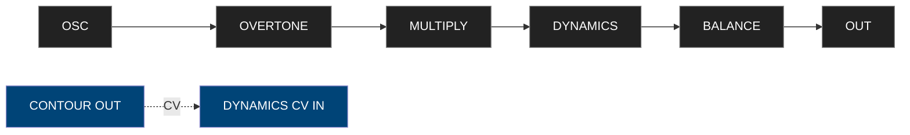
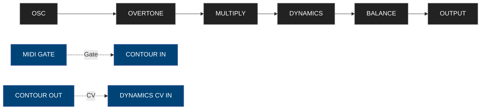
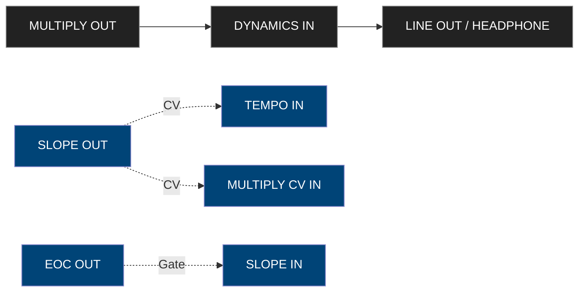
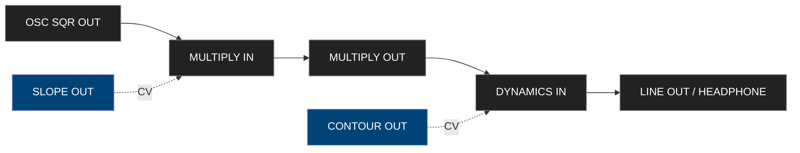
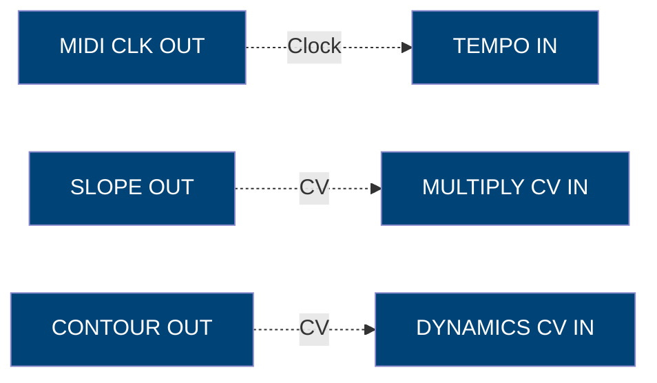
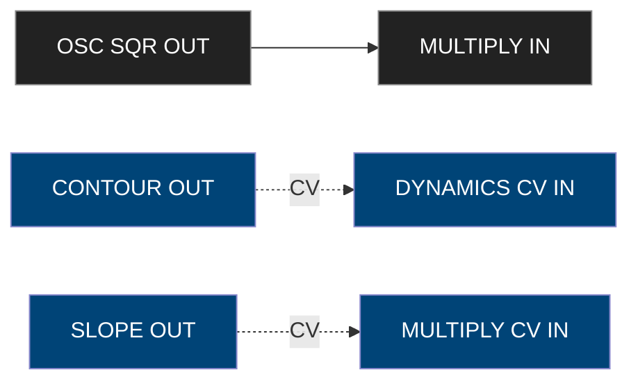
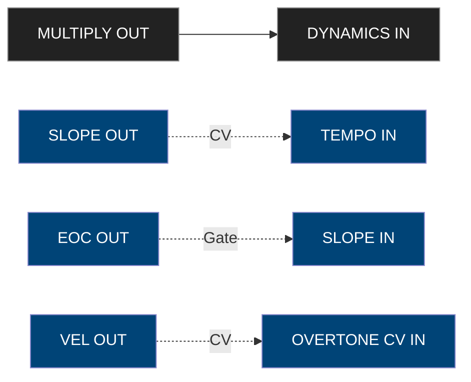
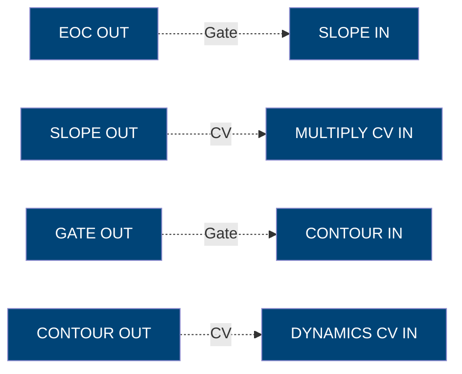

**Source:** Make Noise 0-Coast Manual (Rev. 2018)  
**Version:** 2.0 (Reorganized and Renumbered)

---

## Table of Contents

1. Safety and Power Guidelines  
2. Patch Notation and Diagram Reading  
3. Overview and Architecture  
4. Front Panel Control Reference  
5. Default Sound and Drone Patch  
6. Signal Fundamentals  
7. Attenuation and Attenuversion  
8. Voltage Math and Control Processor  
9. Sound Sources  
 9.1 Oscillator  
 9.2 Overtone and Multiply Sections  
10. Dynamic Sections  
 10.1 Slope Generator  
 10.2 Contour Generator  
11. Advanced MIDI Configuration and Program Pages  
 11.1 Program Page 1 – MIDI Channel  
 11.2 Program Page 2 – Velocity, Mod Wheel, Aftertouch Mapping  
 11.3 Program Page 3 – Clock Division and Start/Stop  
 11.4 Program Page 4 – CV Output Scales  
 11.5 Program Page 5 – MIDI CC Assignment  
 11.6 Program Page 6 – Pitch Bend and Glide  
 11.7 Program Page 7 – LFO / Clock Behavior  
 11.8 Program Page 8 – Aftertouch and Mod Scaling  
12. Patchbay Reference  
 12.1 Audio Patch Points  
 12.2 Control Voltage Patch Points  
13. Control Voltage & Gate Ranges  
14. Extended Patch Gallery  
 14.1 Simple Bass  
 14.2 Krell Patch (Generative)  
 14.3 Wobble Bass  
 14.4 External Processor Patch  
 14.5 Fluttering Arpeggios  
 14.6 East Coast Bass  
 14.7 Pitched Noise Orbit  
 14.8 Arcade Trills  
 14.9 Natural Water Drop  
15. Eurorack Interconnection and Voltage Compatibility  
16. Calibration and Maintenance  
 16.1 Pitch Calibration  
 16.2 MIDI Velocity and Mod Scaling Trim  
 16.3 Cleaning and Physical Care  
 16.4 Firmware Update Procedure  
17. Technical Specifications  
18. Default Signal Flow Diagram  
19. Appendix – MIDI CC Summary  
20. Interoperability with Eurorack

---

## 1. Safety and Power Guidelines

- Power only with the supplied **15 V DC 1.2 A adapter** (center positive).  
- Operate in temperatures 0 – 35 °C.  
- Avoid humidity > 80 % RH and direct sunlight.  
- Clean panel with dry microfiber cloth; never use solvents.  
- Always power down before inserting/removing patch cables.  

> [!WARNING]
> Connecting incorrect polarity or voltage may damage the analog circuitry.

---

## 2. Patch Notation and Diagram Reading

Patch connections in this document follow the Make Noise convention used in the original manual.

- **Audio signals** are written with solid arrows: `→`  
- **Control voltages (CV)** are written with dashed arrows: `-.->`  
- **Gate/Trigger signals** use dotted arrows or explicit “Gate” labels.  
- Normalized (default) connections are represented by simple linear chains unless a patch cable overrides them.

**Example Syntax:**

> [!TIP]
> When a patch input is used, the corresponding internal normalization is broken.  
> For instance, patching a cable into `MULTIPLY IN` disconnects the oscillator’s default input.

---

## 3. Overview and Architecture

The **0-Coast** is a semi-modular synthesizer combining **East-Coast** subtractive and **West-Coast** additive/modulation-driven synthesis philosophies.  
It features fully analog audio and control circuits, a digital MIDI-to-CV converter, and a self-contained power supply.

### Key Features
- **Single analog oscillator** with waveshaping.  
- **Overtone** harmonic control and **Multiply** (wavefolder) section.  
- **Slope Generator** (function generator / LFO / envelope).  
- **Contour Generator** (ADSR-like envelope).  
- **Dynamic Gate** (VCA + low-pass gate).  
- **MIDI to CV** conversion with assignable CCs.  
- **Patch bay** with 13 outputs and 14 inputs.  
- **Fully Eurorack compatible I/O (±5 V CV, +8 V gates).**

### Signal Flow Overview

> [!TIP]
> Use the patchbay to separate modulation and audio routing, or to insert external modules into the signal path.

---

## 4. Front Panel Control Reference

The following table lists all knobs, jacks, and buttons in their left-to-right layout order.  
Each item includes function, range, and internal normalization.

| # | Control | Type | Function | Normalization |
|---|----------|------|-----------|----------------|
| 1 | **OSC FREQ** | Knob | Sets master oscillator frequency | 1 V/Oct from MIDI |
| 2 | **FINE** | Knob | Fine-tuning control ±1 octave | – |
| 3 | **OVERTONE** | Knob | Introduces harmonic overtones | Normalized from OSC |
| 4 | **MULTIPLY** | Knob | Controls wavefolding depth | From OVERTONE |
| 5 | **DYNAMICS** | Knob | Sets VCA/low-pass gate level | From CONTOUR OUT |
| 6 | **CONTOUR ATTACK / DECAY** | Knobs | Attack & decay times | Triggered by MIDI Gate |
| 7 | **SLOPE RISE / FALL** | Knobs | Rise/fall times of function generator | – |
| 8 | **BALANCE** | Knob | Mixes internal vs external audio | Internal mixer |
| 9 | **TEMPO** | Knob | Sets internal clock rate | MIDI Clock override |
| 10 | **VOLUME** | Knob | Final output level | – |
| 11 | **CYCLE Button (SLOPE)** | Button | Enables looping for Slope | – |
| 12 | **PROG Button** | Button | Enters Program Pages | – |
| 13 | **PATCH Points (27)** | Jack Field | CV/Gate/Audio I/O | See Patchbay section |

> [!NOTE]
> **Note:** Controls 1–10 are continuously variable analog potentiometers; all other functions are either gate-driven or digital control states.

---

## 5. Default Sound and Drone Patch

When powered on with no patch cables inserted, the 0-Coast is internally normalized as follows:

> [!TIP]
> - This represents the **default internal signal flow** of the 0-Coast.
>     
> - The **MIDI Gate** triggers the **Contour envelope**, which then modulates **Dynamics**, shaping amplitude over time.

This produces a playable monophonic tone controlled by MIDI.  
To enter **Drone Mode**, remove the gate trigger by breaking `MIDI GATE → CONTOUR IN`:

**Drone Mode Patch**

(Set DYNAMICS knob fully clockwise)
> [!TIP]
> Drone mode is ideal for calibrating pitch and testing modulation routings.  
> You can still patch envelopes or the Slope function manually into `DYNAMICS CV IN` to animate the drone.

---

## 6. Signal Fundamentals

The 0-Coast uses both **AC-coupled audio** and **DC-coupled control voltages**.  
Understanding voltage domains is essential for modular patching.

| Signal Type | Voltage Range | Description |
|--------------|----------------|-------------|
| **Audio** | ±5 V | Bipolar audio from oscillator and Multiply |
| **Control Voltage (CV)** | ±5 V typical | Modulation signals for frequency, amplitude, etc. |
| **Envelope / Gate** | 0–+8 V | Unipolar positive voltages |
| **1 V/Oct** | 0–+8 V | Pitch control standard |
| **Clock / Trigger** | 0–+8 V | Digital pulses, 24 ppqn (MIDI-derived) |

### Voltage Polarity
- **Unipolar (+ only)**: Contour, Dynamics CVs, Gate, MIDI Velocity.  
- **Bipolar (±)**: LFOs, Slope Out, Mod Out, FM Inputs.

### Signal Coupling
- Audio path is **AC-coupled** (filters DC offset).  
- CV path is **DC-coupled** (preserves slow voltages and envelopes).

> [!TIP]
> Patch any control output (like SLOPE OUT) into audio-rate destinations (MULTIPLY IN) for cross-modulation effects.

---

## 7. Attenuation and Attenuversion

Several patch points on the 0-Coast include built-in level controls to manage modulation depth.

| Control | Type | Function |
|----------|------|-----------|
| **Attenuator (e.g., OVERTONE CV)** | Scales incoming CV (0–100%) |
| **Attenuverter (e.g., DYNAMICS CV)** | Scales and inverts CV (-100% to +100%) |
| **MIX / BALANCE** | Crossfades between internal and external sources |
| **Slope Rise/Fall CVs** | Attenuate externally patched modulation sources |

**Practical Example**
SLOPE OUT → OVERTONE CV IN (modulated harmonics)

If modulation is too extreme, turn down the **OVERTONE CV** knob — it acts as a built-in attenuator.

> [!NOTE]
> **Note:** Because most CV ranges are ±5 V, external Eurorack modules may require attenuation to avoid clipping.

---

## 8. Voltage Math and Control Processor

The 0-Coast includes an internal analog control processor for combining, scaling, and inverting voltages — effectively a two-channel **Voltage Math** section.

| Channel | Function | Range | Description |
|----------|-----------|--------|-------------|
| **CH1 IN** | Input | ±10 V | Accepts any external CV or audio |
| **CH1 OUT** | Output | ±10 V | Processed signal after scaling |
| **CH2 IN** | Input | ±10 V | Second input channel |
| **CH2 OUT** | Output | ±10 V | Second processed signal |
| **SUM OUT** | Output | ±10 V | Sum of CH1 + CH2 outputs |
| **INV OUT** | Output | ±10 V | Inverted mix of CH1 + CH2 |

Each channel features a **bi-polar attenuverter**, allowing manual scaling from −1 × to +1 ×.  
You can use this utility for:

- Mixing two modulation sources.  
- Creating inverted envelopes or negative control signals.  
- Offsetting and summing LFOs to complex shapes.  
- Amplitude modulation or tremolo (audio-rate CV).  

> [!EXAMPLE]
> **Example:** Patch `SLOPE OUT → CH1 IN` and `CONTOUR OUT → CH2 IN`, then take `SUM OUT → MULTIPLY CV IN` to blend both envelopes as a single control.

---

## 9. Sound Sources

### 9.1 Oscillator

| Control | Range | Function |
|----------|--------|----------|
| **FREQ** | 27 Hz – 3.5 kHz | Master oscillator frequency |
| **FINE** | ±1 octave | Fine-tune pitch relative to others |
| **LIN FM IN** | ±5 V | Linear FM modulation input |
| **1 V/OCT IN** | 1 V/Oct | Pitch control |
| **PWM IN** | ±5 V | Pulse width modulation |
| **SINE OUT** | Audio | Pure sine waveform |
| **SQR OUT** | Audio | Square wave output |

> [!TIP]
> The oscillator is temperature-compensated and tracks over 6 octaves when properly calibrated.

---

### 9.2 Overtone and Multiply Sections

#### Overtone
Adds harmonics above the base oscillator frequency.

| Control | Range | Description |
|----------|--------|-------------|
| **OVERTONE** | 0–10 | Introduces additional partials via folding |
| **OVERTONE CV IN** | ±5 V | CV control of harmonic mix |

#### Multiply (Wavefolder)
Classic West-Coast-style wave-multiplication for rich timbres.

| Control | Range | Description |
|----------|--------|-------------|
| **MULTIPLY** | 0–10 | Sets amount of folding applied to input |
| **MULTIPLY IN** | Audio | External source to wavefold |
| **MULTIPLY CV IN** | ±5 V | CV control of fold depth |
| **MULTIPLY OUT** | Audio | Output of wavefolder section |

> [!TIP]
> Feed an external oscillator into **MULTIPLY IN** to use the 0-Coast as a stand-alone wavefolder.

---

## 10. Dynamic Sections

## 10.1 Slope Generator

The **SLOPE** is a voltage-controlled function generator capable of acting as an envelope, LFO, or slew limiter.

| Control | Range | Description |
|----------|--------|-------------|
| **RISE** | 0.5 ms – 10 s | Attack / rise time |
| **FALL** | 0.5 ms – 10 s | Decay / fall time |
| **CYCLE** | ON / OFF | Enables looping (LFO mode) |
| **SLOPE IN** | Gate / Trigger | Starts the function |
| **RISE CV IN** | ±5 V | Modulates rise time |
| **FALL CV IN** | ±5 V | Modulates fall time |
| **END OF CYCLE OUT** | Gate | Emits pulse when cycle completes |
| **SLOPE OUT** | CV | Envelope / LFO output |

> [!TIP]
> Patch **EOC OUT → SLOPE IN** for self-cycling LFO behavior.

---

## 10.2 Contour Generator

An attack-decay envelope normalized to the Dynamic Gate.

| Control | Range | Description |
|----------|--------|-------------|
| **ATTACK** | 1 ms – 3 s | Rise time |
| **DECAY** | 1 ms – 5 s | Fall time |
| **SUSTAIN** | Gate dependent | Holds while gate is high |
| **CONTOUR IN** | Gate | Triggers envelope |
| **CONTOUR OUT** | CV | Output of AD envelope |

> [!TIP]
> 
> Send **CONTOUR OUT → MULTIPLY CV IN** for dynamic timbre movement.

---

## 11. Advanced MIDI Configuration and Program Pages

Hold **[PROG] + [PATCH]** on power-up to access extended configuration.  
Settings persist in memory until changed.

### 11.1 Program Page 1 – MIDI Channel
| CC # | Function | Range | Default |
|------|-----------|--------|---------|
| 118 | Select MIDI Channel | 1–16 | 1 |

### 11.2 Program Page 2 – Velocity, Mod Wheel, Aftertouch Mapping
| CC # | Function | Description |
|------|-----------|-------------|
| 102 | Velocity Destination Select | 0 = Dynamics  1 = Overtone  2 = Multiply |
| 103 | Mod Wheel Destination Select | 0 = Overtone  1 = Multiply  2 = Dynamics |
| 104 | Aftertouch Assign | 0 = Off  1 = Overtone  2 = Multiply  3 = Pitch |

### 11.3 Program Page 3 – Clock Division and Start/Stop
| CC # | Function | Range | Default |
|------|-----------|--------|---------|
| 105 | Clock Divide (1–8) | 1–8 | 1 |
| 106 | Start/Stop Enable | 0/1 | 1 |

### 11.4 Program Page 4 – CV Output Scales
| CC # | Function | Range |
|------|-----------|--------|
| 107 | Pitch CV Range | 0 = 0–5 V  1 = 0–8 V |
| 108 | Velocity CV Range | 0 = 0–5 V  1 = 0–8 V |
| 109 | Mod CV Polarity | 0 = Unipolar  1 = Bipolar |

### 11.5 Program Page 5 – MIDI CC Assignment
| CC # | Function |
|------|-----------|
| 1 | Mod Wheel (default to Overtone) |
| 7 | Master Volume |
| 64 | Sustain Pedal → Gate Hold |
| 65 | Portamento Time |
| 71 | Overtone Amount |
| 74 | Multiply Depth |
| 84 | Clock Reset |
| 123 | All Notes Off |

### 11.6 Program Page 6 – Pitch Bend and Glide
| CC # | Parameter | Range | Default |
|------|------------|--------|---------|
| 110 | Pitch Bend Range (semitones) | 0–24 | 2 |
| 111 | Glide Time (CC #5) | 0–127 | 0 |
| 112 | Portamento Mode | 0 = Off  1 = Legato | 1 |

### 11.7 Program Page 7 – LFO / Clock Behavior
| CC # | Parameter | Range | Default |
|------|------------|--------|---------|
| 113 | MIDI B Output Mode | 0 = Velocity Out  1 = LFO Triangle  2 = LFO Square | 0 |
| 114 | LFO Rate (CC #114) | 0–127 | 64 |
| 115 | LFO Sync to Clock | 0 = Free  1 = MIDI Clock Sync | 1 |

### 11.8 Program Page 8 – Aftertouch and Mod Scaling
| CC # | Parameter | Description |
|------|------------|-------------|
| 116 | Aftertouch Curve | 0 = Linear  1 = Exponential |
| 117 | Mod Depth Scale | 0–127 (attenuates CC #1) |

> [!TIP]
> Setting *MIDI B* as LFO Triangle adds a tempo-synced mod source when “LFO Sync” = 1.

---

## 12. Patchbay Reference

### 12.1 Audio Patch Points
| Jack | Type | Range | Function |
|------|------|--------|----------|
| **OSC SINE OUT** | Audio | ±5 V | Pure sine output |
| **OSC SQR OUT** | Audio | ±5 V | Square wave output |
| **MULTIPLY OUT** | Audio | ±5 V | Wavefolder output |
| **DYNAMICS OUT** | Audio | ±5 V | Post-VCA output |
| **LINE OUT** | Audio | Line | Final audio output |
| **EXT AUDIO IN** | Audio | ±5 V | Bypasses oscillator to process external signal |

### 12.2 Control Voltage Patch Points
| Jack | Direction | Range | Description |
|------|------------|--------|-------------|
| **1 V/OCT IN** | In | 1 V/Oct | Oscillator pitch input |
| **FM IN (LIN)** | In | ±5 V | Linear FM |
| **OVERTONE CV IN** | In | ±5 V | Harmonic amount |
| **MULTIPLY CV IN** | In | ±5 V | Wavefolder depth |
| **SLOPE IN** | In | Gate | Trigger for Slope |
| **RISE/FALL CV IN** | In | ±5 V | Modulation of envelope times |
| **CONTOUR IN** | In | Gate | Triggers AD envelope |
| **CONTOUR OUT** | Out | 0–+8 V | AD envelope out |
| **SLOPE OUT** | Out | 0–+8 V | Function output |
| **EOC OUT** | Out | Gate | End-of-cycle pulse |
| **GATE OUT** | Out | 0/+8 V | From MIDI note |
| **CLOCK OUT** | Out | 0/+8 V | From MIDI clock |
| **TEMPO IN** | In | 0–+8 V | Clock input override |
| **MOD OUT** | Out | ±5 V | From MIDI CC 1 |
| **VEL OUT** | Out | 0–+8 V | From MIDI velocity |

> [!TIP]
> Patch **SLOPE OUT → TEMPO IN** for self-modulating rhythmic patterns.

---

## 13. Control Voltage & Gate Ranges

| Signal Type | Nominal Range | Description |
|--------------|----------------|--------------|
| **Audio** | ±5 V | All audio-path signals |
| **Control Voltage (CV)** | ±5 V | Bipolar modulation |
| **Envelope / Gate** | 0–+8 V | Logic-level triggers |
| **1 V/Oct** | 0–+8 V | Standard pitch control |
| **Clock Pulses** | 0–+8 V | 24 ppqn from MIDI |

---

## 14. Extended Patch Gallery

### 14.1 Simple Bass

### 14.2 Krell Patch (Generative)

### 14.3 Wobble Bass

### 14.4 External Processor Patch

### 14.5 Fluttering Arpeggios

> [!TIP]
> - The **MIDI Clock** drives the internal tempo through `TEMPO IN`, syncing Slope and Contour cycles.
>     
> - **SLOPE OUT** modulates timbre via the **Multiply** section.
>     
> - **CONTOUR OUT** dynamically controls amplitude through the **Dynamics CV IN**.

> Use an external sequencer sending arpeggiated notes.  
> Adjust Slope Rate to sync harmonic flutter to tempo. 
### 14.6 East Coast Bass

> [!TIP]
> The OSC square output feeds the wavefolder for rich harmonics.
> 
> SLOPE OUT → MULTIPLY CV IN adds cyclical modulation to the timbre.
> 
> CONTOUR OUT → DYNAMICS CV IN shapes the amplitude envelope, making this an excellent patch for evolving rhythmic tones.

> Classic punchy bass using low Rise/Fall and short Contour.

### 14.7 Pitched Noise Orbit

> [!TIP]
> - `SLOPE OUT → TEMPO IN` and `EOC OUT → SLOPE IN` create a self-generating clock feedback loop.
>     
> - `VEL OUT → OVERTONE CV IN` adds expressivity based on playing dynamics.
>     
> - `MULTIPLY OUT → DYNAMICS IN` completes the signal path, producing an evolving, generative texture.

> A self-modulating random melodic texture; tune Velocity range for dynamic brightness.

### 14.8 Arcade Trills

> [!TIP]
> - `EOC OUT → SLOPE IN` loops the Slope generator, creating rhythmic motion.
>     
> - `SLOPE OUT → MULTIPLY CV IN` applies that motion to timbral variation.
>     
> - `GATE OUT → CONTOUR IN` and `CONTOUR OUT → DYNAMICS CV IN` handle amplitude shaping, producing sharp, articulated notes.

> Produces fast repeating notes reminiscent of early game sounds.  
> Shorten Rise/Fall for higher trill rates.

### 14.9 Natural Water Drop

> [!TIP]
> - `EOC OUT → SLOPE IN` loops the Slope generator, creating rhythmic motion.
>     
> - `SLOPE OUT → MULTIPLY CV IN` applies that motion to timbral variation.
>     
> - `GATE OUT → CONTOUR IN` and `CONTOUR OUT → DYNAMICS CV IN` handle amplitude shaping, producing sharp, articulated notes.

> Asymmetrical envelope looping creates fluid, droplet-like sounds.  
> Longer Rise and quick Fall emulate gravity acceleration.

## 15. Eurorack Interconnection and Voltage Compatibility

| Parameter | 0-Coast Range | Eurorack Safe Range | Notes |
|------------|----------------|---------------------|-------|
| **Audio I/O** | ±5 V | ±10 V | Safe at all levels; may clip slightly above ±8 V |
| **Gate/Trigger** | 0 / +8 V | 0 / +10 V | Threshold ≈ +2 V |
| **CV Inputs** | ±5 V nominal | ±10 V tolerated | External attenuators recommended |
| **Clock** | +5 V pulse | 0 – +10 V | Compatible with Eurorack 5 V logic |
| **MIDI TRS** | Type A (Tip = MIDI Data) | — | Use TRS A or DIN adapter only |

**Best Practices**
- Use passive attenuators when connecting ±10 V Eurorack modulators to 0-Coast CV inputs.  
- Audio outputs are hot; reduce mixer gain when feeding line-level gear.  
- Always power off before repatching audio or MIDI connections.  
- Ground all cases via the same PSU to avoid CV offset drift.  

> [!TIP]
> **Integration Tip:** The 0-Coast pairs particularly well with Maths, Strega, or modular sequencers like René 2 for extended modulation control.

---

## 16. Calibration and Maintenance

Calibration ensures accurate pitch tracking and consistent envelope timing.

### 16.1 Pitch Calibration
1. Connect a tuner to **LINE OUT**.  
2. Send a C2–C5 sequence via MIDI or 1 V/Oct input.  
3. Adjust the internal trimmer (accessible through the rear panel) until pitch tracks evenly across octaves.  

> [!NOTE]
>  **Note:** The factory setting is accurate for 1 V/Oct within ±3 cents; only recalibrate if the oscillator drifts beyond ±20 cents.

### 16.2 MIDI Velocity and Mod Scaling Trim
Each CV output (Velocity and Mod) has internal scaling trim accessible from the underside service ports.  
Use a voltmeter to verify:
- **Velocity Out:** 0–8 V corresponds to MIDI velocity 0–127  
- **Mod Out:** ±5 V corresponds to CC #1 0–127  

### 16.3 Cleaning and Physical Care
- Use a dry, lint-free cloth only.  
- Avoid alcohol or ammonia cleaners.  
- Verify PSU provides 15 V DC @ 1.2 A center-positive.  
- Store between 0–35 °C, < 80 % RH.

### 16.4 Firmware Update Procedure
If Make Noise releases firmware updates, they are distributed as **MIDI SysEx** files.  
To update:
1. Connect MIDI In to a computer interface.  
2. Use a SysEx librarian to transmit the file at ~60 % speed.  
3. Wait for confirmation LED blink sequence.  

## 17. Technical Specifications

| Parameter | Specification |
|------------|---------------|
| **Type** | Semi-modular analog synthesizer |
| **Oscillator** | 1 VCO with Sine and Square outputs |
| **Waveshaper** | Overtone and Multiply (wavefolder) |
| **Function Generators** | Slope and Contour |
| **Dynamics** | Low-pass gate / VCA hybrid |
| **Patch Points** | 27 (13 outs, 14 ins) |
| **MIDI** | In / Out via 3.5 mm TRS A adapter |
| **CV Range** | ±5 V (bipolar), 0–8 V (unipolar) |
| **Power** | 15 V DC, 1.2 A (center positive) |
| **Dimensions** | 241 × 133 × 38 mm |
| **Weight** | 1.2 kg |
| **Firmware** | MIDI v1.2 (2018 rev) |

## 18. Default Signal Flow Diagram

---

## 19. Appendix – MIDI CC Summary

| CC # | Name | Destination | Default Range |
|------|------|--------------|----------------|
| 1 | Mod Wheel | Overtone | ±5 V |
| 7 | Volume | Output | 0–127 |
| 71 | Overtone | Harmonic mix | 0–127 |
| 74 | Multiply | Wavefolder depth | 0–127 |
| 102–109 | Program Pages Config | Global settings | various |
| 123 | All Notes Off | – | – |

## 20. Interoperability with Eurorack

- All CV I/O is safe for ±10 V signals.  
- Gate threshold: ≈ +2 V (on) / < 0.5 V (off).  
- Clock and trigger pulses are TTL-compatible.  
- The 0-Coast can be mounted in a 3U Eurorack case via the included power header.  

> [!TIP]
> **Integration Tip:** The 0-Coast works seamlessly with modular systems like Strega, Maths and René 2 for extended patching and timing control.

