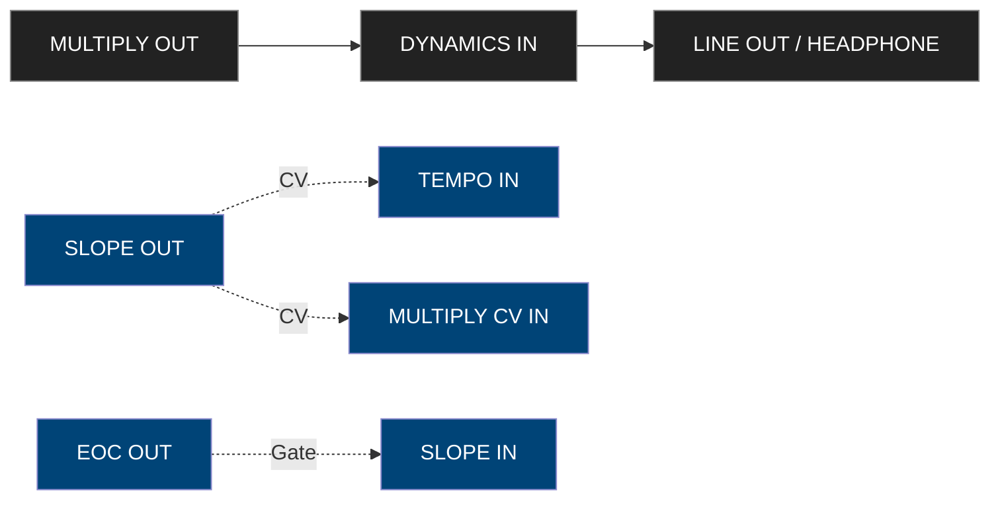
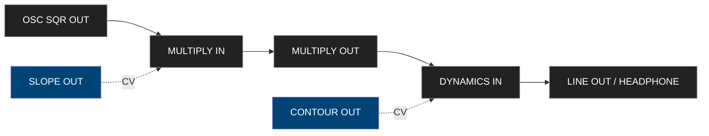

**Source:** Make Noise 0-Coast Manual (Rev. 2018)

---

## Table of Contents

1. Safety and Power Guidelines  
2. Overview and Architecture  
3. Front Panel Layout  
4. Sound Sources  
 4.1 Oscillator  
 4.2 Overtone and Multiply Sections  
5. Dynamic Sections  
 5.1 Slope Generator  
 5.2 Contour Generator  
6. MIDI Interface Overview  
 6.1 MIDI to CV Conversion  
 6.2 Clock and Sync Behavior  
 6.3 Velocity and Mod Routing  
7. Patchbay Reference  
 7.1 Audio Patch Points  
 7.2 Control Voltage Patch Points  
8. Control Voltage & Gate Ranges  
9. Program Pages (MIDI Configuration)  
 9.1 Program Page 1 – MIDI Channel  
 9.2 Program Page 2 – Velocity, Mod Wheel, Aftertouch Mapping  
 9.3 Program Page 3 – Clock Division and Start/Stop  
 9.4 Program Page 4 – CV Output Scales  
 9.5 Program Page 5 – MIDI CC Assignment  
10. Example Patches  
 10.1 Simple Bass  
 10.2 Krell Patch (Generative)  
 10.3 Wobble Bass  
 10.4 External Processor Patch  
11. Technical Specifications  
12. Default Signal Flow Diagram  
13. Appendix – MIDI CC Summary  
14. Interoperability with Eurorack

---

## 1. Safety and Power Guidelines

- Power only with the supplied **15 V DC 1.2 A adapter** (center positive).  
- Operate in temperatures 0 – 35 °C.  
- Avoid humidity > 80 % RH and direct sunlight.  
- Clean panel with dry microfiber cloth; never use solvents.  
- Always power down before inserting/removing patch cables.  

> [!WARNING]
> > Connecting incorrect polarity or voltage may damage the analog circuitry.

---

## 2. Overview and Architecture

The **0-Coast** is a semi-modular synthesizer combining **East-Coast** subtractive and **West-Coast** additive/modulation-driven synthesis philosophies.  
It features fully analog audio and control circuits, a digital MIDI-to-CV converter, and a self-contained power supply.

### Key Features
- **Single analog oscillator** with waveshaping.  
- **Overtone** harmonic control and **Multiply** (wavefolder) section.  
- **Slope Generator** (function generator / LFO / envelope).  
- **Contour Generator** (ADSR-like envelope).  
- **Dynamic Gate** (VCA + low-pass gate).  
- **MIDI to CV** conversion with assignable CCs.  
- **Patch bay** with 13 outputs and 14 inputs.  
- **Fully Eurorack compatible I/O (±5 V CV, +8 V gates).**

---

## 3. Front Panel Layout

> [!TIP]
> 
> 
> - This diagram mirrors the 0-Coast front-panel layout from left to right.
>     
> - Each node represents a functional block (audio or control).
>     
> - You can extend it by adding patch points as secondary branches — for instance, “MIDI I/O → CV/Gate Outputs” or “SLOPE ↔ CONTOUR (modulation loop)”.

### Default Signal Path

> [!Tip]
> 
> 
> - This diagram shows the _normalized_ audio routing inside the 0-Coast.
>     
> - Inserting a patch cable into any module input breaks the internal connection, enabling custom routing.
>     
> - The **BALANCE** control mixes between the internal signal and external audio when patched.

This is the *normalized* routing.  
Inserting a patch cable into any input breaks the internal connection.

> [!Tip]
> **Tip:** patch **OSC SQR OUT** into **MULTIPLY IN** to explore complex FM-like textures.

---

## 4. Sound Sources

### 4.1 Oscillator

| Control | Range | Function |
|----------|--------|----------|
| **FREQ** | 27 Hz – 3.5 kHz | Master oscillator frequency |
| **FINE** | ±1 octave | Fine tuning |
| **LIN FM IN** | ±5 V | Linear FM modulation input |
| **1 V/OCT IN** | 1 V / Oct CV pitch control |
| **PWM IN** | ±5 V | Pulse width modulation |
| **SINE OUT** | Audio | Pure sine waveform |
| **SQR OUT** | Audio | Square wave output |

> [!INFO]
> > The oscillator is temperature-compensated and tracks over 6 octaves when properly calibrated.

### 4.2 Overtone and Multiply (Waveshaping)

#### Overtone
Adds harmonics above the base oscillator frequency.

| Control | Range | Description |
|----------|--------|-------------|
| **OVERTONE** | 0–10 | Introduces additional partials via folding |
| **OVERTONE CV IN** | ±5 V | CV control of harmonic mix |

#### Multiply (Wavefolder)
Classic West-Coast-style wave-multiplication for rich timbres.

| Control | Range | Description |
|----------|--------|-------------|
| **MULTIPLY** | 0–10 | Sets amount of folding applied to input |
| **MULTIPLY IN** | Audio | External source to wavefold |
| **MULTIPLY CV IN** | ±5 V | CV control of fold depth |
| **MULTIPLY OUT** | Audio | Output of wavefolder section |

> [!TIP]
> > Feed an external oscillator into **MULTIPLY IN** to use the 0-Coast as a stand-alone wavefolder.

---

## 5. Dynamic Sections

### 5.1 Slope Generator

The **SLOPE** is a voltage-controlled function generator capable of acting as an envelope, LFO, or slew limiter.

| Control | Range | Description |
|----------|--------|-------------|
| **RISE** | 0.5 ms – 10 s | Attack/ rise time |
| **FALL** | 0.5 ms – 10 s | Decay/ fall time |
| **CYCLE** | ON/OFF | Enables looping (LFO mode) |
| **SLOPE IN** | Gate/Trigger | Starts the function |
| **RISE CV IN** | ±5 V | Modulates rise time |
| **FALL CV IN** | ±5 V | Modulates fall time |
| **END OF CYCLE OUT** | Gate | Emits pulse when cycle completes |
| **SLOPE OUT** | CV | Envelope/LFO output |

> [!TIP]
> > Patch **EOC OUT → SLOPE IN** for self-cycling LFO behavior.

### 5.2 Contour Generator

An attack-decay envelope normalized to the Dynamic Gate.

| Control | Range | Description |
|----------|--------|-------------|
| **ATTACK** | 1 ms – 3 s | Rise time |
| **DECAY** | 1 ms – 5 s | Fall time |
| **SUSTAIN** | Gate dependent | Holds while gate is high |
| **CONTOUR IN** | Gate | Triggers envelope |
| **CONTOUR OUT** | CV | Output of AD envelope |

> [!TIP]
> > Send **CONTOUR OUT → MULTIPLY CV IN** for dynamic timbre movement.

---

## 6. MIDI Interface Overview

The 0-Coast features a fully programmable MIDI to CV converter and responds to both Note and CC messages.

### 6.1 MIDI to CV Conversion

| CV Output | MIDI Source | Range |
|------------|--------------|-------|
| **PITCH OUT** | Note Number | 1 V/Oct (0 – +8 V) |
| **VELOCITY OUT** | Velocity | 0 – +8 V |
| **MOD OUT** | CC 1 (Mod Wheel) | ±5 V |
| **GATE OUT** | Note On/Off | 0 / +8 V |
| **CLOCK OUT** | MIDI Clock | 24 ppqn pulse |

> [!NOTE]
> > **Note:** The converter is monophonic; new notes retrigger the Contour and Slope sections.

### 6.2 Clock and Sync Behavior

- **CLOCK OUT** sends a pulse for each MIDI clock tick (24 per quarter note).  
- **TEMPO CV IN** can override internal clock for sequenced patches.  
- **Start/Stop** messages control EOC cycling when assigned.

### 6.3 Velocity and Mod Routing

Velocity and Mod Wheel CV outs are normalized to the Dynamic section:  
`Velocity → Amplitude`, `Mod → Overtone`.

| Parameter | Default Routing | Re-patchable Destination |
|------------|----------------|---------------------------|
| **Velocity** | Dynamics level | Filter, VCA, or Slope |
| **Mod Wheel** | Overtone amount | Any CV input |
| **Aftertouch** | Assignable (CC source select) | Via Program Page |

---
## 7. Patchbay Reference

The 0-Coast patchbay provides 13 outputs and 14 inputs, allowing integration with Eurorack or external gear.

### 7.1 Audio Patch Points
| Jack | Type | Range | Function |
|------|------|--------|----------|
| **OSC SINE OUT** | Audio | ±5 V | Pure sine output |
| **OSC SQR OUT** | Audio | ±5 V | Square wave output |
| **MULTIPLY OUT** | Audio | ±5 V | Wavefolder output |
| **DYNAMICS OUT** | Audio | ±5 V | Post-VCA output |
| **LINE OUT** | Audio | Line | Final audio output |
| **EXT AUDIO IN** | Audio | ±5 V | Bypasses oscillator to process external signal |

### 7.2 Control-Voltage Patch Points
| Jack | Direction | Range | Description |
|------|------------|--------|-------------|
| **1 V/OCT IN** | In | 1 V/oct | Oscillator pitch input |
| **FM IN (LIN)** | In | ±5 V | Linear FM |
| **OVERTONE CV IN** | In | ±5 V | Harmonic amount |
| **MULTIPLY CV IN** | In | ±5 V | Wavefolder depth |
| **SLOPE IN** | In | Gate | Trigger for Slope |
| **RISE/FALL CV IN** | In | ±5 V | Modulation of envelope times |
| **CONTOUR IN** | In | Gate | Triggers AD envelope |
| **CONTOUR OUT** | Out | 0–+8 V | AD envelope out |
| **SLOPE OUT** | Out | 0–+8 V | Function output |
| **EOC OUT** | Out | Gate | End-of-cycle pulse |
| **GATE OUT** | Out | 0/+8 V | From MIDI note |
| **CLOCK OUT** | Out | 0/+8 V | From MIDI clock |
| **TEMPO IN** | In | 0–+8 V | Clock input override |
| **MOD OUT** | Out | ±5 V | From MIDI CC 1 |
| **VEL OUT** | Out | 0–+8 V | From MIDI velocity |

> [!TIP]
> > **Tip:** patch **SLOPE OUT → TEMPO IN** for self-modulating rhythmic patterns.

---

## 8. Control Voltage & Gate Ranges

| Signal Type | Nominal Range | Description |
|--------------|----------------|--------------|
| **Audio** | ±5 V | All audio-path signals |
| **Control Voltage (CV)** | ±5 V | Bipolar modulation |
| **Envelope / Gate** | 0–+8 V | Logic-level triggers |
| **1 V/Oct** | 0–+8 V | Standard pitch control |
| **Clock Pulses** | 0–+8 V | 24 ppqn from MIDI |

The 0-Coast is Eurorack-compatible and safe to interface with ±10 V modules, though modulation depth scales to ±5 V.

---

## 9. Program Pages (MIDI Configuration)

Hold **[PROG] + [PATCH]** on power-up to access Program Pages.  
Settings persist in memory until changed.

### 9.1 Program Page 1 – MIDI Channel
| CC # | Function | Range | Default |
|------|-----------|--------|----------|
| 118 | Select MIDI Channel 1–16 | 1–16 | 1 |

### 9.2 Program Page 2 – Velocity, Mod Wheel, Aftertouch Mapping
| CC # | Function | Description |
|------|-----------|-------------|
| 102 | Velocity Destination Select | 0 = Dynamics, 1 = Overtone, 2 = Multiply |
| 103 | Mod Wheel Destination Select | 0 = Overtone, 1 = Multiply, 2 = Dynamics |
| 104 | Aftertouch Assign | 0 = Off, 1 = Overtone, 2 = Multiply, 3 = Pitch |

### 9.3 Program Page 3 – Clock Division and Start/Stop
| CC # | Function | Range | Default |
|------|-----------|--------|----------|
| 105 | Clock Divide (1–8) | 1–8 | 1 |
| 106 | Start/Stop Enable | 0/1 | 1 |

### 9.4 Program Page 4 – CV Output Scales
| CC # | Function | Range |
|------|-----------|--------|
| 107 | Pitch CV Range | 0 = 0–5 V   1 = 0–8 V |
| 108 | Velocity CV Range | 0 = 0–5 V   1 = 0–8 V |
| 109 | Mod CV Polarity | 0 = Unipolar   1 = Bipolar |

### 9.5 Program Page 5 – MIDI CC Assignment
| CC # | Function |
|------|-----------|
| 1 | Mod Wheel (default to Overtone) |
| 7 | Master Volume |
| 64 | Sustain Pedal → Gate Hold |
| 65 | Portamento Time |
| 71 | Overtone Amount |
| 74 | Multiply Depth |
| 84 | Clock Reset |
| 123 | All Notes Off |

> **Tip:** Use a standard MIDI CC editor or DAW to remap modulation behavior in real time.

---

## 10. Example Patches

### 10.1 Simple Bass

> [!TIP]
> 
> 
> - This patch produces a tight analog-style bass.
>     
> - The **Contour envelope** modulates amplitude via **DYNAMICS CV IN**.
>     
> - The **MIDI Gate** triggers the contour each time a note is played.
>     
> - Lowering the **Contour Fall** and **Dynamics Decay** times makes the sound punchier.

> Deep, tight analog bassline. Lower FALL time for punch.

---

### 10.2 Krell Patch (Generative)

> [!TIP]
> 
> 
> - This patch creates a **self-generating Krell-style** evolving tone.
>     
> - **SLOPE OUT → TEMPO IN** causes the internal timing to drift organically.
>     
> - **EOC OUT → SLOPE IN** makes the slope generator re-trigger itself — a feedback loop.
>     
> - **SLOPE OUT → MULTIPLY CV IN** dynamically alters timbre with each cycle.
>     
> - Adjust **Rise/Fall** for tempo, and **Multiply** for harmonic motion.
> 

> Self-cycling patch that evolves slowly; adjust RISE/FALL for pacing.

---

### 10.3 Wobble Bass

> [!TIP]
> 
> 
> - The **SLOPE OUT** acts as a synced LFO modulating the **MULTIPLY CV IN**, creating rhythmic timbral wobble.
>     
> - **CONTOUR OUT → DYNAMICS CV IN** shapes each note’s amplitude contour.
>     
> - Increase **SLOPE RATE** for faster modulation, or modulate **Rise/Fall** for evolving wobble patterns.

> Patch the Slope as synced LFO for rhythmic wobble movement.

---

### 10.4 External Processor Patch

> [!TIP]
> 
> 
> - This patch turns the **0-Coast** into an analog **filter + wavefolder + VCA** processor for external sources.
>     
> - Feed any external audio signal into **EXT AUDIO IN**, then control dynamics via the **Contour envelope**.
>     
> - Adjust **Multiply** for harmonic saturation and **Dynamics** for envelope depth.

> Use 0-Coast as analog filter + wavefolder for external sources.

---

## 11. Technical Specifications

| Parameter | Specification |
|------------|---------------|
| **Type** | Semi-modular analog synthesizer |
| **Oscillator** | 1 VCO with Sine and Square outputs |
| **Waveshaper** | Overtone and Multiply (wavefolder) |
| **Function Generators** | Slope and Contour |
| **Dynamics** | Low-pass gate / VCA hybrid |
| **Patch Points** | 27 (13 outs, 14 ins) |
| **MIDI** | In / Out via 3.5 mm TRS A adapter |
| **CV Range** | ±5 V (bipolar), 0–8 V (unipolar) |
| **Power** | 15 V DC, 1.2 A (center positive) |
| **Dimensions** | 241 × 133 × 38 mm |
| **Weight** | 1.2 kg |
| **Firmware** | MIDI v1.2 (2018 rev) |

---

## 12. Default Signal Flow Diagram

## 13. Appendix – MIDI CC Summary

| CC #    | Name                 | Destination      | Default Range |
| ------- | -------------------- | ---------------- | ------------- |
| 1       | Mod Wheel            | Overtone         | ±5 V          |
| 7       | Volume               | Output           | 0–127         |
| 71      | Overtone             | Harmonic mix     | 0–127         |
| 74      | Multiply             | Wavefolder depth | 0–127         |
| 102–109 | Program Pages Config | Global settings  | various       |
| 123     | All Notes Off        | –                | –             |
## 14. Interoperability with Eurorack

- All CV I/O is safe for ±10 V signals.
    
- Gate threshold: ≈ +2 V on, < 0.5 V off.
    
- Clock and trigger pulses are TTL-compatible.
    
- The 0-Coast can be mounted in a 3U Eurorack case via included power header.