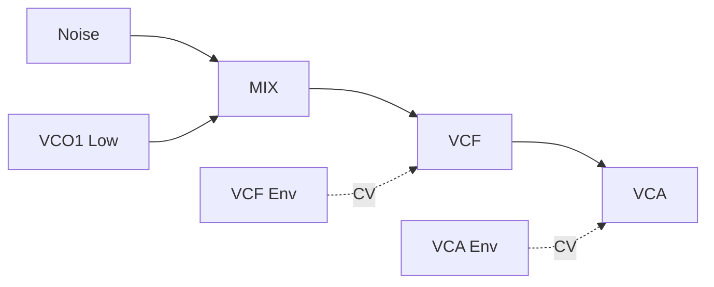
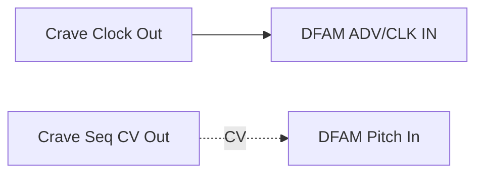
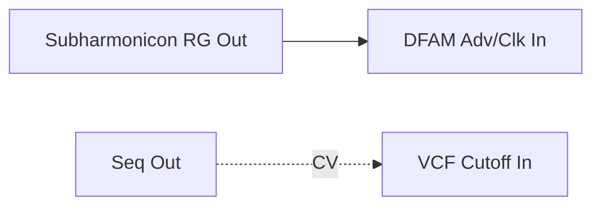

Comprehensive technical and musical reference for the Moog DFAM (Drummer From Another Mother).  
Structured in the same format as the *Matriarch*, *Subharmonicon*, and *Crave* Reference Guides.

---

## Table of Contents
1. Design Lineage – From Mother-32 to DFAM  
2. Overview & Philosophy  
3. Signal Flow Diagram  
4. Oscillator Section (VCO 1–2)  
5. Noise & Mixer  
6. Filter (VCF)  
7. Envelope Generators (VCF & VCA)  
8. Sequencer (8-Step Analog Sequencer)  
9. Patchbay Reference  
10. Integration & Patch Examples  
11. Quick Reference & Nomenclature  

---

## 1. Design Lineage – From Mother-32 to DFAM
The **DFAM (Drummer From Another Mother)** shares circuitry and modular integration with the *Mother-32* and *Subharmonicon*.  
While the Mother-32 focuses on melodic sequences, DFAM transforms that architecture into a percussive, generative rhythm machine.

> [!NOTE]  
> DFAM replaces the keyboard sequencer with an 8-step analog rhythm sequencer, emphasizing dynamic envelopes, pitch modulation, and per-step control.

---

## 2. Overview & Philosophy
DFAM is a **semi-modular analog percussion synthesizer** designed for spontaneous, hands-on sound design.  
It uses two wide-range oscillators, a white-noise generator, a Moog ladder filter, and a pair of envelopes triggered by its built-in sequencer.

> [!TIP]  
> Think of DFAM as a “rhythmic voice” — capable of kicks, snares, basslines, and abstract textures depending on how envelopes and mod sources interact.

---

## 3. Signal Flow Diagram


```mermaid
graph LR
  NOISE["Noise Source"] --> MIX["Mixer"]
  VCO1["VCO1"] --> MIX
  VCO2["VCO2"] --> MIX
  MIX --> VCF["Ladder Filter"]
  VCF --> VCA["VCA (Envelope Controlled)"]
  VCA --> OUT["Main Output"]

  EG1["VCA Env"] -. CV .-> VCA
  EG2["VCF Env"] -. CV .-> VCF
  SEQ["8-Step Sequencer"] -. Pitch CV .-> VCO1
  SEQ -. Pitch CV .-> VCO2
  SEQ -. Trigger .-> EG1
  SEQ -. Trigger .-> EG2

  classDef audio fill:#222,stroke:#888,color:#fff;
  classDef ctrl fill:#004477,stroke:#88c,color:#fff;
  class NOISE,VCO1,VCO2,MIX,VCF,VCA,OUT audio;
  class EG1,EG2,SEQ ctrl;
  ```

> [!NOTE]  
> DFAM is fully analog. Each trigger restarts both envelopes; the VCF and VCA shapes define the overall articulation.

---

## 4. Oscillator Section (VCO 1–2)

|Control|Range|Description|
|---|---|---|
|**VCO1 FREQ**|8 Hz–8 kHz|Coarse tuning|
|**VCO2 FREQ**|8 Hz–8 kHz|Coarse tuning|
|**WAVEFORM**|Triangle / Square|Select per oscillator|
|**VCO2 AMOUNT**|0–10|Cross-modulates VCO1 frequency|
|**VCO1 LEVEL / VCO2 LEVEL**|0–10|Mixer level per oscillator|
|**NOISE LEVEL**|0–10|Adds noise to mixer|
|**VCO1 MOD SOURCE**|VCF ENV / VCO2|Selects mod source for FM|

> [!TIP]  
> Set VCO2 to modulate VCO1 for metallic FM percussion; patch ENV OUT → VCO2 CV IN for evolving tones.

---

## 5. Noise & Mixer

The **Noise Source** provides broadband white noise for percussive attacks or snare-like sounds.  
The **Mixer** combines VCO1, VCO2, and Noise before the filter.

> [!NOTE]  
> With Noise at high level and oscillators low, DFAM becomes a noise percussion generator.

---

## 6. Filter (VCF)

24 dB/oct classic Moog ladder filter.  
Acts as the timbral core of DFAM, dynamically shaped by the filter envelope.

|Control|Range|Description|
|---|---|---|
|**CUTOFF**|20 Hz–20 kHz|Filter frequency|
|**RES**|0–Self-osc|Emphasizes cutoff|
|**VCF MOD SOURCE**|VCF ENV / VCO1|Selects modulation source|
|**VCF MOD AMOUNT**|0–10|Depth of modulation|

> [!TIP]  
> For kick drums: low cutoff (~100 Hz), high ENV AMOUNT, short decay.

---

## 7. Envelope Generators (VCF & VCA)

Two simple AD envelopes independently control the filter and amplifier.

|Parameter|Range|Function|
|---|---|---|
|**ATTACK**|1 ms–4 s|Rise time|
|**DECAY**|1 ms–10 s|Fall time|
|**AMOUNT (VCF only)**|0–10|Mod depth|

> [!NOTE]  
> The envelopes are triggered by each sequencer step; no sustain or release stage exists.  
> VCA envelope shapes loudness; VCF envelope sculpts tone.

---

## 8. Sequencer (8-Step Analog Sequencer)

Each step generates both a **Trigger** and **two CV outputs**:

- Pitch CV → VCO1 & VCO2
- Velocity CV → VCA ENV AMOUNT

|Function|Description|
|---|---|
|**STEP 1-8 PITCH KNOBS**|Set oscillator pitch per step|
|**STEP 1-8 VEL KNOBS**|Set envelope depth per step|
|**RUN/STOP**|Start/stop sequence|
|**ADV/CLK IN**|Advance one step or sync via external clock|
|**TEMPO**|Internal clock speed|
|**TRIG OUT**|Fires at each step|

> [!TIP]  
> Patch **VEL OUT → VCF CUTOFF IN** for dynamic timbre sequencing.

```mermaid
graph LR   
CLK["Clock / Trigger"] --> STEPSEQ["8-Step Sequencer"]   
STEPSEQ --> VCO_CV["Pitch CV Out"]   
STEPSEQ --> VEL_CV["Velocity CV Out"]   
VCO_CV -.-> VCO1   
VCO_CV -.-> VCO2   
VEL_CV -.-> VCA`
```
---

## 9. Patchbay Reference

|Patch Point|Type|Range|Description|
|---|---|---|---|
|**VCO1 CV IN**|CV|1 V/oct|Pitch input|
|**VCO2 CV IN**|CV|1 V/oct|Pitch input|
|**VCO2 FM IN**|CV|±5 V|Modulate VCO2 frequency|
|**VCF CUTOFF IN**|CV|±5 V|Modulate filter cutoff|
|**VCF OUT**|Audio|±5 V|Post-filter output|
|**VCA CV IN**|CV|0–8 V|Control loudness|
|**MIX OUT**|Audio|±5 V|Pre-filter signal|
|**VELOCITY OUT**|CV|0–8 V|Per-step envelope amount|
|**PITCH OUT**|CV|0–8 V|Sequencer pitch output|
|**TRIGGER OUT**|Gate|5 V|Step trigger signal|
|**ADV/CLOCK IN**|Gate|5 V|External step advance|
|**RUN/STOP IN**|Gate|5 V|External transport control|
|**AUDIO OUT**|Audio|Line|Final output|

> [!WARNING]  
> Patch points are normalized internally. Inserting a cable breaks the internal connection.

---

## 10. Integration & Patch Examples

### 10.1 DFAM Standalone – Kick & Snare Layer


> [!TIP]  
> Use one oscillator low (~40 Hz) for kick, add Noise for snare.  
> Adjust each step’s velocity for accent variations.

---

### 10.2 DFAM + Crave – Clock & Pitch Sync



> [!NOTE]  
> This creates synchronized rhythmic patterns: DFAM follows Crave’s tempo and melodic contour.

---

### 10.3 DFAM + Subharmonicon – Rhythmic Modulation




> [!TIP]  
> The Subharmonicon’s polyrhythms drive DFAM envelopes, forming complex hybrid rhythms.

---

## 11. Quick Reference & Nomenclature

### Core Controls

|Label|Alias|Type|Range|Description|
|---|---|---|---|---|
|VCO1 FREQ|VCO1_FREQ|Knob|8 Hz–8 kHz|Oscillator 1 tuning|
|VCO2 FREQ|VCO2_FREQ|Knob|8 Hz–8 kHz|Oscillator 2 tuning|
|MIX LEVELS|MIX_LVLx|Knob|0–10|Mix oscillator & noise|
|FILTER CUTOFF|VCF_CUTOFF|Knob|20 Hz–20 kHz|Filter frequency|
|FILTER RES|VCF_RES|Knob|0–10|Resonance|
|VCF ATT/DEC|VCF_ENVx|Knob|1 ms–10 s|Filter envelope stages|
|VCA ATT/DEC|VCA_ENVx|Knob|1 ms–10 s|Amp envelope stages|
|TEMPO|SEQ_TEMPO|Knob|20–300 BPM|Internal clock speed|
|STEP 1–8 (Pitch)|STEP_Px|Knob|0–8 V|Per-step pitch|
|STEP 1–8 (Velocity)|STEP_Vx|Knob|0–8 V|Per-step envelope depth|

### Patch Points

|Point|Alias|Type|Range|
|---|---|---|---|
|VCO1 CV IN|PATCH_VCO1|CV|1 V/oct|
|VCO2 CV IN|PATCH_VCO2|CV|1 V/oct|
|VCF CUTOFF IN|PATCH_VCF|CV|±5 V|
|VCA CV IN|PATCH_VCA|CV|0–8 V|
|VELOCITY OUT|PATCH_VEL|CV|0–8 V|
|PITCH OUT|PATCH_PITCH|CV|0–8 V|
|TRIGGER OUT|PATCH_TRIG|Gate|5 V|
|ADV/CLOCK IN|PATCH_CLK|Gate|5 V|
|AUDIO OUT|PATCH_OUT|Audio|Line|

---

_End of Moog DFAM – Reference Guide v1.0_