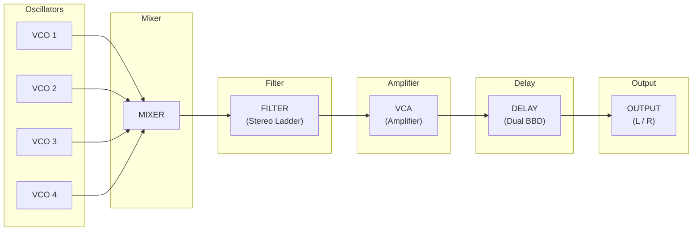
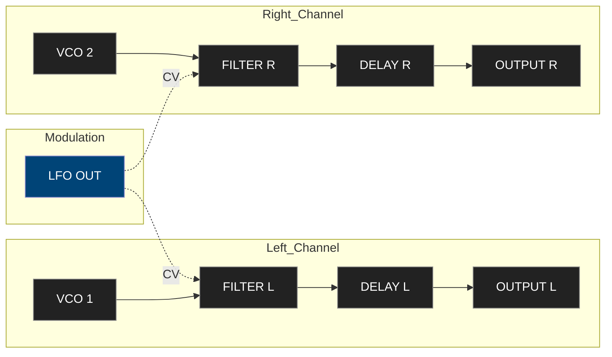
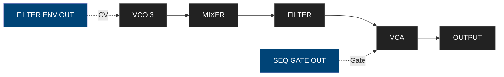

**Source:** Moog Matriarch Owner’s Manual (Rev. 2020)

---

## Table of Contents

1. Safety and Power Guidelines  
2. Overview and Signal Architecture  
3. Rear Panel Connections  
4. Oscillator Section  
5. Mixer Section  
6. Filter Section  
7. Amplifier (VCA) Section  

---

## 1. Safety and Power Guidelines

Before operating the Moog Matriarch, review the following safety notes to ensure proper handling and performance.

### Power Requirements
- Only use the supplied Moog 12 V DC, 2 A power adapter.  
- Confirm that your local mains voltage matches the adapter rating.  
- Disconnect the power supply before connecting external devices to the patchbay.

> Warning: Use of third-party adapters may damage the analog circuitry or introduce hum due to improper grounding.

### Operating Environment
- Temperature: 0–35 °C (32–95 °F).  
- Avoid high humidity, direct sunlight, or dusty environments.  
- Allow sufficient ventilation around the unit; the analog circuitry generates heat during operation.  
- Clean the front panel only with a dry, lint-free cloth.

### Handling
- Avoid abrupt movements while powered on; patch cables should not be yanked or twisted.  
- Never insert patch cables with power disconnected if static discharge is suspected.  
- When not in use, disconnect power and cover the instrument to prevent dust buildup.

---

## 2. Overview and Signal Architecture

The **Moog Matriarch** is a semi-modular analog synthesizer combining classic Moog circuits with a modern patchbay and paraphonic architecture.  
It can operate as a self-contained instrument or as the centerpiece of a modular system via its 90+ patch points.

### Key Features
- Four analog oscillators with selectable waveforms and paraphonic capability (up to 4 notes).  
- Classic Moog ladder filter with stereo configuration.  
- Dual envelope generators for filter and amplifier.  
- Extensive patchbay providing modular reconfiguration.  
- 256-step sequencer and arpeggiator with clock synchronization.  
- Stereo analog delay based on BBD technology.  
- Comprehensive MIDI and CV integration.

### Signal Flow Overview

The Matriarch can operate:
- **Monophonically** (all oscillators layered).  
- **Paraphonically** (up to 4-note chords sharing the same filter/VCA).  
- **Semi-modularly** via patchbay rerouting.

> Tip: Use the patchbay to separate the oscillators into independent voices, or to insert external modules into the signal path.

---

## 3. Rear Panel Connections

| Connector | Type | Description |
|------------|------|-------------|
| **AUDIO OUT L/R** | ¼" TS | Main stereo output (post-delay) |
| **PRE-DELAY OUT** | ¼" TS | Output before delay section |
| **AUDIO IN L/R** | ¼" TS | External input to filter or delay |
| **HEADPHONES** | ¼" TRS | Stereo headphone output |
| **MIDI IN / OUT / THRU** | 5-pin DIN | Standard MIDI ports |
| **USB** | Type-B | MIDI over USB (no audio) |
| **CV / GATE / CLOCK** | 3.5 mm | CV and synchronization I/O for modular integration |
| **POWER IN** | 12 V DC, 2 A | Power connector (center positive) |
| **POWER SWITCH** | Toggle | Turns unit on/off |

> Tip: Use the PRE-DELAY OUT when you want to record the dry signal while monitoring the stereo delay output.

---

## 4. Oscillator Section

The **Oscillator section (VCO 1–4)** is the primary sound source of the Matriarch. Each oscillator produces a continuously variable waveform and can be tuned independently.

### Front-Panel Controls

| Control | Range | Function |
|----------|--------|----------|
| **OCTAVE** | 32’, 16’, 8’, 4’, 2’ | Sets base frequency range |
| **WAVEFORM** | Saw / Square / Triangle / Narrow Pulse | Selects waveform shape |
| **FREQUENCY** | ±7 semitones | Fine-tune pitch relative to others |
| **SYNC** | Off / On | Hard-syncs oscillator to Osc 1 |
| **FM AMOUNT** | 0–10 | Amount of frequency modulation from mod source |
| **PW / PWM** | 0–10 | Pulse width control or modulation depth |
| **MIXER LEVEL** | 0–10 | Signal level into mixer |

> Tip: For thick unison sounds, slightly detune oscillators 2–4 by ±2 semitones.

### Paraphonic Behavior
In **4-note paraphonic mode**, each oscillator tracks one key.  
All oscillators share the same filter and amplifier envelope, producing a layered yet harmonically distinct sound.

> Note: Oscillator sync and FM affect each voice differently depending on trigger order in paraphonic mode.

### Patch Points
| Patch Point | Type | Description |
|--------------|------|-------------|
| **VCO 1–4 WAVE OUT** | Audio | Raw waveform output for external routing |
| **VCO 1–4 PITCH IN** | CV | 1V/Oct input per oscillator |
| **VCO MIX OUT** | Audio | Mixed signal output pre-filter |
| **SYNC IN** | CV | Hard-sync trigger input |
| **PWM IN** | CV | External modulation of pulse width |

> Tip: Patch “VCO MIX OUT” directly to “DELAY IN” to bypass the filter for bright FM textures.

---

## 5. Mixer Section

The **Mixer** combines signals from the oscillators and external input before routing them to the filter.

### Controls
| Control | Range | Description |
|----------|--------|-------------|
| **OSC 1 LEVEL** | 0–10 | Level of oscillator 1 |
| **OSC 2 LEVEL** | 0–10 | Level of oscillator 2 |
| **OSC 3 LEVEL** | 0–10 | Level of oscillator 3 |
| **OSC 4 LEVEL** | 0–10 | Level of oscillator 4 |
| **NOISE LEVEL** | 0–10 | White noise source |
| **EXTERNAL IN LEVEL** | 0–10 | Level of external audio input |

### Behavior
- When multiple oscillators are at full level, the filter input may saturate, adding mild Moog-style overdrive.  
- The external input passes through the same gain stage and can modulate or replace the oscillator mix.

> Tip: Overdriving the filter by increasing oscillator levels yields the characteristic Moog growl.

### Patch Points
| Patch Point | Type | Description |
|--------------|------|-------------|
| **MIX OUT** | Audio | Mixer output pre-filter |
| **EXT AUDIO IN** | Audio | External input feed |
| **MIX CV IN** | CV | Controls mixer level via CV modulation |

---

## 6. Filter Section

The **Filter** is a stereo Moog Ladder Filter operating in parallel or series configurations.

### Controls
| Control | Range | Description |
|----------|--------|-------------|
| **CUTOFF** | 20 Hz – 20 kHz | Adjusts frequency cutoff |
| **RESONANCE** | 0–10 | Emphasizes frequencies near the cutoff point |
| **ENVELOPE AMT** | -10 to +10 | Bipolar control for envelope modulation depth |
| **MODE** | LP / HP / BP / Series / Parallel | Selects filter topology |
| **KEYBOARD TRACK** | Off / 50% / 100% | Controls pitch tracking of cutoff |
| **STEREO OFFSET** | 0–10 | Differentiates cutoff between left and right filters |

### Behavior
- In **parallel mode**, both filters operate on the same input, producing wide stereo separation.  
- In **series mode**, the output of Filter A feeds Filter B, resulting in sharper roll-off.  
- The envelope amount determines how much the filter responds dynamically to each keypress.

> Tip: Try using 50% keyboard tracking with medium resonance for natural brightness across octaves.

### Patch Points
| Patch Point | Type | Description |
|--------------|------|-------------|
| **FILTER IN L/R** | Audio | Audio input to left/right filter |
| **CUTOFF CV IN L/R** | CV | External control of cutoff frequency |
| **RESONANCE CV IN** | CV | Modulation of resonance |
| **FILTER ENV OUT** | CV | Envelope output signal |
| **POST FILTER OUT L/R** | Audio | Output after filtering |

> Note: Routing “POST FILTER OUT” back into “AUDIO IN” creates a feedback path for aggressive timbres.

---

## 7. Amplifier (VCA) Section

The **VCA** controls the overall loudness contour of the Matriarch’s signal path.

### Controls
| Control | Range | Description |
|----------|--------|-------------|
| **AMP ENV ATTACK** | 0.5 ms – 10 s | Time for volume to rise after key press |
| **DECAY** | 1 ms – 10 s | Time for level to fall to sustain |
| **SUSTAIN** | 0–10 | Sustained level during note hold |
| **RELEASE** | 1 ms – 10 s | Time to fade out after key release |
| **VEL AMT** | 0–10 | Amount of velocity sensitivity |
| **VCA MODE** | ENV / ON | Envelope or constant signal mode |

### Patch Points
| Patch Point | Type | Description |
|--------------|------|-------------|
| **VCA IN** | Audio | Audio input to amplifier |
| **VCA OUT** | Audio | Output post-VCA |
| **AMP ENV OUT** | CV | Sends envelope signal for external modulation |
| **AMP ENV GATE IN** | Gate | Triggers envelope externally |

> Tip: In “ON” mode, the VCA remains open, ideal for drone patches or modular processing.

---
## 8. Modulation Section

The Matriarch features a single, wide-ranging analog LFO and two independent envelope generators.  
Together they provide complex modulation for filter, pitch, amplitude, and external destinations through the patchbay.

### 8.1 Low-Frequency Oscillator (LFO)

| Control | Range | Description |
|----------|--------|-------------|
| **RATE** | 0.1 Hz – 1 kHz | Sets modulation speed |
| **SHAPE** | Triangle / Square / Ramp / Saw / Sample-and-Hold | Selects waveform |
| **DEPTH** | 0–10 | Modulation intensity |
| **SYNC** | OFF / ON | Syncs LFO to keyboard gate or clock |

LFO may modulate oscillator pitch, filter cutoff, or amplitude simultaneously depending on patch configuration.

> Tip: At high rates the LFO can reach the audio range, producing metallic FM-like textures when patched to VCO Pitch In.

**Patch Points**

| Patch Point | Type | Description |
|--------------|------|-------------|
| **LFO OUT** | CV | Sends the LFO signal to external destinations |
| **LFO RATE IN** | CV | Controls LFO speed from another source |
| **LFO SYNC IN** | Gate | Synchronizes phase to external clock |
| **S&H OUT** | CV | Random stepped voltage output from S&H circuit |

---

### 8.2 Envelope Generators

Matriarch provides two ADSR envelopes—one pre-wired to the filter, one to the amplifier.  
Both can be routed freely through the patchbay.

| Parameter | Range | Description |
|------------|--------|-------------|
| **ATTACK** | 0.5 ms – 10 s | Time to reach peak after trigger |
| **DECAY** | 1 ms – 10 s | Time to fall to sustain |
| **SUSTAIN** | 0–10 | Level held while gate remains high |
| **RELEASE** | 1 ms – 10 s | Time to return to zero after gate off |

**Patch Points**

| Patch Point | Type | Description |
|--------------|------|-------------|
| **FILTER ENV OUT** | CV | Sends filter envelope to patchbay |
| **AMP ENV OUT** | CV | Sends amplifier envelope to patchbay |
| **ENV GATE IN** | Gate | External trigger for either envelope |

> Tip: Route the filter envelope to oscillator pitch for expressive attack bends.

---

## 9. Stereo Analog Delay Section

A dual BBD (Bucket-Brigade Device) analog delay capable of stereo ping-pong or dual-mono operation.

### Controls
| Control | Range | Description |
|----------|--------|-------------|
| **TIME L / R** | 35 ms – 850 ms | Delay time per channel |
| **FEEDBACK L / R** | 0–10 | Controls number of repeats |
| **SYNC** | OFF / ON | When ON, delays track global clock divisions |
| **MIX** | 0–10 | Wet/dry balance |
| **PING-PONG** | OFF / ON | Cross-feeds left and right channels for stereo movement |

**Patch Points**

| Patch Point | Type | Description |
|--------------|------|-------------|
| **DELAY IN L/R** | Audio | Signal input to delay line |
| **DELAY OUT L/R** | Audio | Delayed signal output |
| **TIME CV IN L/R** | CV | Modulates delay time |
| **FB CV IN L/R** | CV | Controls feedback via CV |
| **MIX CV IN** | CV | Modulates wet/dry mix |

> Tip: Modulate TIME CV IN with the LFO for vintage tape-style chorusing.

---

## 10. Patchbay

Matriarch’s 90-plus patch points make it a powerful semi-modular system.  
Unpatched, it behaves as a traditional synth; patching overrides or extends the internal routing.

### Patch Categories
| Category | Example Points |
|-----------|----------------|
| **Audio** | VCO OUT, MIX OUT, FILTER IN/OUT, VCA IN/OUT |
| **Control Voltage** | LFO OUT, ENV OUT, KB PITCH, MOD WHEEL CV |
| **Gate/Trigger** | KB GATE, SEQ GATE, EXT CLOCK IN |
| **MIDI/CV Interface** | MIDI IN/OUT → CV/Gate, CLOCK OUT |
| **Utility** | ATTENUATOR IN/OUT, MULT IN/OUT |

### Signal Normals (Internal Routings)
- VCO → Mixer → Filter → VCA → Delay → Output  
- Filter ENV → Filter Cutoff  
- Amp ENV → VCA Level  
- LFO → VCO Pitch & Filter Cutoff  
- Keyboard CV → Oscillator Pitch  
Breaking any connection with a patch cable reroutes the signal to the new destination.

> Tip: Use the built-in mults to distribute modulation to multiple points without an external splitter.

---

## 11. Keyboard and Glide

A 49-key Fatar keyboard with velocity and aftertouch transmits both MIDI and CV.  

### Controls
| Control | Range | Description |
|----------|--------|-------------|
| **GLIDE TIME** | 0–10 | Portamento between notes |
| **KB MODE** | Low / High / Last / Multi | Determines voice priority |
| **AFTERTOUCH AMT** | 0–10 | Amount of pressure modulation |
| **VEL AMT** | 0–10 | Velocity depth applied to amplitude or filter |

**Patch Points**
| Patch Point | Type | Description |
|--------------|------|-------------|
| **KB PITCH OUT** | CV | 1 V/oct pitch control |
| **KB GATE OUT** | Gate | Note-on signal |
| **VEL OUT** | CV | Velocity voltage |
| **AT OUT** | CV | Aftertouch output |
| **GLIDE CV IN** | CV | Modulates glide time |

> Tip: Patch VEL OUT → FILTER CV IN for dynamic touch-responsive brightness.

---

## 12. Sequencer and Arpeggiator

Matriarch features a 256-step sequencer and an independent arpeggiator sharing the same control panel.

### 12.1 Sequencer

| Function | Description |
|-----------|-------------|
| **STEP COUNT** | Up to 256 steps per pattern |
| **PATTERNS** | 4 patterns stored per bank |
| **CLOCK SOURCE** | Internal, MIDI, or External CV |
| **DIRECTION** | Forward / Reverse / Ping-Pong / Random |
| **RATE** | Sets playback tempo when internal clock used |
| **GLIDE ON/OFF** | Enables portamento between steps |
| **REC MODE** | Real-time or Step-by-Step entry |

**Basic Operation**
1. Hold [HOLD] and press [REC] to enter record mode.  
2. Play notes; rests are entered with [REST].  
3. Press [PLAY] to exit recording and start playback.  
4. [FUNC]+[PLAY] transposes the sequence by played key.

> Tip: Use external clock from modular gear to sync multiple analog sequencers.

---

### 12.2 Arpeggiator

| Parameter | Options |
|------------|----------|
| **MODE** | Up / Down / Up-Down / Random / Order |
| **OCTAVE RANGE** | 1–4 |
| **CLOCK SOURCE** | Internal / External CV / MIDI |
| **LATCH** | ON/OFF |
| **RATE** | Sets tempo in internal mode |

**Operation**
- Hold multiple keys to define the arpeggio range.  
- Engage **LATCH** to sustain without holding keys.  
- Sync to external clock for tempo-locked patterns.

> Tip: Combine arpeggiator with paraphonic mode for chord-driven rhythmic textures.

---

## 13. Utilities and Global Settings

Accessed via [HOLD] + power-on or via MIDI CC commands.

| Setting | Description |
|----------|-------------|
| **Clock Division** | Sets rhythmic division for delay sync and sequencer clock |
| **Local Control** | Enables/disables internal connection between keys and engine |
| **MIDI Channel** | 1–16; defines transmit/receive channel |
| **Aftertouch Curve** | Linear / Soft / Hard |
| **Velocity Curve** | Linear / Logarithmic / Exponential |
| **Calibration Access** | Initiates oscillator & filter calibration routine |

---

## 14. MIDI Implementation

Matriarch supports full MIDI over USB and DIN.

| Function | Description |
|-----------|-------------|
| **Notes** | 4-note paraphony transmitted and received |
| **Pitch Bend** | ±2 semitones (configurable via CC) |
| **Mod Wheel (CC 1)** | Routed to global modulation depth |
| **Aftertouch (Ch Pressure)** | Controls filter cutoff or pitch (assignable) |
| **Velocity** | Mapped to VCA and filter envelope |
| **Clock / Start / Stop** | Standard MIDI transport messages |
| **Program Change** | Loads stored sequences |
| **CC 7** | Master volume |
| **CC 74** | Filter cutoff |
| **CC 71** | Resonance |
| **CC 73** | Attack |
| **CC 72** | Release |

> Tip: Matriarch’s MIDI Out mirrors CV Pitch and Gate data, allowing it to drive external synths without additional converters.

---

## 15. Calibration and Maintenance

### Oscillator Tuning
1. Warm up unit for 15 minutes.  
2. Hold [HOLD] + power-on → Calibration Mode.  
3. Follow on-screen LEDs for progress (~2 min).  

### Filter Tracking
- Calibrate by sending a 1 V/oct signal to FILTER CV IN and adjust internal trim if necessary (service manual).

### General Maintenance
- Keep all jacks dust-free.  
- Perform full calibration every 6–12 months.  
- Avoid contact cleaner sprays; they may damage potentiometers.

---

## 16. Appendix – Patch Examples and Technical Specifications

### Example 1 – Stereo Drone

### Example 2 – Percussive Sequence

### Technical Specifications
| Parameter | Specification |
|------------|----------------|
| **Voices** | 4 (paraphonic) |
| **Oscillators** | 4 analog VCOs |
| **Filter** | Stereo Moog ladder 24 dB/oct |
| **Envelopes** | 2 ADSR |
| **LFO** | Analog, multi-shape |
| **Delay** | Dual BBD (35–850 ms) |
| **Sequencer** | 256 steps × 4 patterns |
| **Audio Outputs** | L/R ¼″ TS (unbalanced) |
| **Headphones** | ¼″ TRS stereo |
| **MIDI** | USB + 5-pin DIN |
| **Dimensions** | 679 × 375 × 146 mm |
| **Weight** | ≈ 11 kg |
| **Power** | 12 V DC, 2 A |

---

