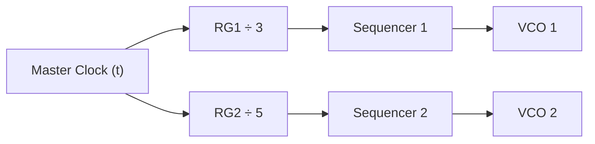
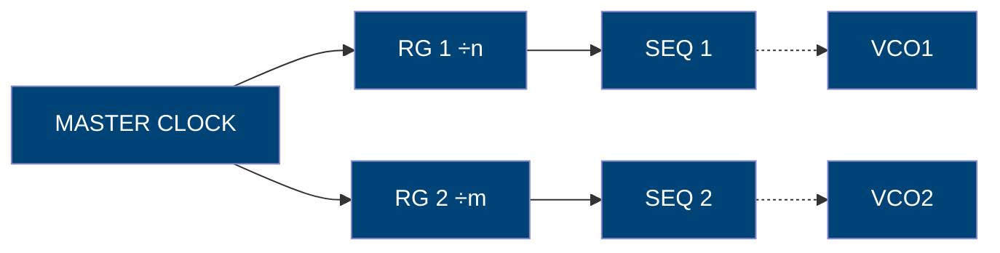
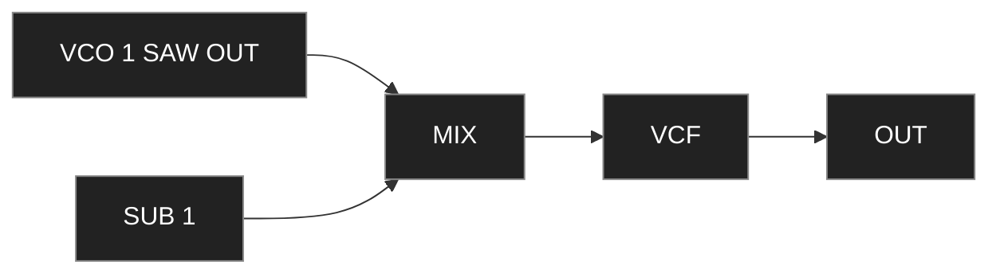
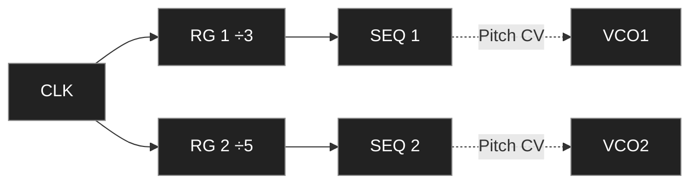

Based on the official Moog Subharmonicon Manual (Rev. 2020).  
Structured and formatted consistently with the *Moog Matriarch Reference v2.1.*

---

## Table of Contents
1. Overview and Philosophy  
2. Signal Flow Diagram  
3. Sound Architecture  
 3.1 Oscillators (VCO 1–2)  
 3.2 Subharmonic Oscillators  
 3.3 Mixer Section  
 3.4 Filter (VCF)  
 3.5 Envelope Generator (EG)  
4. Sequencing and Polyrhythm System  
 4.1 Rhythm Generators  
 4.2 Sequencers 1 & 2  
 4.3 Quantization and Clock Division  
5. Patchbay Reference  
6. Performance Controls  
7. Clock, Sync & MIDI Integration  
8. CV and Gate Specifications  
9. Example Patches  
10. Creating Evolving Polyrhythms (Appendix)  
11. Quick Reference & Nomenclature  

---
## Historical Introduction – Understanding Subharmonics & Polyrhythms

In traditional music theory, harmonics are integer multiples of a fundamental frequency.  
If a string vibrates at 440 Hz (A4), halving its length doubles the frequency to 880 Hz (A5), producing the first overtone.  
Multiplying by integers (ƒ × 2, ƒ × 3, ƒ × 4, …) yields higher harmonics responsible for the timbre of any instrument.

Creating *undertones* — or **subharmonics** — in the acoustic domain is less intuitive.  
Instead of multiplying, we divide the frequency by integers: (ƒ / 2, ƒ / 3, ƒ / 4, …).  
These “mirror” intervals extend downward, producing mathematically precise but sonically rich undertones.

> [!NOTE]  
> Electronic circuits can easily generate subharmonics, dividing an oscillator’s base frequency to create a *subharmonic series* — the inverse of the harmonic series.

During the 1930s–70s, pioneers like **Oskar Sala, Joseph Schillinger, Leon Theremin, Friedrich Trautwein, and Bob Moog** explored new frontiers where electronics could translate mathematics into music.  
Sala’s *Mixtur-Trautonium* used subharmonic oscillators (fractions of a base pitch), while Theremin’s *Rhythmicon*, built with Schillinger and Cowell, produced integer-based rhythmic divisions.  
These inventions laid the groundwork for both **subharmonic synthesis** and **algorithmic rhythm**.

> [!TIP]  
> The Subharmonicon unites these two ideas:  
> – Pitch divisions (ƒ / n) generate subharmonics.  
> – Time divisions (t / n) generate polyrhythms.

### Overtones vs Undertones

| Type | Formula | Example | Interval |
|------|----------|----------|-----------|
| **Overtones (Harmonics)** | ƒ × 2, 3, 4, … | 440 Hz × 2 = 880 Hz | Octave Up |
| | ƒ × 3 = 1320 Hz | Octave + Fifth |
| **Undertones (Subharmonics)** | ƒ ÷ 2, 3, 4, … | 440 ÷ 2 = 220 Hz | Octave Down |
| | 440 ÷ 3 ≈ 146.6 Hz | Perfect Fifth Below |

### Understanding Polyrhythms

Each Subharmonicon rhythm generator divides the master clock (t) by an integer, producing rhythmic layers that overlap and realign cyclically.



When multiple rhythm generators are active, each running at a different division, their outputs eventually converge again on the same downbeat — forming a large repeating **polyrhythmic cycle**.

> [!NOTE]  
> You can think of the rhythm generators as orbiting hands on a clock: moving at different speeds but returning together at the top of each full rotation.

## 1. Overview and Philosophy

The **Subharmonicon** is a semi-modular analog synthesizer exploring the intersection between *mathematical harmony* and *time division*.  
Its engine blends **two VCOs**, **four sub-oscillators**, and **two rhythmically divided sequencers**, creating continuously shifting relationships.

| Section | Function |
|----------|-----------|
| **VCO 1 & 2** | Primary oscillators generating base frequencies |
| **Sub 1–4** | Subharmonics derived from integer divisions of each VCO |
| **VCF / EG / VCA** | Shared analog filter, envelope, and amplifier |
| **Sequencer 1 & 2** | Dual 4-step sequencers controlling pitch or rhythm |
| **Rhythm Generators** | Clock dividers driving sequencers at different ratios |
| **Patchbay** | 32 points for modulation, CV control, and audio routing |

> [!NOTE]  
> Subharmonics are frequencies produced by integer division of a fundamental tone (f / n).  
> Polyrhythms are overlapping rhythmic cycles whose lengths are relatively prime.

Historically the concept originates from Oskar Sala’s *Trautonium* (1930) and Joseph Schillinger’s theory of rhythmic harmony, inspiring Moog’s modern implementation.

---

## 2. Signal Flow Diagram

```mermaid
graph LR
  VCO1["VCO 1"] --> MIX["Mixer"]
  VCO2["VCO 2"] --> MIX
  SUB1["Sub 1–2"] --> MIX
  SUB2["Sub 3–4"] --> MIX
  MIX --> VCF["VCF (Ladder Filter)"]
  VCF --> VCA["VCA (Envelope Controlled)"]
  VCA --> OUT["Output"]

  SEQ1["Sequencer 1"] -. Pitch CV .-> VCO1
  SEQ2["Sequencer 2"] -. Pitch CV .-> VCO2
  RG["Rhythm Generators"] -. Clock .-> SEQ1
  RG -. Clock .-> SEQ2

  classDef audio fill:#222,stroke:#888,color:#fff;
  classDef ctrl fill:#004477,stroke:#88c,color:#fff;
  class VCO1,VCO2,SUB1,SUB2,MIX,VCF,VCA,OUT audio;
  class SEQ1,SEQ2,RG ctrl;
  ```
  
>[!TIP]
Every signal passes through one shared VCF and VCA. Sequencers and rhythm dividers shape pitch and timing rather than amplitude.
## 3. Sound Architecture
### 3.1 Oscillators (VCO 1–2)

Each oscillator feeds two subharmonic generators producing frequencies at f/n and f/m ratios.

| Parameter         | Range         | Description              |
| ----------------- | ------------- | ------------------------ |
| **FREQ**          | 16 Hz – 4 kHz | Base pitch               |
| **WAVE**          | Saw / Square  | Selects waveform         |
| **SUB DIV KNOBS** | 1–16          | Divisor for subharmonics |
| **VCO LEVEL**     | 0–10          | Send to Mixer            |

> [!TIP]
Use VCO1 and VCO2 in intervals (e.g. a fifth) to create harmonic interference patterns.

### 3.2 Subharmonic Oscillators
Each main oscillator drives two subharmonic oscillators derived from integer divisions.

|Sub|Derived From|Formula|Comment|
|---|---|---|---|
|Sub 1|VCO1|f₁ / n₁|Warm, bass-rich partials|
|Sub 2|VCO1|f₁ / n₂|Beating against Sub 1|
|Sub 3|VCO2|f₂ / n₃|Complementary tone|
|Sub 4|VCO2|f₂ / n₄|Adds motion and depth|

```mermaid
graph TD
  VCO1 --> SUB1 --> MIX
  VCO1 --> SUB2 --> MIX
  VCO2 --> SUB3 --> MIX
  VCO2 --> SUB4 --> MIX
```

> [!NOTE]
Odd divisions (3, 5, 7) yield darker colors; even divisions (2, 4, 8) sound more consonant.

### 3.3 Mixer Section
Six inputs (VCO 1–2 + Sub 1–4) sum to a single mono bus feeding the filter.

| Input | Function |
|--------|-----------|
| **VCO 1 LEVEL** | Controls main oscillator 1 amplitude |
| **SUB 1/2 LEVEL** | Sets balance of subharmonics for VCO 1 |
| **VCO 2 LEVEL** | Controls main oscillator 2 amplitude |
| **SUB 3/4 LEVEL** | Sets balance of subharmonics for VCO 2 |
| **MASTER LEVEL** | Global output to VCF |

### 3.4 Filter (VCF)
Classic 24 dB/oct Moog ladder filter. Shared for all sources.
CUTOFF 20 Hz–20 kHz; RESONANCE self-oscillates at maximum.


| Parameter | Range | Function |
|------------|--------|----------|
| **CUTOFF** | 20 Hz – 20 kHz | Frequency cutoff |
| **RESONANCE** | 0–10 | Emphasizes frequencies near cutoff |
| **VCF EG AMOUNT** | −10 to +10 | Envelope modulation depth |
| **VCF EG IN** | CV | Modulation input |
> [!TIP]
> Subharmonic content responds dramatically to resonance; slight boosts create complex formant-like tones.
> 
### 3.5 Envelope Generator (EG)
ADSR controlling VCF and VCA simultaneously.

| Control | Range | Function |
|----------|--------|----------|
| **ATTACK** | 0.5 ms – 10 s | Rise time |
| **DECAY** | 0.5 ms – 10 s | Fall time |
| **SUSTAIN** | 0–10 | Hold level |
| **RELEASE** | 0.5 ms – 10 s | Final release time |

## 4. Sequencing and Polyrhythm System
### 4.1 Rhythm Generators
Two dividers (RG1, RG2) split the master clock into independent ratios.

|Generator|Division|Feeds|
|---|---|---|
|RG 1|÷1 – ÷16|SEQ 1|
|RG 2|÷1 – ÷16|SEQ 2|

> [!TIP]
Unequal divisions (e.g. 3 and 5) create non-repeating polyrhythms.

### 4.2 Sequencers 1 & 2
Each sequencer has four steps, each outputting a pitch CV to its corresponding VCO.

| Control            | Function             |
| ------------------ | -------------------- |
| **STEP 1-4 KNOBS** | Set CV per step      |
| **DESTINATION SW** | Pitch / VCF / SubDiv |
| **CLOCK IN**       | From RG or external  |

> [!WARNING]
Voltages are unquantized until the QUANTIZE switch is engaged.

### 4.3 Quantization and Clock Division



  
> [!NOTE]
If RG1 = 3 and RG2 = 5, the full cycle repeats every 15 steps.

## 5. Patchbay Reference

|Patch Point|Type|Description|
|---|---|---|
|VCO1/2 CV IN|CV|Pitch control (1 V/oct)|
|SUB DIV CV IN|CV|Controls division ratio|
|VCF CUTOFF IN|CV|Cutoff modulation|
|VCA CV IN|CV|Amplitude control|
|EG OUT|CV|Envelope signal|
|SEQ 1/2 OUT|CV|Sequencer pitch output|
|RG 1/2 OUT|Gate|Clock pulses|
|CLOCK IN/OUT|Gate|External sync|
|AUDIO OUT|Audio|Post-VCA signal|
|MIX OUT|Audio|Pre-filter signal|
## 6. Performance Controls
Tempo knob, Run/Stop, Reset, Quantize, Sequencer Link.

| Control | Function |
|----------|-----------|
| **TEMPO KNOB** | Sets master clock rate |
| **RUN/STOP** | Starts or stops both sequencers |
| **RESET** | Resets all sequences to step 1 |
| **QUANTIZE SWITCH** | Engages pitch quantization |
| **SEQUENCER LINK** | Syncs SEQ 1 and 2 to same rhythm source |


> [!TIP]
Link both sequencers for synchronized phrases or unlink to let them drift against each other.

## 7. Clock, Sync & MIDI Integration

| Function     | Description                    |
| ------------ | ------------------------------ |
| Clock In/Out | 5 V pulses for sync            |
| MIDI In/Thru | Note, Clock & Transport        |
| Sync Mode    | Internal / External selectable |

> [!TIP]
> You can slave the Subharmonicon to any MIDI or analog clock source — or use it as a master to drive other gear.

## 8. CV and Gate Specifications

|Parameter|Range|Note|
|---|---|---|
|Pitch CV|1 V/oct|Standard Moog scaling|
|Gate|0–5 V|>3.6 V to trigger|
|Audio|±5 V|Line/Eurorack levels|
|Envelope Out|0–8 V|Unipolar|
|Clock Pulse|0–5 V|TTL compatible|

## 9. Example Patches
### 9.1 Subharmonic Drone




> [!TIP] 
> Hold RUN/STOP for Drone mode; modulate Cutoff slowly for evolving textures.

### 9.2 Polyrhythmic Sequence




> [!TIP] 
> Divisions 3 and 5 produce a 15-step non-repeating loop.

## 10. Creating Evolving Polyrhythms (Appendix)

1. Set RG1 = 3, RG2 = 5.
2. Unlink Sequencers.
3. Quantize ON.
4. Patch SEQ1 OUT → VCO1 CV IN; SEQ2 OUT → VCF CUTOFF IN.
5. Increase RESONANCE and slowly adjust TEMPO.

> [!TIP] 
> Each cycle resolves every 15 steps (LCM of 3 and 5). Use this as a polymetric foundation for ambient composition.

## 11. Quick Reference & Nomenclature

| Label              | Alias      | Type   | Range        | Description           |
| ------------------ | ---------- | ------ | ------------ | --------------------- |
| VCO 1 FREQ         | VCO1_FREQ  | Knob   | 16 Hz–4 kHz  | Primary osc tune      |
| VCO 2 FREQ         | VCO2_FREQ  | Knob   | 16 Hz–4 kHz  | Secondary osc         |
| SUB 1–4 DIV        | SUBx_DIV   | Knob   | 1–16         | Division ratio        |
| VCF CUTOFF         | VCF_CUTOFF | Knob   | 20 Hz–20 kHz | Filter cutoff         |
| VCF RES            | VCF_RES    | Knob   | 0–10         | Resonance             |
| EG ATT/DEC/SUS/REL | EG_x       | Knob   | 0–10         | Envelope stages       |
| TEMPO              | TEMPO      | Knob   | 20–280 BPM   | Master clock          |
| RUN/STOP           | RUN_BTN    | Button | –            | Start/stop sequencers |

|Point|Alias|Type|Range|
|---|---|---|---|
|VCO1 CV IN|PATCH_VCO1_CV|CV|1 V/oct|
|VCO2 CV IN|PATCH_VCO2_CV|CV|1 V/oct|
|SUB DIV CV IN|PATCH_SUB_DIV|CV|0–8 V|
|VCF CUTOFF IN|PATCH_VCF_CV|CV|±5 V|
|VCA CV IN|PATCH_VCA|CV|0–8 V|
|EG OUT|PATCH_EG_OUT|CV|0–8 V|
|SEQ1 OUT|PATCH_SEQ1|CV|0–8 V|
|SEQ2 OUT|PATCH_SEQ2|CV|0–8 V|
|RG1 OUT|PATCH_RG1|Gate|5 V|
|RG2 OUT|PATCH_RG2|Gate|5 V|
|CLOCK IN/OUT|PATCH_CLK|Gate|5 V|

|Parameter|MIDI CC|CV Input|Description|
|---|---|---|---|
|Filter Cutoff|74|VCF CUTOFF IN|Brightness|
|Resonance|71|–|VCF feedback|
|Envelope Amount|79|EG OUT|Depth|
|Tempo|–|CLOCK IN|External clock|
|Volume|7|VCA CV IN|Amplitude|

| Specification | Value |
|----------------|--------|
| **Type** | Semi-modular analog synthesizer |
| **Oscillators** | 2 VCOs + 4 subharmonic generators |
| **Sequencers** | Dual 4-step sequencers, 2 rhythm generators |
| **Filter** | Moog 24 dB/oct ladder low-pass filter |
| **Envelope** | Single ADSR controlling VCF and VCA |
| **Patch Points** | 32 total |
| **MIDI** | In / Thru, clock & transport support |
| **Power** | 12 V DC, 2 A (center positive) |
| **Dimensions** | 31.8 × 37.5 × 13.4 cm |
| **Weight** | 2.5 kg |


End of Moog Subharmonicon – Reference Guide v1.5
