# Elektron Digitone II - Complete Reference
**Source**: Digitone II User Manual OS 1.00A (October 2024)

---

## 📋 OVERVIEW

**Type**: Digital 8-voice FM Synthesizer with Subtractive Filtering  
**Manufacturer**: Elektron  
**Release**: 2024 (Digitone II)  
**Architecture**: 4-operator FM + Analog-modeled Filter + Effects

### Key Features
- **Voices**: 8-voice polyphony (distributed across 4 tracks)
- **Operators**: 4 operators per voice (Groups: C, A, B1, B2)
- **Algorithms**: 8 different routing configurations
- **Synthesis**: Frequency Modulation (FM) + Subtractive
- **Filter**: Analog-modeled multimode filter with overdrive
- **Sequencer**: 64-step sequencer with parameter locks
- **Effects**: Per-track (Chorus, Delay, Reverb, Overdrive) + Master effects
- **Integration**: Overbridge support, MIDI tracks for external gear

---

## 🎛️ SYNTHESIS ARCHITECTURE

### Signal Flow

```
┌─────────────┐
│  FM Engine  │  (4 Operators: C, A, B1, B2)
│  8 Algos    │
└──────┬──────┘
       │
       ▼
┌─────────────┐
│  Overdrive  │  (Per-track)
└──────┬──────┘
       │
       ▼
┌─────────────┐
│ Multimode   │  (LP/HP/BP/Notch + more)
│   Filter    │
└──────┬──────┘
       │
       ▼
┌─────────────┐
│  Base-Width │  (Stereo imaging)
│   Filter    │
└──────┬──────┘
       │
       ▼
┌─────────────┐
│     Amp     │  (AHDSR envelope)
└──────┬──────┘
       │
       ▼
┌─────────────┐
│   Effects   │  (Chorus, Delay, Reverb)
└─────────────┘
```

**Key Difference from Classic FM**: The Digitone II treats FM as a **complex tone generator** rather than a complete synthesizer voice. The signal then goes through a subtractive-style filter and amp section, making it more approachable than traditional FM synths.

---

## 🔢 OPERATORS

### Operator Groups

The Digitone II divides its 4 operators into 3 groups for simplified control:

| Group | Operators | Role | Ratio Range |
|-------|-----------|------|-------------|
| **C** | 1 operator | Usually Carrier | Mostly integers (0.5-16) |
| **A** | 1 operator | Carrier or Modulator | Extensive (0.25-16) |
| **B** | 2 operators (B1 + B2) | Modulators | 0.25-16 (both controlled together) |

### Operator Structure

Each operator contains:
```
┌───────────────────┐
│    OPERATOR       │
│                   │
│  ┌─────────────┐  │
│  │  Waveform   │  │ ← Sine by default, harmonics adjustable
│  │  (Sine +    │  │
│  │  Harmonics) │  │
│  └──────┬──────┘  │
│         │         │
│  ┌──────▼──────┐  │
│  │  Envelope   │  │ ← ADE or ASDE (Attack-Decay-End / Attack-Sustain-Decay-End)
│  │  (AD/ASD)   │  │
│  └──────┬──────┘  │
│         │         │
│  ┌──────▼──────┐  │
│  │  Feedback   │  │ ← Optional (adds harmonics)
│  └──────┬──────┘  │
│         │         │
│  ┌──────▼──────┐  │
│  │  Modulation │  │ ← Input from other operators
│  │    Input    │  │
│  └──────┬──────┘  │
│         │         │
│         ▼         │
│      Output       │
└───────────────────┘
```

### Operator Roles

**Carrier**: Generates the audible tone (output to X or Y)  
**Modulator**: Modulates another operator's frequency (adds harmonics)  
**Hybrid**: Can be both carrier and modulator simultaneously

---

## 🔀 ALGORITHMS (8 Total)

An **algorithm** is a routing configuration that determines how the 4 operators are connected.

### Algorithm Diagram Legend

```
┌─────────┐
│  B²     │  ← Operator B2
│  ─ ─ ─  │
│  B¹     │  ← Operator B1
│  ─────  │
│    A    │  ← Operator A
│  ─────  │
│    C    │  ← Operator C
└──┬───┬──┘
   X   Y     ← Output (two carrier outputs)
   
Line Types:
────── Filled line  = Amplitude affected by operator envelope
- - - - Dotted line = Amplitude NOT affected by envelope
```

### The 8 Algorithms

# Algorithm 1 - Dual Path FM con Feedback

## Spiegazione

L'**Algorithm 1** del Digitone II è una configurazione di sintesi FM a 4 operatori con doppio percorso parallelo e feedback.

### Struttura

**Percorso A (con feedback):**
- **Operatore A** modula se stesso (feedback loop) e poi modula l'operatore **C**
- Il feedback su A crea armoniche complesse e timbri più ricchi

**Percorso B:**
- **Operatore B²** modula **B¹**, che a sua volta modula **C**
- Questa catena permette modulazioni più complesse e stratificate

**Carrier finale:**
- **Operatore C** riceve modulazione sia da A che da B¹
- C è il carrier principale che produce l'output udibile su **X**

### Output
- **X**: Output principale del carrier C (linea tratteggiata = envelope-controlled)
- **Y**: Output ausiliario da B¹ (linea tratteggiata = envelope-controlled)

### Utilizzo tipico

Questo algoritmo è ideale per:

- Suoni metallici e percussivi (grazie al feedback su A)
- Timbri complessi con armoniche ricche
- Pad e texture evolute
- Bass con carattere e movimento

Il feedback su A aggiunge instabilità controllata, mentre la doppia modulazione su C offre grande versatilità timbrica.


# Algorithm 2 - Dual Carrier con Feedback su B²

## Spiegazione

L'**Algorithm 2** del Digitone II è una configurazione a doppio carrier indipendente con feedback su B².

### Struttura

**Percorso A (semplice):**

- **Operatore A** modula direttamente **C**
- Modulazione lineare senza feedback, per timbri più puliti e controllati

**Percorso B (con feedback):**

- **Operatore B²** modula se stesso (feedback loop) e poi modula **B¹**
- Il feedback su B² aggiunge complessità armonica e instabilità controllata

**Carrier duali:**

- **C** e **B¹** sono entrambi carrier indipendenti
- Non si modulano a vicenda, creando due voci timbriche separate

### Output

- **X**: Output principale del carrier C (linea tratteggiata = envelope-controlled)
- **Y**: Output indipendente dal carrier B¹ (linea tratteggiata = envelope-controlled)

### Utilizzo tipico

Questo algoritmo è ideale per:

- **Split sounds** con due timbri distinti (uno pulito da A→C, uno complesso da B²→B¹)
- **Layer di texture** con caratteri diversi
- **Bass + lead** simultanei con timbri complementari
- **Suoni percussivi duali** (kick + snare, hi-hat + clap)

La separazione dei due percorsi offre grande flessibilità nel mixaggio, mentre il feedback su B² permette di aggiungere aggressività e carattere al secondo timbro mantenendo il primo più pulito.

```dot
digraph G {
    rankdir=TB;
    node [shape=box, style=filled, fillcolor=black, fontcolor=white, width=0.8, height=0.8, fontname="Helvetica", fontsize=24];
    edge [color=black];
    
    A [label="A"];
    B2 [label="B²"];
    B1 [label="B¹"];
    C [label="C"];
    
    X [shape=circle, label="X", fillcolor=white, fontcolor=black, fontname="Helvetica", fontsize=20];
    Y [shape=circle, label="Y", fillcolor=white, fontcolor=black, fontname="Helvetica", fontsize=20];
    
    // Connessioni solide
    A -> C;
    B2 -> B1;
    
    // Feedback su B2
    B2 -> B2 [constraint=false];
    
    // Connessioni tratteggiate
    C -> X [style=dashed];
    B1 -> Y [style=dashed];
    
    // Layout
    {rank=same; A; B2}
}
```



# Algorithm 3 - Multi-Modulator con Feedback

## Spiegazione

L'**Algorithm 3** del Digitone II è una configurazione con un singolo modulatore che controlla tutti gli altri operatori, arricchito da feedback.

### Struttura

**Operatore A (master modulator con feedback):**

- **Operatore A** modula se stesso (feedback loop) per armoniche complesse
- A modula contemporaneamente **C**, **B²** e **B¹**
- È il cuore dell'algoritmo, controllando l'intero timbro

**Carrier multipli:**

- **C** e **B²** sono carrier che convergono sull'output **X**
- **B¹** è un carrier indipendente che va all'output **Y**
- Nessun operatore modula gli altri oltre ad A

### Output

- **X**: Output combinato di C e B² (entrambi modulati da A)
- **Y**: Output indipendente di B¹ (modulato da A)

### Utilizzo tipico

Questo algoritmo è ideale per:

- **Timbri uniformemente complessi** dove tutti gli operatori condividono la stessa sorgente di modulazione
- **Pad evolutivi** con texture coerenti
- **Droni armonici** ricchi e stratificati
- **Suoni metallici sincronizzati** dove il feedback su A aggiunge brillantezza
- **Lead monofonici** con carattere aggressivo

Il feedback su A garantisce che tutta la complessità armonica sia distribuita uniformemente su tutti i carrier, creando timbri densi ma coerenti. La separazione tra output X (doppio carrier) e Y (singolo) offre possibilità di mixaggio interessanti.

```dot
digraph G { 
rankdir=TB; 
node [shape=box, style=filled, fillcolor=black, fontcolor=white, width=0.8, height=0.8, fontname="Helvetica", fontsize=24]; 
edge [color=black]; 
A [label="A"]; 
C [label="C"];
B2 [label="B²"]; 
B1 [label="B¹"];  
X [shape=circle, label="X", fillcolor=white, fontcolor=black, fontname="Helvetica", fontsize=20]; 
Y [shape=circle, label="Y", fillcolor=white, fontcolor=black, fontname="Helvetica", fontsize=20]; 
// Connessioni solide 
A -> C; 
A -> B2; 
A -> B1; 
// Feedback su A 
A -> A [constraint=false]; 
// Connessioni tratteggiate 
C -> X [style=dashed]; 
B2 -> X [style=dashed]; 
B1 -> Y [style=dashed]; 
}
```




# Algorithm 4 - Catena Sequenziale con Feedback

## Spiegazione

L'**Algorithm 4** del Digitone II è una configurazione a catena lineare dove ogni operatore modula il successivo, con feedback all'inizio della catena.

### Struttura

**Catena di modulazione completa:**

- **Operatore B²** modula se stesso (feedback loop) e avvia la catena
- **B²** → **B¹** → **A** → **C**
- Ogni operatore amplifica e trasforma la modulazione del precedente
- Modulazione "a cascata" per timbri estremamente complessi

**Carrier principale:**

- **C** è il carrier finale che riceve tutta la modulazione accumulata
- **A** funge da carrier intermedio con output separato

### Output

- **X**: Output principale del carrier finale C (modulazione massima)
- **Y**: Output ausiliario dal carrier intermedio A (modulazione parziale)

### Utilizzo tipico

Questo algoritmo è ideale per:

- **Timbri molto complessi e densi** con armoniche stratificate
- **Suoni evoluti e imprevedibili** grazie alla catena completa
- **Bass profondi e distorti** con il feedback su B²
- **Lead aggressivi** con saturazione armonica
- **Effetti sonori** e texture sperimentali
- **Pad drammatici** con grande profondità

Il feedback su B² all'inizio della catena crea instabilità che si propaga attraverso tutti gli operatori, risultando in timbri ricchissimi ma potenzialmente caotici. L'output Y da A permette di monitorare uno stadio intermedio della modulazione, offrendo interessanti possibilità di layering tra suono "parziale" e "completo".


# Algorithm 5 - Doppia Modulazione con Feedback

## Spiegazione

L'**Algorithm 5** del Digitone II è una configurazione con doppio percorso di modulazione convergente, con feedback su B¹.

### Struttura

**Operatore B¹ (sorgente con feedback):**

- **Operatore B¹** modula se stesso (feedback loop) per armoniche complesse
- B¹ modula sia **B²** che direttamente **A**
- Crea due percorsi paralleli di modulazione dalla stessa sorgente

**Doppio percorso convergente:**

- **Percorso diretto**: B¹ → A
- **Percorso indiretto**: B¹ → B² → A
- Entrambi i percorsi convergono su **A**, che poi modula il carrier finale **C**

**Carrier principale:**

- **C** riceve la modulazione combinata e produce l'output principale
- **A** funge anche da carrier intermedio con output separato

### Output

- **X**: Output principale del carrier C (modulazione completa e stratificata)
- **Y**: Output ausiliario dal carrier intermedio A (mix dei due percorsi)

### Utilizzo tipico

Questo algoritmo è ideale per:

- **Timbri ricchi con interferenze** create dai due percorsi paralleli
- **Lead espressivi** con dinamica complessa
- **Bass con movimento** grazie alla doppia modulazione
- **Pad densi e corposi** con battimenti armonici
- **Suoni percussivi articolati** (snare, toms con corpo)
- **Texture evolute** con sfumature continue

Il feedback su B¹ alla sorgente garantisce complessità che si propaga attraverso entrambi i percorsi. La convergenza su A crea interferenze e battimenti tra le due catene di modulazione, risultando in timbri particolarmente ricchi e dinamici. L'output Y permette di ascoltare il punto di convergenza prima del carrier finale.

```dot
digraph G {
    rankdir=TB;
    node [shape=box, style=filled, fillcolor=black, fontcolor=white, width=0.8, height=0.8, fontname="Helvetica", fontsize=24];
    edge [color=black];
    
    A [label="A"];
    B2 [label="B²"];
    B1 [label="B¹"];
    C [label="C"];
    
    X [shape=circle, label="X", fillcolor=white, fontcolor=black, fontname="Helvetica", fontsize=20];
    Y [shape=circle, label="Y", fillcolor=white, fontcolor=black, fontname="Helvetica", fontsize=20];
    
    // Connessioni solide
    B1 -> B2;
    B2 -> A;
    B1 -> A;
    A -> C;
    
    // Feedback su B1
    B1 -> B1 [constraint=false];
    
    // Connessioni tratteggiate
    C -> X [style=dashed];
    A -> Y [style=dashed];
}
```




# Algorithm 6 - Parallelo Simmetrico con Feedback

## Spiegazione

L'**Algorithm 6** del Digitone II è una configurazione perfettamente simmetrica dove due modulatori paralleli controllano gli stessi carrier, con feedback su A.

### Struttura

**Modulatori paralleli:**

- **Operatore A** modula se stesso (feedback loop) e poi modula sia **B¹** che **C**
- **Operatore B²** modula gli stessi target: **B¹** e **C**
- Architettura simmetrica e bilanciata

**Carrier duali con doppia modulazione:**

- **C** riceve modulazione da entrambi A e B²
- **B¹** riceve modulazione da entrambi A e B²
- Ogni carrier ha caratteristiche timbriche identiche ma produce output separati

### Output

- **X**: Output dal carrier C (doppia modulazione da A e B²)
- **Y**: Output dal carrier B¹ (doppia modulazione da A e B²)

### Utilizzo tipico

Questo algoritmo è ideale per:

- **Split stereo** con timbri identici ma mixabili separatamente
- **Unisono ricco** combinando X e Y per spessore
- **Pad larghi e corposi** con doppio layer
- **Lead potenti** con presenza stereo
- **Rhodes/EP elettrici** con carattere vintage
- **Bells e mallets** con risonanza naturale
- **Dual voice arrangements** dove X e Y suonano note diverse

Il feedback su A aggiunge complessità armonica al primo modulatore, creando una leggera asimmetria timbrica tra i due modulatori che arricchisce il suono. La perfetta simmetria delle connessioni permette di ottenere due voci praticamente identiche ma controllabili indipendentemente in fase di mix, ideale per creare spazialità e profondità.

```dot
digraph G {
    rankdir=TB;
    node [shape=box, style=filled, fillcolor=black, fontcolor=white, width=0.8, height=0.8, fontname="Helvetica", fontsize=24];
    edge [color=black];
    
    A [label="A"];
    C [label="C"];
    B2 [label="B²"];
    B1 [label="B¹"];
    
    X [shape=circle, label="X", fillcolor=white, fontcolor=black, fontname="Helvetica", fontsize=20];
    Y [shape=circle, label="Y", fillcolor=white, fontcolor=black, fontname="Helvetica", fontsize=20];
    
    // Connessioni solide
    A -> B1;
    A -> C;
    B2 -> B1;
    B2 -> C;
    
    // Feedback su A
    A -> A [constraint=false];
    
    // Connessioni tratteggiate
    C -> X [style=dashed];
    B1 -> Y [style=dashed];
    
    // Layout
    {rank=same; A; B2}
}
```





# Algorithm 7 - Dual Path con Output Misti

## Spiegazione

L'**Algorithm 7** del Digitone II è una configurazione a doppio percorso indipendente dove modulatori e carrier si mescolano direttamente agli output.

### Struttura

**Percorso A (con feedback):**

- **Operatore A** modula se stesso (feedback loop)
- A modula il carrier **C**
- A va anche direttamente all'output **X** (connessione solida = sempre attivo)

**Percorso B:**

- **Operatore B²** modula il carrier **B¹**
- B² va anche direttamente all'output **Y** (connessione solida = sempre attivo)

**Mix agli output:**

- **X** riceve sia A (diretto) che C (modulato da A)
- **Y** riceve sia B² (diretto) che B¹ (modulato da B²)

### Output

- **X**: Mix di modulatore A + carrier C (linea tratteggiata da C = envelope-controlled)
- **Y**: Mix di modulatore B² + carrier B¹ (linea tratteggiata da B¹ = envelope-controlled)

### Utilizzo tipico

Questo algoritmo è ideale per:

- **Timbri ibridi** che combinano modulatore e carrier
- **Suoni metallici brillanti** con presenza del modulatore
- **Bass con sub** (modulatore = sub, carrier = armoniche)
- **Lead cutting** con edge aggressivo
- **Percussion complesse** con transiente + risonanza
- **Noise + tone** combinations per effetti speciali
- **Dual-layer sounds** con caratteri complementari

Il feedback su A arricchisce il percorso sinistro, mentre la presenza diretta dei modulatori A e B² negli output crea timbri particolarmente brillanti e aggressivi. Questa configurazione è unica perché permette di bilanciare la "purezza" del modulatore con la complessità del carrier modulato, offrendo grande versatilità timbrica attraverso il controllo degli envelope.

```dot
digraph G {
    rankdir=TB;
    node [shape=box, style=filled, fillcolor=black, fontcolor=white, width=0.8, height=0.8, fontname="Helvetica", fontsize=24];
    edge [color=black];
    
    A [label="A"];
    B2 [label="B²"];
    B1 [label="B¹"];
    C [label="C"];
    
    X [shape=circle, label="X", fillcolor=white, fontcolor=black, fontname="Helvetica", fontsize=20];
    Y [shape=circle, label="Y", fillcolor=white, fontcolor=black, fontname="Helvetica", fontsize=20];
    
    // Connessioni solide
    A -> C;
    B2 -> B1;
    A -> X;
    B2 -> Y;
    
    // Feedback su A
    A -> A [constraint=false];
    
    // Connessioni tratteggiate
    C -> X [style=dashed];
    B1 -> Y [style=dashed];
    
    // Layout
    {rank=same; A; B2}
}
```




# Algorithm 8 - Tri-Carrier Indipendente

## Spiegazione

L'**Algorithm 8** del Digitone II è una configurazione minimalista con tre carrier quasi completamente indipendenti e un singolo percorso di modulazione.

### Struttura

**Percorso modulato:**

- **Operatore A** modula il carrier **C**
- C produce output su **X** (linea tratteggiata = envelope-controlled)

**Carrier diretti:**

- **Operatore B²** va direttamente all'output **X** (connessione solida = sempre attivo)
- **Operatore B¹** modula se stesso (feedback loop) e va all'output **Y** (connessione solida = sempre attivo)

**Architettura ibrida:**

- **X** riceve sia B² (diretto) che C (modulato da A)
- **Y** riceve solo B¹ (con feedback su se stesso)
- Tre "voci" essenzialmente indipendenti

### Output

- **X**: Mix di carrier diretto B² + carrier modulato C
- **Y**: Carrier B¹ con feedback (completamente indipendente)

### Utilizzo tipico

Questo algoritmo è ideale per:

- **Three-voice layering** con controllo individuale
- **Bass + mid + high splits** per suoni stratificati
- **Kick + bass combinations** (B¹ = kick con feedback, A→C = bass, B² = sub o high)
- **Additive-style synthesis** con tre sorgenti quasi pure
- **Organi elettrici** con drawbars virtuali
- **Pad semplici ma ricchi** con tre layer sottili
- **Minimalismo timbrico** con massima separazione

Il feedback su B¹ lo rende il carrier più complesso armonicamente, mentre B² rimane completamente puro e A→C offre modulazione FM tradizionale. Questo algoritmo è perfetto quando si desidera massima indipendenza tra gli operatori, permettendo di costruire timbri additivi o layer completamente separati. È l'algoritmo più "aperto" e flessibile per sound design creativo.


---

## 🎚️ FM PARAMETERS (SYN PAGE 1)

### RATIO C
**Range**: 0.5 - 16.0 (mostly integers)  
**Function**: Sets the frequency ratio for operator C  
**Details**: Limited mostly to integers since C typically carries the base note

### RATIO A
**Range**: 0.25 - 16.0 (extensive)  
**Function**: Sets the frequency ratio for operator A  
**Details**: More extensive range for inharmonic relationships

### RATIO B (B1 and B2)
**Range**: 0.25 - 16.0 (dual control)  
**Function**: Controls both B1 and B2 ratios simultaneously  
**Behavior**: 
- B2 increases from 0.25 to 16.0 first
- When B2 reaches 16.0, it resets to 0.25 and B1 increments
- Like a clock: B2 is the "minute hand", B1 is the "hour hand"
- Continues until both reach maximum (16.0)

**Example sequence**:
```
Value 0:   B1=0.25, B2=0.25
Value 32:  B1=0.25, B2=8.00
Value 64:  B1=0.25, B2=16.00  ← B2 maxed, B1 increments
Value 65:  B1=0.50, B2=0.25   ← B2 resets
Value 96:  B1=0.50, B2=16.00
Value 97:  B1=0.75, B2=0.25
...
Value 127: B1=16.00, B2=16.00 ← Both maxed
```

### HARM (Harmonics)
**Range**: -26.00 to +26.00 (bipolar)  
**Function**: Adds upper partials to operators  
**Behavior**:
- **Negative values** (-26 to 0): Change operator C harmonics
- **Positive values** (0 to +26): Change operators A and B1 harmonics
- Intermediate values interpolate between harmonics (wavetable-like)

**Harmonic Series**:
```
-26 ──────────────── 0 ──────────────── +26
     Operator C         Operators A, B1
     
Series progression:
1. Sine (pure)
2. Saw reduction
3. Odd/Even mix
4. Square (odd partials)
5. Square reduction
6. Bell tones
7. Saw (all partials)
```

**Additive Synthesis Method**:
```
Sine:       1st partial only
            ▂

Saw:        All partials, decreasing amplitude
            ▂▁▁▁▁▁

Square:     Odd partials only
            ▂ ▁ ▁ ▁

Bell:       Custom partial selection
            ▂  ▁▁  ▁
```

### DTUN (Detune)
**Range**: -64 to +64  
**Function**: Detunes operators A and B2  
**Behavior**:
- Values 0-64: Subtle detuning (chorus effect)
- Values >64: Heavy detuning (creates dissonance)
- Adds movement and width to sounds

### FDBK (Feedback)
**Range**: 0-127  
**Function**: Self-modulation amount for operator with feedback  
**Effect**: 
- Adds harmonics and brightness
- Creates aggressive, sharp timbres
- Operator with feedback shown in algorithm diagram (feedback loop symbol)
- Can turn sine wave into saw/square-like waveforms

### MIX
**Range**: -64 to +64 (bipolar)  
**Function**: Crossfades between X and Y outputs  
**Behavior**:
- **-64**: Only X output (from first carrier)
- **0**: 50/50 mix of X and Y
- **+64**: Only Y output (from second carrier)
- Allows morphing between two different timbres created by different operators

---

## 📊 OPERATOR ENVELOPES (SYN PAGE 2)

### Envelope Groups

**Envelope A**: Controls operator A modulation  
**Envelope B**: Controls both B1 and B2 modulation (macro-mapped)

### Envelope Types

**ADE (Triggered)**:
```
Level
  │     ╱╲
  │    ╱  ╲____
  │   ╱         ╲___ End Level
  │  ╱               ╲___
  └──┴────┴────┴────┴────── Time
     Atk  Dec       
     
Note On only (ignores Note Off)
```

**ASDE (Gated)**:
```
Level
  │     ╱─────╲
  │    ╱       ╲____
  │   ╱   Sus        ╲___ End Level
  │  ╱                   ╲___
  └──┴────┴────┴────┴────┴── Time
     Atk       Dec    Rel
     │◄──Note On──►│◄─Note Off─►│
     
Responds to Note On and Note Off
```

### Parameters

**ATCK (Attack)**
- Time to reach peak modulation level
- Range: 0 - 127 (0ms - several seconds)

**DEC (Decay)**
- Time to decay from peak to sustain/end level
- Range: 0 - 127

**END** (End Level)
- Final modulation level
- Range: 0 - 127
- **Key difference from standard AD**: Doesn't go to zero
- Allows sustained modulation after initial pluck

**LEV (Level)**
- Maximum modulation amount
- Range: 0 - 127
- Acts as sustain level in gated mode

**ATRG/BTRG** (Trigger Mode)
- ON: ADE mode (triggered)
- OFF: ASDE mode (gated)

**ARST/BRST** (Reset on Retrigger)
- ON: Envelope resets to zero when retriggered
- OFF: Envelope continues from current position

```
Reset ON:
  ╱╲     ╱╲
 ╱  ╲   ╱  ╲
▼   ▼  ▼   ▼
Trig1  Trig2

Reset OFF:
  ╱╲   ╱──╲
 ╱  ╲ ╱    ╲
▼   ▼▼     ▼
Trig1 Trig2
```

### B Level Macro Mapping

The **LEV B** parameter controls both B1 and B2 levels:

```
Level
127 ┤         ╱────── B2
    │       ╱
    │     ╱
64  │   ╱       B1 ───╲
    │ ╱                 ╲
0   ┴─────┬──────┬──────┬─── Parameter Value
         43     64     85
```

- Values 0-43: Only B1 increases (B2 = 0)
- Values 43-85: B1 maxes out, B2 starts increasing  
- Values 85-127: B2 continues to max

---

## 🔊 FILTER SECTION

### Filter Types (Multi-Mode)

The Digitone II has multiple filter machines available:

**MULTI-MODE** (Default):
- LP (Low Pass): 12dB/24dB slopes
- HP (High Pass): 12dB/24dB slopes
- BP (Band Pass)
- Notch
- Peak

**LOWPASS 4**:
- Classic 4-pole low pass
- Analog-modeled Moog-style

**LEGACY LP/HP**:
- Original Digitone filter (from Digitone I)
- Character from first generation

**COMB-** and **COMB+**:
- Comb filtering
- Creates metallic, resonant sounds

**EQUALIZER**:
- Parametric EQ
- Tone shaping

### Filter Parameters

**FREQ (Frequency/Cutoff)**
- Filter cutoff frequency
- Range: 0-127
- 20 Hz - 20 kHz (approximately)

**RES (Resonance)**
- Emphasis at cutoff frequency
- Range: 0-127
- Self-oscillates at maximum

**ENVD (Envelope Depth)**
- Amount of filter envelope modulation
- Bipolar: -64 to +64
- Negative: Inverted envelope

**FENV (Filter Envelope)**: ADSR
- Attack, Decay, Sustain, Release
- Modulates filter cutoff
- Independent from operator envelopes

**TRCK (Key Tracking)**
- Makes filter follow keyboard pitch
- 0%: Static filter (same cutoff for all notes)
- 100%: Full tracking (filter moves with pitch)
- Useful for maintaining brightness across octaves

**BASE and WIDTH**:
- **BASE**: Starting frequency for tracking
- **WIDTH**: Stereo width of filter
- Create stereo movement

---

## 💥 OVERDRIVE

**Type**: Analog-modeled saturation  
**Position**: Between FM engine and filter  
**Range**: 0-127

**Effect**:
- Adds harmonics and warmth
- Softens digital FM harshness
- Creates analog character
- Can be subtle (10-30%) or aggressive (70-100%)

**Routing Options**:
- Pre-filter (affects filter input)
- Post-filter (clean filter response)

---

## 🎵 EFFECTS

### Per-Track Effects

**CHORUS**:
- Adds shimmer and width
- Parameters: Depth, Speed, HPF, Width
- Creates detuned doubling effect

**DELAY**:
- Tempo-synced or free
- Parameters: Time, Feedback, HPF, LPF
- Pingpong mode available
- Can send to reverb

**REVERB**:
- Algorithmic reverb
- Parameters: Pre-delay, Decay, Shelving, HPF, LPF
- Shared between all tracks

### Master Effects

**COMPRESSOR**:
- Master bus compression
- Glues mix together
- Sidechain options

---

## 🎹 PERFORMANCE FEATURES

### Parameter Locks

**Most powerful feature**: Lock any parameter per step
- Create evolving sounds within a pattern
- Modulate filter cutoff per note
- Change operator ratios per trig
- Dynamic timbral shifts

**Example Use Cases**:
- Filter sweep: Lock increasing cutoff values
- Harmonic evolution: Lock different HARM values per step
- Ratio modulation: Different FM tones per note

### Trig Conditions

- Probability-based triggering
- Fill patterns
- Conditional playback
- Adds variation to patterns

### Micro-Timing

- Per-step timing adjustment
- ±23 microsteps
- Create swing, shuffle, humanization

### Pattern Chaining

- Link patterns for long arrangements
- Song mode available
- Create full tracks on device

---

## 🎛️ SOUND DESIGN STRATEGIES

### Creating Different Sound Types

**Bass**:
- Algorithm 1 or 2 (series for punch)
- Low ratio on operator C (1.0 or 0.5)
- Modulator with envelope for movement
- LP filter, high resonance
- Overdrive for warmth

**Lead**:
- Algorithm 3 or 7 (complex modulation)
- High ratio on modulators (3-7 for brightness)
- Feedback for aggression
- BP filter for presence
- Delay and chorus for width

**Pad**:
- Algorithm 5 (parallel operators)
- Slight detuning (DTUN 10-30)
- Slow envelope attacks
- LP filter, gentle resonance
- Heavy chorus and reverb

**Percussion**:
- Algorithm 1 (series)
- Fast envelopes (all zero decay)
- Pitch envelope on operator (ENVD high)
- HP or BP filter
- No reverb (keep dry)

**Keys/Bells**:
- Algorithm 2 or 4
- Integer ratios (1, 2, 3, 4, 5)
- Fast attack, medium decay
- LP filter, moderate resonance
- Subtle chorus

### FM Ratio Guidelines

**Harmonic Sounds** (Musical):
- Use integer ratios: 1, 2, 3, 4, 5, 6, 7, 8
- Creates harmonically related overtones
- Sounds musical and tonal

**Inharmonic Sounds** (Metallic):
- Use decimal ratios: 1.37, 2.51, 5.83
- Creates clangorous, bell-like tones
- Good for percussion and effects

**Classic Waveforms**:
- Saw wave: Ratio 1:1 (carrier:modulator)
- Square wave: Ratio 1:2
- Triangle-ish: Ratio 1:3

### Modulation Amount Guidelines

**Subtle Modulation** (LEV 0-40):
- Slight harmonic enrichment
- Adds warmth without changing character
- Good for realistic instruments

**Medium Modulation** (LEV 40-80):
- Clear FM character
- Adds complexity and movement
- Sweet spot for most FM sounds

**Heavy Modulation** (LEV 80-127):
- Aggressive, harsh timbres
- Metallic, digital character
- Good for aggressive bass and leads

---

## ⚠️ LIMITATIONS AND WORKAROUNDS

### Limitations

1. **4 Operators Only**
   - Less complex than 6-op FM synths (DX7)
   - Workaround: Use parameter locks for evolving timbres

2. **No Built-in Keyboard**
   - Requires external MIDI controller
   - Workaround: Step sequencer is very powerful

3. **Menu Diving**
   - Some parameters require menu navigation
   - Workaround: Learn shortcuts, use Overbridge

4. **FM Can Be Harsh**
   - Digital FM can sound cold
   - Workaround: Use overdrive, filter carefully, add effects

5. **Shared Reverb**
   - One reverb for all tracks
   - Workaround: Use external reverb or freeze/render

### Pro Tips

1. **Start Simple**: Begin with 2 operators, add complexity
2. **Use the Filter**: Tame harsh FM timbres with LP filter
3. **Parameter Locks**: Make static sounds evolve
4. **Save Often**: FM sounds can be hard to recreate
5. **Reference Sounds**: Study factory presets
6. **Backup**: Export patterns and projects regularly

---

## 📚 SPECIFICATIONS

**Audio**:
- Sample Rate: 48 kHz
- Bit Depth: 24-bit
- Frequency Response: 20 Hz - 20 kHz
- Dynamic Range: >100 dB
- THD+N: <0.002%

**Connectivity**:
- Audio Output: 2x 6.35mm balanced TRS
- Audio Input: 2x 6.35mm balanced TRS
- MIDI: In, Out, Thru (5-pin DIN)
- USB: USB-C (MIDI + Overbridge)
- Headphones: 6.35mm stereo

**Physical**:
- Dimensions: 34 x 18.5 x 6.3 cm
- Weight: ~2 kg
- Build: Metal chassis, rubber encoders

**Power**:
- DC 12V 2.5A
- Power consumption: ~15W

---

## 🎓 LEARNING PATH

### Beginner
1. Learn basic FM concepts (carrier, modulator, ratio)
2. Start with Algorithm 1 (simplest)
3. Experiment with single operator sounds
4. Add one modulator at a time
5. Use factory presets as templates

### Intermediate
1. Understand all 8 algorithms
2. Learn operator envelope shaping
3. Master parameter locks
4. Create full patterns with variation
5. Integrate with DAW via Overbridge

### Advanced
1. Design complex timbres from scratch
2. Use multiple algorithms per track
3. Create evolving soundscapes with locks
4. Perform live with pattern chains
5. Integrate with modular systems

---

## 🔗 RESOURCES

**Official**:
- Elektron Website: elektron.se
- User Manual: (Included PDF)
- Elektron Forum: elektron.se/forums
- Video Tutorials: Elektron YouTube channel

**Community**:
- Elektronauts Forum
- Reddit: r/Elektron
- Facebook: Elektron User Groups

**Third-Party**:
- Sound packs and presets
- Video tutorials (YouTube)
- Online courses (Skillshare, Udemy)

---

## 📝 NOTES

**Document Version**: 1.0  
**Based on**: Digitone II User Manual OS 1.00A (October 2024)  
**Last Updated**: October 2024  
**Author**: Sound Design Skill Reference Database

**Changes from Digitone I**:
- Added machines (Wavetone, Swarmer, FM Drum)
- Expanded filter options
- Improved sequencer features
- Better MIDI implementation
- Overbridge 2.0 support

---

**END OF DIGITONE II REFERENCE**

This document is designed to be read alongside the official manual for complete understanding. All information is derived from official Elektron documentation.
